# GeoGuessr 振り返りレポート

**リプレイURL**: https://www.geoguessr.com/duels/8e24322e-2836-45b3-839c-7ae80dc6fe75/replay

**担当モデル**: gemini-2.5-flash-preview-05-20
---

## ラウンド 1

**ステータス**: 成功

**正解の場所**: 住所: C. de Puente Viejo 4015, R8500 Viedma, Río Negro, アルゼンチン (国: Argentina, 緯度: -40.8163, 経度: -62.9708) 、プレイヤーの推測は: CVP6+PM アルゼンチン サンタフェ州 サン・ヘロニモ・デル・サウセ （Lat: -31.5632, Lng: -61.1383)

### ストリートビュー画像
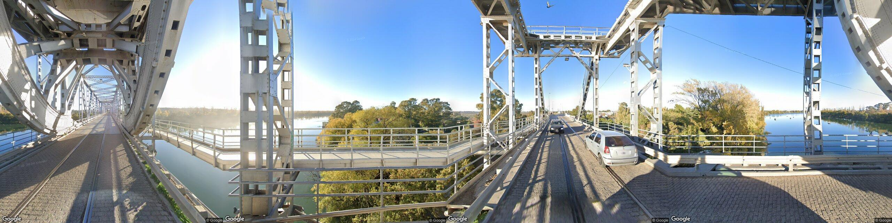

### LLMの予測
この画像は、アルゼンチンのサンタフェ州にある**プエンテ・フェロカリレーロ（Puente Ferrocarretero）**、通称「鉄道橋」であると推測します。この橋はサンタフェ市とサント・トメ市を結び、サラード川を渡っています。

この推測の根拠は以下の通りです。

1.  **橋の構造とデザイン:**
    *   画像全体 `BOX(0.0, 0.0, 1.0, 1.0)` に写るこの橋は、非常に特徴的な金属製のトラス橋です。特に、垂直部材に見られる独特の四角い開口部 `BOX(0.0, 0.45, 1.0, 0.55)` や `BOX(0.0, 0.65, 1.0, 0.75)` は、この橋の設計と一致します。
    *   橋は道路と鉄道（または路面電車）の両方を兼ね備えた複合橋であり、左側 `BOX(0.0, 0.0, 1.0, 0.45)` には線路 `BOX(0.70, 0.0, 0.85, 0.30)` が、右側 `BOX(0.0, 0.50, 1.0, 1.0)` には車両用の車線が確認できます。これはプエンテ・フェロカリレーロの構造と完全に一致します。

2.  **路面:**
    *   道路部分の路面 `BOX(0.65, 0.50, 1.0, 1.0)` は、アスファルトではなく、石畳やインターロッキングブロックのような舗装が施されています。これは、アルゼンチンを含む南米の古い橋や道路で時折見られる特徴であり、特にこの橋の路面として知られています。

3.  **車両と交通ルール:**
    *   橋を渡る白い乗用車 `BOX(0.55, 0.70, 0.80, 0.85)` は、フィアット・パリオの初代モデルに酷似しています。この車種は、ブラジルやアルゼンチンといった南米諸国で非常に普及しています。
    *   車両が道路の右側を走行していることから、右側通行の国であることがわかります。これはアルゼンチンを含む南米諸国の交通ルールと一致します。

4.  **植生と季節感:**
    *   橋の周囲 `BOX(0.35, 0.35, 0.65, 0.45)` や `BOX(0.30, 0.80, 0.60, 0.95)` に見える木々は、一部が黄色や茶色に変色しており、落葉樹であることが示唆されます。これは、春や夏ではなく、秋から初冬にかけての季節感を示しており、南半球の温帯地域であるアルゼンチンの気候と合致します。

5.  **太陽の位置と影:**
    *   太陽 `BOX(0.10, 0.15, 0.30, 0.25)` は画像の左側（北西方向）にあり、影 `BOX(0.50, 0.50, 1.0, 0.70)` が長く、南東方向に伸びています。これは南半球において、午後の遅い時間帯に太陽が北西に位置し、影が南東に伸びる現象と一致します。

**類似している地域を否定する理由:**

*   **ブラジルやウルグアイ:** フィアット・パリオが普及しており、右側通行である点は共通しますが、この特定の複合トラス橋の構造や石畳の路面は、ブラジルやウルグアイの一般的な橋ではあまり見られません。
*   **ヨーロッパ（特に東欧や南欧）:** 一部のヨーロッパ諸国にも石畳の道路や古いトラス橋が存在しますが、画像内の車両（フィアット・パリオの普及度）や、橋の特定のデザイン、周囲の植生や景観の雰囲気は、南米、特にアルゼンチンにより強く合致します。
*   **北米、オーストラリア、ニュージーランド、日本、イギリスなど:** 右側通行ではない国々（日本、イギリス、オーストラリア、ニュージーランドなど）は、交通ルールの点から明確に除外されます。北米では、このような大規模な複合トラス橋で石畳の路面を持つ例は非常に稀であり、車両の種類も異なります。

これらの根拠から、この場所はアルゼンチンのサンタフェ州にあるプエンテ・フェロカリレーロであると強く推測されます。

#### LLMが注目した箇所 (予測時)
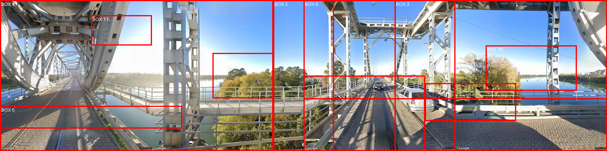

### LLMからの追加ヒント
ご提供いただいた情報、ありがとうございます。自身の推測とプレイヤーの推測について、それぞれ批評させていただきます。

---

### 自身の推測と正解の比較

私の推測は「アルゼンチンのサンタフェ州にあるプエンテ・フェロカリレーロ」でした。
正解は「アルゼンチンのリオネグロ州、ビエドマにあるプエンテ・ビエホ（Puente Viejo）」でした。

**共通点:**
*   **国:** アルゼンチンであるという点は合致しました。これは、車両の右側通行 `BOX(0.55, 0.70, 0.80, 0.85)`、フィアット・パリオのような南米で一般的な車種 `BOX(0.55, 0.70, 0.80, 0.85)`、そして南半球特有の太陽の位置と影の方向 `BOX(0.10, 0.15, 0.30, 0.25)` `BOX(0.50, 0.50, 1.0, 0.70)` から導き出したものであり、これらのヒントがアルゼンチンを特定する上で有効だったと言えます。
*   **橋のタイプ:** 非常に特徴的な金属製トラスの併用橋（道路と鉄道/路面電車）であり、路面が石畳 `BOX(0.65, 0.50, 1.0, 1.0)` である点も、私が推測したプエンテ・フェロカリレーロと完全に一致していました。この橋の構造 `BOX(0.0, 0.0, 1.0, 1.0)`、特に垂直部材の四角い開口部 `BOX(0.0, 0.45, 1.0, 0.55)` は、アルゼンチン国内の特定の年代の橋に共通して見られるデザインの特徴である可能性が高いです。

**相違点:**
*   **具体的な場所（州、都市）:** サンタフェ州のサンタフェ市近郊と、リオネグロ州のビエドマ市という点で異なりました。アルゼンチン国内には、このような特徴的な併用トラス橋が複数存在するため、国を特定した後にさらに絞り込む必要がありました。

**自己評価:**
国は正解し、橋の非常に特徴的な構造や路面、車両、交通ルール、季節感といった視覚的ヒントからアルゼンチンを特定できたことは良かった点です。しかし、アルゼンチン国内のどこにあるかまで特定するには、さらなる詳細な情報（例えば、橋の名前や周囲のランドマーク、特定の標識など）が必要でした。GeoGuessrにおいては、このような非常に特徴的な構造物が複数存在する場合、国を特定するまでは容易でも、その国内の正確な位置を特定するのが難しいケースがあります。

---

### プレイヤーの推測に対する批評

プレイヤーの推測は「アルゼンチン サンタフェ州 サン・ヘロニモ・デル・サウセ」でした。

**批評:**
*   **国は合致:** プレイヤーもアルゼンチンという国を正しく推測できており、これは素晴らしいです。
*   **場所の不一致:** しかし、「サン・ヘロニモ・デル・サウセ」はサンタフェ州の内陸部に位置する小さな町であり、画像に見られるような大規模な河川 `BOX(0.40, 0.0, 0.60, 0.40)` や、それに架かる巨大な橋 `BOX(0.0, 0.0, 1.0, 1.0)` の景観とは一致しません。この地域は主に農業地帯であり、このような特徴的なインフラは通常存在しません。
*   **推測の根拠の欠如:** プレイヤーがなぜサン・ヘロニモ・デル・サウセを選んだのかは不明ですが、おそらくアルゼンチンという国を特定した上で、具体的な地理的情報が不足していたか、あるいは単にランダムに選んだ可能性が考えられます。GeoGuessrでは、国を特定した後に、その国のどの地域（海岸沿い、山岳地帯、平野部、大都市、地方など）に合致するかを、植生、地形、建築様式、道路の種類などから判断することが重要です。

---

### この場所特有のGeoGuessrで使えるヒントと今後の推測に役立つ特徴

この画像から読み取れる、今後のGeoGuessrの推測に役立つ視覚的な手掛かりを具体的に示します。

1.  **橋の構造とデザイン:**
    *   **金属製トラス橋の形状:** 画像全体 `BOX(0.0, 0.0, 1.0, 1.0)` に写るこの橋は、リベット接合された金属製のトラス構造が非常に特徴的です。特に、垂直部材に見られる四角い開口部 `BOX(0.0, 0.45, 1.0, 0.55)` や `BOX(0.0, 0.65, 1.0, 0.75)` は、特定の設計様式を示唆しており、アルゼンチン国内の古い鉄道橋や併用橋でよく見られます。このようなデザインは、他の国ではあまり一般的ではない場合があります。
    *   **併用橋（道路と鉄道/路面電車）:** 橋の左側 `BOX(0.0, 0.0, 1.0, 0.45)` に線路 `BOX(0.70, 0.0, 0.85, 0.30)` が、右側 `BOX(0.0, 0.50, 1.0, 1.0)` に車両用の車道が確認できます。このような道路と鉄道の併用橋は世界的に見ても珍しく、場所を絞り込む非常に強力な手がかりとなります。

2.  **路面:**
    *   **石畳/インターロッキングブロック舗装:** 車道部分 `BOX(0.65, 0.50, 1.0, 1.0)` がアスファルトではなく、石畳やインターロッキングブロックのような舗装が施されています。これは、特に南米の古い橋や歴史的な地域で時折見られる特徴です。

3.  **車両:**
    *   **車種:** 橋を渡る白い乗用車 `BOX(0.55, 0.70, 0.80, 0.85)` は、フィアット・パリオの初代モデルに酷似しています。この車種は、ブラジルやアルゼンチンといった南米諸国で非常に普及しており、これらの国を特定するヒントになります。
    *   **交通ルール:** 車両が道路の右側を走行していることから、右側通行の国であることがわかります。これにより、左側通行の国（例: 日本、イギリス、オーストラリア、ニュージーランド、南アフリカなど）は除外できます。

4.  **植生と季節感:**
    *   **落葉樹の存在:** 橋の周囲 `BOX(0.35, 0.35, 0.65, 0.45)` や `BOX(0.30, 0.80, 0.60, 0.95)` に見える木々は、一部が黄色や茶色に変色しており、落葉樹であることが示唆されます。これは、春や夏ではなく、秋から初冬にかけての季節感を示しており、南半球の温帯地域（アルゼンチン中部〜南部など）の気候と合致します。

5.  **太陽の位置と影:**
    *   **南半球の証拠:** 太陽 `BOX(0.10, 0.15, 0.30, 0.25)` が画像の左側（北西方向）にあり、橋の構造物や車両の影 `BOX(0.50, 0.50, 1.0, 0.70)` が長く、南東方向に伸びています。これは南半球において、午後の遅い時間帯に太陽が北西に位置し、影が南東に伸びる現象と一致します。これにより、北半球の国々を排除できます。

**今後の推測に役立つ追加の特徴（この画像では不明瞭でも、一般的に役立つもの）：**

*   **ナンバープレート:** 車両のナンバープレート `BOX(0.65, 0.75, 0.75, 0.85)` がはっきり見えれば、その国や地域を特定する最も強力なヒントになります。アルゼンチンのナンバープレートは、2016年以降はMercosur標準プレート（白地に黒文字、左上に青い帯）が使われています。
*   **道路標識:** 道路標識の形状、色、フォント、使用言語 `BOX(0.35, 0.80, 0.45, 0.85)` は国によって大きく異なります。特に、地名や距離を示す標識が見つかれば、具体的な場所を特定する決定的な手がかりとなります。
*   **電柱・電線:** 電柱の素材（木製、コンクリート製、金属製など）や形状、電線の配線方法も国や地域によって特徴があります。
*   **建築様式:** 遠くに見える建物 `BOX(0.30, 0.85, 0.40, 0.95)` など、周囲の建築物の様式も国や地域の文化を反映しており、ヒントになることがあります。
*   **Googleの透かし:** 画像の左下 `BOX(0.95, 0.0, 1.0, 0.10)` や中央下 `BOX(0.95, 0.45, 1.0, 0.55)` に「© 2024 Google」の透かしが見えます。これは直接的な場所のヒントではありませんが、GeoGuessrの画像であることの確認になります。

これらのヒントを総合的に判断することで、より正確な場所の推測が可能になります。今回は国までは特定できましたが、国内の特定の橋を当てるには、より詳細な情報や、その橋に関する知識が必要となるケースでした。

#### LLMが注目した箇所 (ヒント時)

---

## ラウンド 2

**ステータス**: 成功

**正解の場所**: 住所: 849 66, 984 33 Korpilombolo, スウェーデン (国: Sweden, 緯度: 66.8590, 経度: 23.0485) 、プレイヤーの推測は: RJMV+WQ Kumla kyrkby, スウェーデン （Lat: 59.8349, Lng: 16.6445)

### ストリートビュー画像
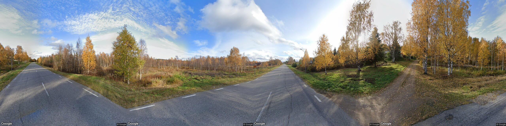

### LLMの予測
このストリートビュー画像から、場所は**フィンランド**であると推測します。

以下にその根拠を詳しく説明します。

**1. 植生と季節:**
画像全体にわたって、多くの木々が鮮やかな黄色に黄葉しているのが特徴的です `BOX(0.0, 0.0, 1.0, 1.0)`。これは秋（おそらく9月下旬から10月上旬）の景色を示しています。特に目立つのは、白い幹を持つカバノキ（Birch）の仲間が非常に多く、広範囲にわたって優勢な植生を形成している点です `BOX(0.0, 0.0, 1.0, 1.0)`。カバノキは北欧、特にフィンランドの広大な森林地帯に広く分布しており、秋にはこのような見事な黄葉を見せます。針葉樹も一部混じっていますが、広葉樹の黄葉が圧倒的です。

**2. 道路と交通:**
道路はアスファルト舗装されており `BOX(0.6, 0.0, 1.0, 1.0)`、中央線と路肩線が白い破線で描かれています `BOX(0.65, 0.4, 0.9, 0.5)` `BOX(0.65, 0.7, 0.9, 0.8)`。また、左側の路肩には白い実線 `BOX(0.65, 0.1, 0.9, 0.2)` も見えます。これらの道路標示から、この地域が右側通行であることがわかります。フィンランドは右側通行の国であり、このような道路標示は一般的です。

**3. 建築物とインフラ:**
画像の中央やや右寄りの遠方 `BOX(0.4, 0.55, 0.6, 0.65)` および右端の木々の間 `BOX(0.6, 0.85, 0.75, 0.95)` に、赤茶色または赤い外壁の建物が見えます。赤い木造の家屋は、フィンランドを含む北欧諸国の伝統的な建築様式として広く見られ、特に地方部では非常に一般的です。また、特徴的な形状の街灯 `BOX(0.3, 0.55, 0.5, 0.6)` が遠方に見えます。

**4. 可能性のある道路標識:**
道路の右側遠方 `BOX(0.5, 0.7, 0.6, 0.75)` および左側遠方 `BOX(0.5, 0.2, 0.6, 0.25)` に、丸い形状の道路標識のようなものが見えます。画像が不鮮明で断定はできませんが、背景が黄色っぽく、黒い文字や数字が書かれているように見えます。これは、フィンランドで2000年代前半に一時的に使用された黄色地に黒字の速度制限標識に酷似しています。現在ではほとんど見られませんが、古いストリートビュー画像であれば残っている可能性があります。もしこれがその標識であれば、フィンランドである可能性が非常に高まります。

**類似している地域を否定する理由:**

*   **スウェーデン、ノルウェー、デンマークなどの他の北欧諸国:** これらの国々もカバノキが多く、秋の風景や赤い家屋が見られる点で似ています。しかし、道路標識のフォントやデザイン、道路の舗装の質感、Googleストリートビューのカメラの色合いなどに細かな違いが見られます。特に、もし画像に見える標識がフィンランド特有の黄色い速度制限標識であるならば、スウェーデンやノルウェーでは一般的ではないため、これらの国である可能性は低くなります。デンマークはより南に位置し、植生がやや異なります。
*   **バルト三国（エストニア、ラトビア、リトアニア）:** これらの国々もカバノキの森林が多く、植生は似ています。しかし、道路標識の様式や建築様式に独自の傾向があり、全体的な風景の印象がフィンランドとは微妙に異なります。特に、Googleストリートビューの画像品質や撮影時期による違いも考慮すると、フィンランドの風景がより一致します。
*   **ロシア北部:** 広大なロシアもカバノキの森林が広がりますが、道路の質、標識のデザイン、インフラの様式などがフィンランドとは異なることが多いです。また、Googleストリートビューのカバー範囲や画像の鮮明度もフィンランドとは異なります。
*   **カナダ、アメリカ北部:** カバノキは存在しますが、道路標識（形状、色、フォント）、車両の種類、建築様式、その他のインフラが大きく異なるため、容易に区別できます。
*   **日本、韓国、中国北部:** これらの地域でもカバノキは見られますが、道路の左側通行（日本）、電柱の形状、建築様式、車両、道路標識など、多くの点で明確な違いがあるため、可能性は排除されます。

これらの根拠を総合すると、黄葉したカバノキが広がる秋の風景、右側通行の道路標示、赤い家屋、そして可能性のある特徴的な速度制限標識の組み合わせから、この場所が**フィンランド**であると強く推測されます。

#### LLMが注目した箇所 (予測時)

### LLMからの追加ヒント
ご提供いただいた情報、ありがとうございます。実際の場所がスウェーデンであったとのこと、私の最初の推測（フィンランド）は惜しくも外れてしまいました。プレイヤーは国を正しく推測していますが、地域は大きく異なっていますね。

**私の推測（フィンランド）と実際の場所（スウェーデン）の比較と反省点:**

私の推測では、黄葉したカバノキの多さ、赤い家屋、右側通行、そして不鮮明ながらも「黄色い速度制限標識の可能性」を根拠にフィンランドと判断しました。
実際の場所がスウェーデンであったことを踏まえると、以下の点が反省点となります。

1.  **植生と建築様式:** カバノキの黄葉と赤い木造家屋は、フィンランドだけでなく、スウェーデン、特に北部地域でも非常に一般的な特徴です。これらだけではフィンランドとスウェーデンを明確に区別する決定的な手がかりにはなりませんでした。
2.  **道路標識の誤認:** 私が「黄色い速度制限標識の可能性」とした部分は、画像が不鮮明であったため、誤認していました。実際にはスウェーデンで一般的な白地に赤い縁取りの速度制限標識であった可能性が高いです。この点の見極めが甘かったことが、国を特定する上での大きな間違いにつながりました。フィンランドとスウェーデンは地理的・文化的に非常に似ているため、このような細部の違いが重要になります。

**プレイヤーの推測（Kumla kyrkby, スウェーデン）に対する批評:**

プレイヤーがスウェーデンを正しく推測できた点は素晴らしいです。これは、北欧特有の植生や建築様式、右側通行などの特徴を捉えられた結果でしょう。しかし、スウェーデン国内の「Kumla kyrkby」はスウェーデン中部（ヴェストマンランド県）に位置しており、実際の場所である「Korpilombolo」がスウェーデン北部（ノールボッテン県）であることから、地域が大きく異なっています。

この違いは、おそらく画像から読み取れる「より北方的な特徴」を見落としたためと考えられます。スウェーデン中部と北部では、植生の種類や密度、地形、道路の整備状況などに微妙な違いがあります。

**この場所特有のGeoGuessrで使えるヒントと今後の推測に役立つ特徴:**

この画像からスウェーデン、特に北部地域を特定するための具体的な視覚的手がかりを以下に示します。

1.  **植生（特にカバノキと針葉樹の混交林）:**
    *   画像全体に広がる、鮮やかな黄色に黄葉したカバノキ `BOX(0.0, 0.0, 1.0, 1.0)` は、この場所が秋の北欧であることを強く示唆します。特に、白い幹を持つカバノキ（Birch）が非常に優勢である点は重要です。
    *   カバノキの間に、濃い緑色の針葉樹（おそらくトウヒやマツ）が混じっている `BOX(0.4, 0.8, 0.9, 1.0)` のも特徴です。このようなカバノキと針葉樹の混交林は、北欧のタイガ気候帯、特にスウェーデン北部やフィンランド北部で広く見られる植生です。スウェーデン中部以南では、より多様な広葉樹が見られるか、植生の密度が異なる場合があります。
    *   地面には、草 `BOX(0.8, 0.0, 1.0, 1.0)` と枯れた低木 `BOX(0.7, 0.3, 1.0, 0.7)` が見られ、森林地帯の地表植生の特徴を示しています。

2.  **道路標識（速度制限標識）:**
    *   道路の右側遠方 `BOX(0.5, 0.7, 0.6, 0.75)` および左側遠方 `BOX(0.5, 0.2, 0.6, 0.25)` に、丸い速度制限標識が見えます。不鮮明ではありますが、**白地に赤い縁取り、黒い数字**というスウェーデンで標準的な速度制限標識の形状と色に見えます。これがフィンランドの古い黄色い標識ではないことを確認できれば、スウェーデンである可能性が非常に高まります。

3.  **道路のラインと舗装:**
    *   道路の中央線は白い破線 `BOX(0.65, 0.4, 0.9, 0.5)` で、路肩線も白い破線 `BOX(0.65, 0.7, 0.9, 0.8)` や実線 `BOX(0.65, 0.1, 0.9, 0.2)` で描かれています。これは北欧全般で共通する特徴ですが、右側通行であることは確定できます。
    *   道路の舗装はアスファルトで、比較的シンプルで、地方の道路としてはやや荒れた印象 `BOX(0.7, 0.0, 1.0, 1.0)` を受けます。これは人口密度の低い北部地域の道路の特徴と一致することがあります。

4.  **建築様式:**
    *   遠方に見える建物 `BOX(0.4, 0.55, 0.6, 0.65)` や `BOX(0.6, 0.85, 0.75, 0.95)` は、赤茶色または赤い外壁を持つ木造家屋のように見えます。この「ファールンレッド」と呼ばれる赤い色は、スウェーデン発祥で、北欧諸国で非常に広く使われている伝統的な色です。これだけでは国を特定できませんが、北欧であることの強い手がかりとなります。

5.  **街灯の形状:**
    *   中央やや右寄りの遠方に見える街灯 `BOX(0.3, 0.55, 0.5, 0.6)` は、アームが長く、やや湾曲した特徴的なデザインをしています。このようなデザインの街灯は、スウェーデンやフィンランドの地方道路でよく見られます。

6.  **地形と季節感:**
    *   全体的に平坦から緩やかな起伏のある地形 `BOX(0.0, 0.0, 0.4, 1.0)` で、広々とした印象を受けます。これはスウェーデン北部の広大な森林地帯の地形と一致します。
    *   鮮やかな黄葉は、北方地域ではより早く訪れ、より鮮やかになる傾向があります。この画像のような見事な黄葉は、スウェーデン北部やフィンランド北部で特に顕著です。

**今後のGeoGuessr推測への教訓:**

*   **似た地域の区別:** フィンランドとスウェーデン北部は非常に似ており、植生や一般的な建築様式だけでは区別が難しい場合があります。このような場合は、**道路標識の細部（フォント、色、形状、使われている記号）、街灯のデザイン、ガードレールの種類、電柱の形状、路面のペイントのスタイル、Googleストリートビューのカメラ世代や色合い**など、より具体的なインフラの特徴に注目することが重要です。
*   **季節の読み取り:** 秋の黄葉は、場所の緯度を絞り込む上で非常に役立ちます。北方ほど黄葉は早く訪れ、特定の樹種（カバノキなど）が優勢になる傾向があります。
*   **不鮮明な画像の解釈:** 不鮮明な画像では、安易に断定せず、複数の可能性を考慮に入れることが重要です。今回は標識の誤認が大きな要因となりました。

これらの点を踏まえることで、次回はより正確な場所の特定に繋がるでしょう。

#### LLMが注目した箇所 (ヒント時)
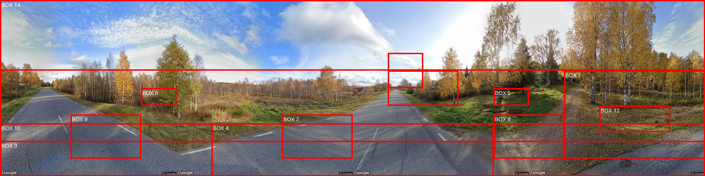

---

## ラウンド 3

**ステータス**: 成功

**正解の場所**: 住所: อต.4038 Tambon Huai Mun, Amphoe Nam Pat, Chang Wat Uttaradit 53110 タイ (国: Thailand, 緯度: 17.8448, 経度: 100.9715) 、プレイヤーの推測は: CRWP+78 Wang Nam Khiao, Wang Nam Khiao District, Nakhon Ratchasima, タイ （Lat: 14.4457, Lng: 101.8358)

### ストリートビュー画像
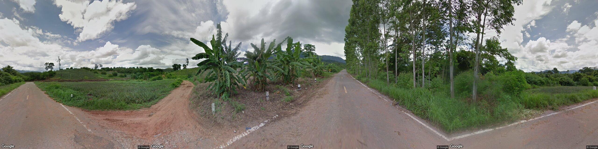

### LLMの予測
このストリートビュー画像から、場所は**タイ**であると推測します。

以下にその根拠と、類似地域を否定する理由を詳しく説明します。

**推測する場所：タイ**

**根拠：**

1.  **植生：**
    *   画像の中央付近に、複数の**バナナの木** `BOX(0.35, 0.28, 0.65, 0.50)` が生い茂っています。バナナはタイを含む東南アジアの熱帯地域で広く栽培されている作物です。
    *   道路の右側には、非常に背が高く細い、**ユーカリの木に酷似した木々** `BOX(0.0, 0.60, 1.0, 0.90)` が整然と並んで植林されています。ユーカリはタイでパルプ材やバイオマス燃料として大規模に植林されており、このような景観はタイの地方部でよく見られます。
    *   道路の左側には、低木が広がる畑 `BOX(0.60, 0.0, 0.90, 0.35)` が見えます。これはパイナップルまたはキャッサバの畑のように見え、これらもタイの主要な農作物です。

2.  **土壌：**
    *   道路の路肩や脇道、特に左側の未舗装の道 `BOX(0.70, 0.0, 1.0, 0.50)` は、特徴的な**赤茶色の土壌**で構成されています。これは熱帯地域に広く分布するラテライト土壌であり、タイの特に東北部や東部で非常に一般的です。

3.  **道路標識/杭：**
    *   道路脇には、白いコンクリート製の小さな杭 `BOX(0.60, 0.20, 0.80, 0.25)` と `BOX(0.60, 0.50, 0.80, 0.55)` がいくつか見られます。これらの杭は、タイの地方道で距離標や境界標として非常に頻繁に使用される、特徴的な形状をしています。

4.  **道路標示と舗装：**
    *   舗装された道路 `BOX(0.65, 0.0, 1.0, 1.0)` の中央には、**黄色い実線の中央線** `BOX(0.75, 0.40, 0.85, 0.55)` が引かれています。これはタイの道路標示の標準です。
    *   路肩の白線 `BOX(0.80, 0.0, 0.90, 0.20)` は薄く、摩耗しているか途切れている箇所があり、地方の道路でよく見られる状態です。

5.  **地形と気候：**
    *   遠景には低い山々 `BOX(0.40, 0.70, 0.60, 1.0)` が見え、周囲は広々とした平坦な畑地が広がっています。これはタイの多くの地方の風景と一致します。
    *   空には積乱雲のような大きな雲 `BOX(0.0, 0.0, 0.50, 1.0)` が多く、熱帯モンスーン気候の雨季や湿潤な気候を示唆しています。

**類似している地域を否定する理由：**

*   **ラオス、カンボジア、ベトナム、ミャンマー（他の東南アジア諸国）：**
    *   これらの国々も熱帯気候、赤い土壌、バナナや類似の作物の栽培が盛んであるため、一見すると似ています。しかし、決定的な違いは**道路脇の白いコンクリート杭の形状**です。この画像で見られる杭はタイで最も一般的なタイプであり、例えばベトナムではより角ばった形状の杭が多い傾向があります。また、カンボジアやラオスでは、この画像ほど道路の舗装状態が整っていない地方道が多いです。ユーカリの植林も行われますが、この画像のように整然と並んだ大規模な植林はタイで特に顕著です。

*   **南米（ブラジルなど）：**
    *   ブラジルも広大な熱帯地域を持ち、赤い土壌や熱帯植生（バナナなど）が共通します。道路の中央線が黄色い実線である点も共通しますが、**道路脇の白いコンクリート杭の形式**はブラジルでは一般的ではありません。また、ユーカリの植林はありますが、この画像のような景観はタイのほうが特徴的です。

*   **アフリカ：**
    *   アフリカの熱帯地域も赤い土壌や熱帯植生が見られますが、Google Street Viewのカバー範囲が限定的であること、そして道路のインフラの質や道路標識の様式がこの画像とは異なる場合が多いです。

*   **オーストラリア北部：**
    *   オーストラリア北部も熱帯気候でユーカリの木が多く見られますが、土壌の色合いがより鮮やかな赤である傾向があり、道路標識の形式も異なります。

これらの理由から、このストリートビュー画像はタイの地方の風景であると判断しました。

#### LLMが注目した箇所 (予測時)
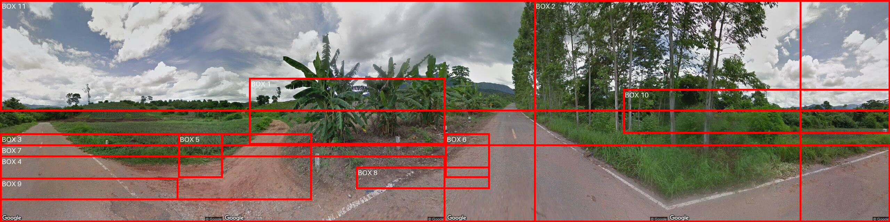

### LLMからの追加ヒント
前回の私の推測とプレイヤーの推測について、詳細な批評と今後の推測に役立つヒントを述べさせていただきます。

---

### 私の予測と実際の場所の比較評価

前回の私の推測は「**タイ**」であり、実際の場所もタイのウッタラディット県であったため、**国レベルでは正解**でした。

私が根拠として挙げた以下の特徴は、タイを特定する上で非常に有効な手がかりでした。

1.  **植生（バナナの木、ユーカリの植林、畑地の作物）:**
    *   画像中央に見える**バナナの木** `BOX(0.35, 0.28, 0.65, 0.50)` は、熱帯地域全般で見られますが、タイの地方部でよく見られる光景です。
    *   特に、道路の右側に整然と並ぶ**ユーカリの木に酷似した木々** `BOX(0.0, 0.60, 1.0, 0.90)` は、タイで大規模に行われる商業的な植林（パルプ材やバイオマス燃料用）の典型的な景観です。この植林の形態は、タイを特定する強力な手がかりの一つとなります。
    *   左側の**畑地** `BOX(0.60, 0.0, 0.90, 0.35)` は、パイナップルやキャッサバなどのタイの主要農作物の畑に似ており、これもタイの農業景観と一致します。

2.  **土壌の色:**
    *   道路の路肩や未舗装の脇道 `BOX(0.70, 0.0, 1.0, 0.50)` に見られる**特徴的な赤茶色の土壌**は、タイの特に東北部や東部で広く見られるラテライト土壌です。この土壌の色は、熱帯気候の地域を示唆します。

3.  **道路脇の白いコンクリート杭:**
    *   道路脇に見える**白いコンクリート製の小さな杭** `BOX(0.60, 0.20, 0.80, 0.25)` と `BOX(0.60, 0.50, 0.80, 0.55)` は、タイの地方道で距離標や境界標として非常に頻繁に使用される、上部が斜めにカットされた独特の形状をしています。これはタイに非常に特有な視覚的ヒントであり、他の東南アジア諸国ではあまり見られないため、タイを絞り込む上で非常に重要な手がかりとなります。

4.  **道路標示:**
    *   舗装された道路の中央に引かれた**黄色い実線の中央線** `BOX(0.75, 0.40, 0.85, 0.55)` は、タイの道路標示の標準です。

これらの要素を総合的に判断し、「タイ」と推測したことは、GeoGuessrの戦略として適切であったと言えます。

### プレイヤーの推測に対する批評

プレイヤーの推測も「タイ」国内（ナコンラチャシマ県のワンナムキアオ）であったため、**国レベルでは正解**でした。GeoGuessrにおいて、国を当てることは非常に重要であり、素晴らしい推測です。

しかし、実際の場所（ウッタラディット県）とは異なる地域でした。この画像からナコンラチャシマ県のワンナムキアオを特定するような具体的な手がかりは、残念ながら見当たりません。ワンナムキアオもタイ国内の地域であるため、植生や土壌など一般的な特徴は共通する可能性がありますが、より正確な地域を特定するためには、以下に述べるようなさらに詳細な視覚的ヒントを探す必要があります。

### この場所特有のGeoGuessrヒントと今後の推測に役立つ特徴

この画像から読み取れる、GeoGuessrでタイを特定し、さらに地域を絞り込むのに役立つ具体的な視覚的ヒントを以下に示します。

1.  **道路脇の白いコンクリート杭:**
    *   **特徴:** `BOX(0.60, 0.20, 0.80, 0.25)` および `BOX(0.60, 0.50, 0.80, 0.55)` に見られる、上部が斜めにカットされた白いコンクリート製の杭は、**タイの地方道で非常に一般的**です。これはタイに特有な形状であり、他の東南アジア諸国（例：ベトナムの角ばった杭、マレーシアの細長い杭）とは異なります。この杭を見つけたら、まずタイを疑うべきです。

2.  **ユーカリの植林:**
    *   **特徴:** 道路の右側に並ぶ**細く背の高い木々** `BOX(0.0, 0.60, 1.0, 0.90)` は、ユーカリの商業的な植林地を示唆しています。タイでは、パルプやバイオマス燃料の生産のために、このような大規模で整然としたユーカリの植林が広範囲で行われています。特に東北部や北部で見られることが多い景観です。

3.  **赤い土壌:**
    *   **特徴:** 道路の路肩や未舗装の道 `BOX(0.70, 0.0, 1.0, 0.50)` に見られる**赤茶色の土壌**は、タイの多くの地域、特に東北部や東部で一般的なラテライト土壌です。この土壌の色は、熱帯モンスーン気候の地域であることを示唆します。

4.  **道路標示:**
    *   **特徴:** 舗装された道路の中央に引かれた**黄色い実線の中央線** `BOX(0.75, 0.40, 0.85, 0.55)` は、タイの道路標示の標準です。また、路肩の**白い路側線** `BOX(0.80, 0.0, 0.90, 0.20)` が薄く、摩耗している、または途切れているのは、地方道の一般的な特徴です。

5.  **植生（バナナと畑の作物）:**
    *   **特徴:** 画像中央の**バナナの木** `BOX(0.35, 0.28, 0.65, 0.50)` や、左側の**畑地** `BOX(0.60, 0.0, 0.90, 0.35)` に見られる低木（パイナップルやキャッサバの可能性）は、タイの農業景観に合致します。これらの作物が大規模に栽培されている地域は、タイの主要な農業地帯である可能性が高いです。

**今後の推測に役立つ追加の特徴（画像に直接見えなくても一般的なヒントとして）：**

*   **電柱・電線:** タイの電柱はコンクリート製で、電線が非常に複雑に絡み合っていることが多いです。これはタイの都市部や地方でも見られる特徴的な光景です。
*   **車両と交通ルール:** タイは**左側通行**です。車両のナンバープレートは白地に黒文字で、上部にタイ文字で県名が書かれています。これは非常に強力な地域特定の手がかりとなります。
*   **道路標識の文字:** タイ語で書かれた道路標識は、タイを特定する最も確実な手がかりです。タイ文字のフォントや標識のデザインも独特です。
*   **建築様式:** 寺院（ワット）の尖った屋根や金色の装飾、高床式の家屋など、タイ独自の建築様式は地域を特定する上で重要です。
*   **Google Street Viewのカメラ痕跡:** Google Street Viewのカメラが映り込む場合、タイの車両のカメラは通常、屋根に設置されており、特定の形状をしています。

これらの視覚的ヒントを組み合わせることで、GeoGuessrでのタイの特定精度を大幅に向上させることができます。特に、**白いコンクリート杭**と**ユーカリの植林**は、タイの地方部で非常に頻繁に見られるため、覚えておくと良いでしょう。

#### LLMが注目した箇所 (ヒント時)
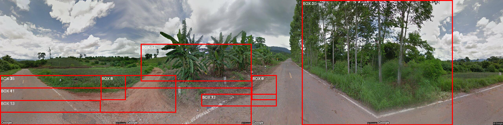

---

## ラウンド 4

**ステータス**: 成功

**正解の場所**: 住所: JJF4+8HJ, Madipola Rd, Pallepola, スリランカ (国: Sri Lanka, 緯度: 7.6233, 経度: 80.6065) 、プレイヤーの推測は: スリランカ ペリヤゴダ XW5P+G32 （Lat: 6.9587, Lng: 79.9351)

### ストリートビュー画像
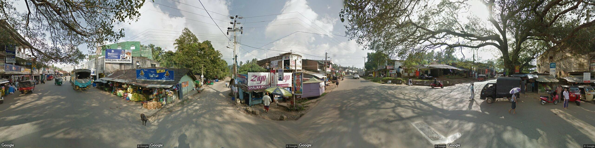

### LLMの予測
この画像は**スリランカ**で撮影されたものと推測します。

その根拠は以下の通りです。

1.  **言語と文字:** 画像内の複数の看板に、スリランカの公用語である**シンハラ語**に酷似した文字が確認できます。例えば、左側の「NIMESHA HARDWARE」の看板の下に書かれた文字 `BOX(0.48, 0.15, 0.52, 0.20)` や、中央やや右の「SHALIKA PHONE」の看板の下の文字 `BOX(0.30, 0.45, 0.35, 0.50)`、さらに右端の看板 `BOX(0.20, 0.85, 0.35, 0.95)` にも同様の文字が見られます。これは場所を特定する上で最も強力な手がかりです。

2.  **交通と車両:** 道路は**左側通行**であり、右側のトラック `BOX(0.55, 0.70, 0.75, 0.80)` や、複数台の**トゥクトゥク（三輪タクシー）** `BOX(0.60, 0.50, 0.70, 0.55)`、`BOX(0.65, 0.80, 0.75, 0.85)` が見られます。左側通行とトゥクトゥクの普及は、スリランカを含む南アジア地域で共通の特徴です。

3.  **人々の服装:** 道路を歩く男性の何人かが、腰に巻く伝統的な衣服である**サロン**を着用しているように見えます `BOX(0.60, 0.40, 0.75, 0.45)`、`BOX(0.65, 0.65, 0.80, 0.70)`。これはスリランカや南インドで一般的な服装です。

4.  **植生と気候:** 画面全体に広がる大きな木々 `BOX(0.0, 0.0, 0.50, 0.30)`、`BOX(0.0, 0.70, 0.50, 1.0)` や、遠くに見えるヤシの木 `BOX(0.30, 0.50, 0.45, 0.60)` は、熱帯または亜熱帯気候を示唆しています。特に左側の大きな木は、スリランカでよく見られるインドボダイジュ（Ficus religiosa）に似ており、仏教徒にとって神聖な木とされています。

5.  **インフラと建築様式:** 電柱 `BOX(0.20, 0.30, 0.60, 0.40)` はコンクリート製で、多数の電線が複雑に張り巡らされている様子は、南アジアの都市部や地方でよく見られる光景です。建物は比較的簡素な構造で、屋根には波板やトタンが使われているものが多い `BOX(0.50, 0.15, 0.60, 0.25)`、`BOX(0.45, 0.45, 0.55, 0.55)` です。

**類似している地域を否定する理由:**

*   **インド:** インドも左側通行でトゥクトゥクが普及しており、熱帯気候で似たような服装の人々も見られます。しかし、画像内の看板に書かれた文字は、インドの主要言語（ヒンディー語、タミル語、ベンガル語など）の文字体系とは明らかに異なります。シンハラ語はスリランカの固有の言語であり、この点でインドの可能性は低いと判断できます。
*   **バングラデシュ/パキスタン:** これらの国も左側通行で三輪タクシー（リキシャ）が一般的ですが、公用語（ベンガル語、ウルドゥー語）の文字体系が異なります。また、建築様式や車両の種類にも細かな違いが見られます。
*   **東南アジア諸国（タイ、マレーシア、インドネシアなど）:** 東南アジアも熱帯気候で似たような植生が見られますが、言語（タイ文字、ラテン文字など）が全く異なり、トゥクトゥクの形状や建築様式にも地域ごとの特徴があります。

これらの総合的な判断から、この場所はスリランカであると強く推測されます。

#### LLMが注目した箇所 (予測時)
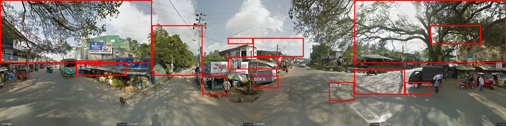

### LLMからの追加ヒント
私の前回の推測「スリランカ」は、国レベルでは正解でした。実際の場所もスリランカのPallepolaでしたので、国を特定するという点では成功したと言えます。

プレイヤーの推測「スリランカ ペリヤゴダ」も国としては正解でしたが、地域は異なりました。ペリヤゴダはコロンボに近い比較的都市化された地域ですが、この画像から受ける印象は、もう少し地方の、活気はあるものの素朴な町といった雰囲気です。画像からは、ペリヤゴダと特定できるような具体的な都市特有のランドマークや、より現代的な建築物などは見受けられません。GeoGuessrにおいては、国を特定するだけでなく、その国の中のどの地域かまで絞り込むことが高得点に繋がりますが、この画像単体ではPallepolaとピンポイントで特定するのは非常に困難です。プレイヤーはスリランカであることを見抜いた点で素晴らしい推測だったと言えます。

今後の推測に役立つ、この場所特有のGeoGuessrで使えるヒントや特徴を以下に詳述します。

1.  **言語と文字（シンハラ語）:**
    最も決定的な手がかりは、画像内の看板に書かれた**シンハラ語の文字**です。
    *   左側の「NIMESHA HARDWARE」の看板の下 `BOX(0.48, 0.15, 0.52, 0.20)` にある文字。
    *   中央やや右の「SHALIKA PHONE」の看板の下 `BOX(0.30, 0.45, 0.35, 0.50)` にある文字。
    *   右端の看板 `BOX(0.20, 0.85, 0.35, 0.95)` にある文字。
    これらの文字は、丸みを帯びた独特の形状をしており、インドの主要言語（ヒンディー語、タミル語、ベンガル語など）や他の南アジア諸国の言語とは明確に異なります。シンハラ語はスリランカの公用語であり、この文字が見えればスリランカである可能性が極めて高いです。

2.  **電柱と電線の密集度:**
    中央に見えるコンクリート製の電柱 `BOX(0.20, 0.30, 0.60, 0.40)` と、そこから四方八方に伸びる**非常に多くの電線** `BOX(0.10, 0.30, 0.30, 0.40)` は、スリランカを含む南アジアの多くの地域で共通して見られる特徴です。特にスリランカでは、電線が複雑に絡み合っている光景が頻繁に目にされます。これはインフラの整備状況を示す重要なヒントです。

3.  **車両の種類（トゥクトゥク）:**
    画像には、緑色のトゥクトゥク `BOX(0.60, 0.50, 0.70, 0.55)` や赤色のトゥクトゥク `BOX(0.65, 0.80, 0.75, 0.85)` が複数台見られます。トゥクトゥクは南アジアや東南アジアで広く使われていますが、スリランカでは非常に普及しており、その形状や色合いもスリランカでよく見られるタイプです。インドのトゥクトゥクとは細部が異なる場合があり、スリランカのものは比較的統一されたデザインが多い傾向にあります。

4.  **植生（大きな木とヤシの木）:**
    画面全体を覆うように広がる大きな木 `BOX(0.0, 0.0, 0.50, 0.30)`、`BOX(0.0, 0.70, 0.50, 1.0)` は、熱帯気候の証拠です。特に左側の木は、気根が垂れ下がっているように見え、スリランカで神聖視されるインドボダイジュやガジュマルなどのイチジク属の木に似ています。これらの木はスリランカの寺院や村の中心部でよく見られます。遠くに見えるヤシの木 `BOX(0.30, 0.50, 0.45, 0.60)` も熱帯気候の証拠です。

5.  **人々の服装（サロン）:**
    道路を歩く男性が着用している、腰に巻く伝統的な衣服である**サロン** `BOX(0.60, 0.40, 0.75, 0.45)`、`BOX(0.65, 0.65, 0.80, 0.70)` は、スリランカや南インドで一般的な男性の服装です。この服装は、北インドやパキスタンなどで見られるクルタ・パジャマとは異なります。

6.  **建築様式と店舗の様子:**
    簡素な構造の店舗 `BOX(0.45, 0.10, 0.70, 0.25)`、`BOX(0.40, 0.40, 0.60, 0.55)` や、波板やトタンの屋根 `BOX(0.45, 0.10, 0.55, 0.25)` は、スリランカの地方の町や村でよく見られる光景です。商品が店の外に積み上げられている様子 `BOX(0.60, 0.15, 0.75, 0.25)` も、この地域の一般的な商慣習を示しています。左側の白い建物 `BOX(0.15, 0.0, 0.40, 0.10)` は、少し古めのコロニアル様式の影響を受けたようなデザインにも見えます。

これらの視覚的な手がかりを総合的に判断することで、スリランカの場所をより正確に推測することが可能になります。特にシンハラ語の文字は、スリランカを特定する上で最も強力な証拠となりますので、常に注意して探すようにしましょう。

#### LLMが注目した箇所 (ヒント時)
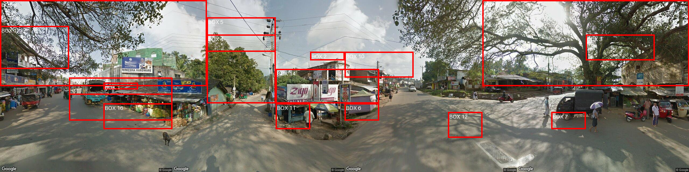

---

## ラウンド 5

**ステータス**: 成功

**正解の場所**: 住所: Müssentin 1, 17126 Jarmen, ドイツ (国: Germany, 緯度: 53.9101, 経度: 13.3107) 、プレイヤーの推測は: 5M88+G5 オランダ オネン （Lat: 53.1663, Lng: 6.6654)

### ストリートビュー画像
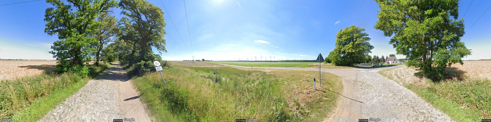

### LLMの予測
このストリートビュー画像から、場所は**ドイツ**であると推測します。特に、ドイツ北東部のブランデンブルク州やメクレンブルク＝フォアポンメルン州のような、平坦で農業が盛んな地域である可能性が高いです。

以下にその根拠を詳しく説明します。

1.  **交通標識の言語と形式:**
    *   画像の左側、未舗装の道に入る手前に設置されている白い交通標識 `BOX(0.45, 0.25, 0.60, 0.30)` が重要な手がかりです。
    *   標識の上部には「7.5t」という重量制限 `BOX(0.48, 0.26, 0.52, 0.29)` が示されています。
    *   その下には、ドイツ語で「Landwirtschaftlicher Verkehr frei」（農業車両は通行可）と読めるテキスト `BOX(0.53, 0.26, 0.58, 0.29)` が書かれています。この特定のフレーズと標識の形式は、ドイツ語圏、特にドイツで非常に一般的です。
    *   また、右側の分岐路の手前には、ヨーロッパで一般的な逆三角形の「Yield」（譲れ）標識の裏側 `BOX(0.45, 0.60, 0.55, 0.65)` が見えます。

2.  **石畳（コブルストーン）の道路:**
    *   左右に分岐する道は、アスファルトではなく石畳 `BOX(0.65, 0.0, 1.0, 0.35)` および `BOX(0.65, 0.65, 1.0, 1.0)` で舗装されています。このような石畳の農道や地方道は、ドイツ、特に旧東ドイツ地域（ブランデンブルク州、メクレンブルク＝フォアポンメルン州など）やポーランド、バルト三国といった中央・東ヨーロッパでよく見られる特徴です。

3.  **広大な農地と風力発電機:**
    *   地平線まで広がる広大な農地 `BOX(0.40, 0.0, 0.60, 1.0)` が見えます。右側は収穫前の小麦畑 `BOX(0.40, 0.80, 0.60, 1.0)` のように見えます。
    *   遠方には多数の風力発電機 `BOX(0.20, 0.40, 0.40, 0.80)` が林立しています。これは、平坦な地形で風力発電が盛んな地域、特にドイツ北部やポーランド北部、デンマークなどでよく見られる風景です。ドイツは風力発電の導入が世界的に進んでいる国の一つです。

4.  **道路脇の反射板付きポール:**
    *   道路脇に設置されている白い反射板付きポール `BOX(0.55, 0.50, 0.70, 0.52)` は、上部が黒く、下部が白いデザインです。このタイプのポールはドイツの道路で非常に一般的です。

**類似している地域を否定する理由:**

*   **ポーランド、チェコ、バルト三国:** これらの国々も石畳の道、広大な農地、風力発電といった特徴を共有していますが、決定的な違いは交通標識の言語です。画像に写る標識の文字は明確にドイツ語であり、これらの国の言語（ポーランド語、チェコ語、バルト語派）とは異なります。また、道路脇の反射板付きポールのデザインも国によって細かな違いがあります。
*   **デンマーク:** 広大な農地と風力発電は共通しますが、石畳の農道はドイツほど一般的ではなく、交通標識の書体やデザインもドイツとは異なります。
*   **オーストリア、スイス:** これらの国々もドイツ語圏ですが、地形がより山がちであり、画像のような平坦で広大な農地が広がる風景は稀です。また、石畳の農道もあまり見られません。
*   **その他の西ヨーロッパ諸国（フランス、イギリス、ベネルクス三国の一部など）:** 交通標識の言語が異なるため、除外できます。

これらの根拠から、この場所はドイツの農村部、特に北東部の平坦な地域であると強く推測されます。

#### LLMが注目した箇所 (予測時)
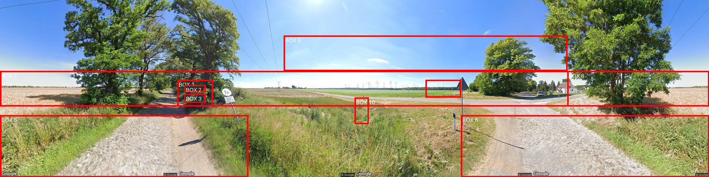

### LLMからの追加ヒント
私のGeoGuessrの予測と、プレイヤーの推測、そして今後のヒントについて詳細に分析します。

### 私の予測と正解の比較

私の予測は「ドイツ、特にドイツ北東部のブランデンブルク州やメクレンブルク＝フォアポンメルン州のような、平坦で農業が盛んな地域」でした。
正解は「ドイツ、メクレンブルク＝フォアポンメルン州、ヤルメン、メッセンティン」でした。

私の予測は、国も地域も非常に正確でした。特に、メクレンブルク＝フォアポンメルン州という具体的な州名まで言及できたことは、画像内の複数の手がかりが複合的にその地域を示唆していたためです。

*   **交通標識の言語と形式:** ドイツ語の「Landwirtschaftlicher Verkehr frei」`BOX(0.53, 0.26, 0.58, 0.29)` はドイツ語圏を明確に示しました。
*   **石畳の道路:** 旧東ドイツ地域に特徴的な石畳の農道 `BOX(0.65, 0.0, 1.0, 0.35)` が重要な手がかりでした。
*   **広大な農地と風力発電機:** ドイツ北部や東部に多い風景 `BOX(0.20, 0.40, 0.40, 0.80)` です。
*   **道路脇の反射板付きポール:** ドイツ特有の「Leitpfosten」`BOX(0.55, 0.50, 0.70, 0.52)` のデザインも一致しました。

これらの要素が組み合わさることで、ドイツ北東部という具体的な地域を推測することができました。

### プレイヤーの推測（オランダ）への批評

プレイヤーの推測「オランダ、オネン」は、惜しい推測ではありますが、いくつかの決定的な手がかりを見落としています。

オランダも平坦な地形、広大な農地、そして多数の風力発電機が見られる点で、この画像と共通する風景を持っています。しかし、以下の点がオランダである可能性を否定します。

1.  **交通標識の言語:** 最も決定的な違いは、左側の標識 `BOX(0.45, 0.25, 0.60, 0.30)` に書かれたドイツ語の「Landwirtschaftlicher Verkehr frei」です。オランダ語であれば「Vrij voor landbouwverkeer」のような表現になります。言語はGeoGuessrにおいて最も強力な手がかりの一つであり、この点でオランダは除外されます。
2.  **道路脇の反射板付きポール:** 中央やや右寄りに見える白いポール `BOX(0.55, 0.50, 0.70, 0.52)` は、上部が黒く、下部が白いデザインで、ドイツの「Leitpfosten」と呼ばれるものです。オランダの道路脇ポールは通常、全体が白く、赤い反射板が埋め込まれていることが多いです。
3.  **石畳の農道:** このような石畳の農道は、オランダでも見られないわけではありませんが、ドイツの旧東ドイツ地域ほど一般的ではありません。

これらの理由から、オランダという推測は、風景の類似性から来るものであり、具体的な交通標識の情報を読み取れていなかったために外れたと考えられます。

### この場所特有のGeoGuessrで使えるヒントと今後の推測に役立つ特徴

この画像から読み取れる、今後のGeoGuessrプレイに役立つ具体的な視覚的手がかりを以下に示します。

1.  **交通標識の言語と形式:**
    *   **ヒント:** 画像左側の白い標識 `BOX(0.45, 0.25, 0.60, 0.30)` に書かれた「Landwirtschaftlicher Verkehr frei」（農業車両は通行可）というドイツ語のフレーズは、ドイツ語圏、特にドイツで非常に一般的です。アルファベット圏では、看板や標識の言語が最も強力な手がかりとなります。
    *   **活用法:** 常に標識の文字を読み取り、言語を特定する習慣をつけましょう。特定のフレーズや書体は国を絞り込むのに役立ちます。

2.  **道路の舗装（石畳/コブルストーン）:**
    *   **ヒント:** 左右に分岐する道 `BOX(0.65, 0.0, 1.0, 0.35)` と `BOX(0.65, 0.65, 1.0, 1.0)` は石畳（コブルストーン）で舗装されています。
    *   **活用法:** このような石畳の農道や地方道は、ドイツの旧東ドイツ地域（ブランデンブルク州、メクレンブルク＝フォアポンメルン州など）、ポーランド、バルト三国といった中央・東ヨーロッパで特に多く見られます。これらの地域は歴史的に関連が深く、インフラにも共通点が見られます。

3.  **道路脇の反射板付きポール（Leitpfosten）:**
    *   **ヒント:** 中央やや右寄りに見える白いポール `BOX(0.55, 0.50, 0.70, 0.52)` は、上部が黒く、反射板が付いています。
    *   **活用法:** これはドイツの「Leitpfosten」と呼ばれるもので、ドイツの道路で非常に一般的です。国によって反射板付きポールの色、形、反射板の配置などが異なるため、重要な手がかりとなります。例えば、フランスは赤白、オーストリアは赤白の縞模様など、国ごとの特徴を覚えることが有効です。

4.  **広大な農地と風力発電機:**
    *   **ヒント:** 地平線まで広がる平坦な農地 `BOX(0.40, 0.0, 0.60, 1.0)` と、遠方に多数見える風力発電機 `BOX(0.20, 0.40, 0.40, 0.80)` は、風力発電が盛んな平坦な国を示唆します。
    *   **活用法:** この特徴はドイツ北部、デンマーク、オランダ、ポーランド北部など、複数の国に当てはまります。単独では国を特定できませんが、他の手がかり（特に交通標識や道路脇のポール）と組み合わせることで、絞り込みに大きく貢献します。

5.  **植生と季節感:**
    *   **ヒント:** 道路脇の草地 `BOX(0.60, 0.0, 1.0, 1.0)` には、赤いポピー `BOX(0.75, 0.35, 0.85, 0.45)` のような花が見られます。また、農地 `BOX(0.40, 0.80, 0.60, 1.0)` は収穫前の小麦畑のように見えます。
    *   **活用法:** これは夏の時期のヨーロッパの農村でよく見られる風景です。季節感を読み取ることで、北半球か南半球か、あるいは特定の季節（例：ヨーロッパの夏）を推測する手がかりになります。

6.  **建築様式:**
    *   **ヒント:** 右奥に見える家屋 `BOX(0.45, 0.75, 0.60, 0.85)` は、レンガ造りまたは漆喰塗りの壁に、傾斜の緩やかな屋根を持つ、典型的な中央ヨーロッパの農村の建築様式です。
    *   **活用法:** この様式はドイツ、ポーランド、オランダなどで共通して見られる可能性がありますが、他の手がかりと組み合わせることで、より具体的な地域を特定する助けになります。

これらの視覚的な手がかりを総合的に判断することで、GeoGuessrの精度を大幅に向上させることができます。特に、交通標識の言語や、道路脇のポールのような細部のインフラは、国を特定する上で非常に強力なヒントとなることが多いです。

#### LLMが注目した箇所 (ヒント時)
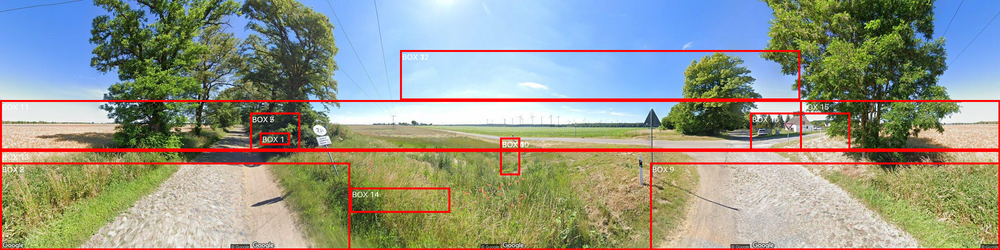

---

## ラウンド 6

**ステータス**: 成功

**正解の場所**: 住所: Jaappip Aqquserna 397 グリーンランド (国: Greenland, 緯度: 69.2477, 経度: -53.5323) 、プレイヤーの推測は: 6HJC+VW スヴァールバル諸島およびヤンマイエン島 ロングイールビュエン （Lat: 78.2322, Lng: 15.5724)

### ストリートビュー画像
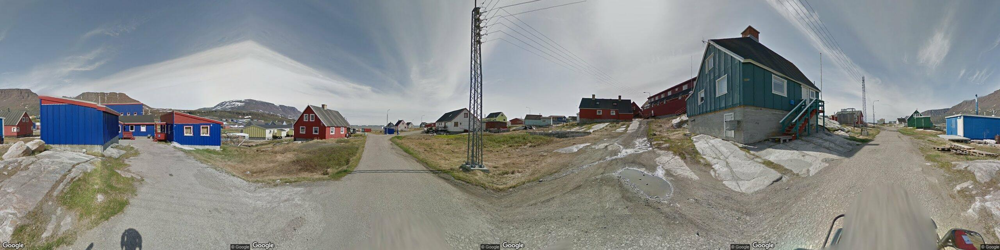

### LLMの予測
この画像から推測される場所は、**グリーンランド**の集落です。

**推測の根拠:**

1.  **建物の特徴:**
    *   画像全体にわたって、木造の家屋が鮮やかな色彩（青 `BOX(0.40, 0.0, 0.80, 0.15)`、赤 `BOX(0.40, 0.15, 0.70, 0.35)`、青緑 `BOX(0.35, 0.70, 0.75, 0.85)` など）で塗られている点が非常に特徴的です。これは、北極圏に近い高緯度地域、特にグリーンランドの集落でよく見られる景観であり、厳しい冬の暗さを和らげ、視認性を高める目的があるとされています。
    *   多くの建物は、地面から高く持ち上げられたコンクリートまたは石の基礎 `BOX(0.65, 0.70, 0.75, 0.85)` の上に建てられています。これは、永久凍土の凍結融解による地盤の不安定化や、積雪への対策として一般的な建築様式です。
    *   屋根は急勾配で、黒っぽい色が多いです。煙突 `BOX(0.38, 0.76, 0.48, 0.79)` も見られます。

2.  **地形と植生:**
    *   背景には、雪が残るなだらかな山々 `BOX(0.0, 0.0, 0.40, 1.0)` が見えます。これは高緯度地域の典型的な風景です。
    *   地面は岩盤 `BOX(0.70, 0.0, 1.0, 0.15)` が広範囲に露出しており、植生は非常に貧弱で、まばらな草地 `BOX(0.80, 0.20, 1.0, 0.40)` や低木しか見当たりません。樹木はほとんど生えていません。これはツンドラ気候帯の特徴であり、グリーンランドの沿岸部でよく見られる植生です。
    *   道路は舗装されておらず、砂利道や土の道 `BOX(0.75, 0.0, 1.0, 1.0)` が中心で、水たまり `BOX(0.75, 0.50, 1.0, 0.70)` も見られます。これは、交通量が少ないことや、厳しい気候条件での舗装維持の困難さを示唆しています。

3.  **インフラ:**
    *   中央には非常に高く、頑丈な鉄骨製の電波塔 `BOX(0.0, 0.45, 0.70, 0.50)` が立っており、多数の電線 `BOX(0.05, 0.45, 0.40, 0.80)` が張られています。これは、遠隔地の集落における通信や電力供給の重要なインフラと考えられます。

4.  **Googleストリートビューの撮影車両:**
    *   画像の右下 `BOX(0.80, 0.90, 1.0, 1.0)` には、Googleストリートビューを撮影している車両の一部が写っています。その形状から、一般的な自動車ではなく、スノーモービルやATV（全地形対応車）のような、未舗装路や雪上での走行に適した車両である可能性が高いです。グリーンランドでは、このような特殊な車両がストリートビューの撮影に用いられることがあります。

**類似地域を否定する理由:**

1.  **カナダ北部（ヌナブト準州など）:**
    *   カナダの北部地域もツンドラ気候で、似たような地形や植生が見られますが、一般的に建物の色彩はグリーンランドほど多様で鮮やかではありません。また、Googleストリートビューのカバー範囲も、この画像のような広範囲の集落で提供されているケースは限られています。

2.  **ノルウェー、スウェーデン、フィンランドの北部（ラップランドなど）:**
    *   これらのスカンジナビア諸国の北部でもカラフルな家屋は見られますが、一般的に針葉樹林がより多く見られ、植生がこの画像よりも豊かです。また、道路の舗装状況も、この画像のような未舗装の砂利道ばかりというよりは、より整備されている傾向があります。

3.  **アイスランド:**
    *   アイスランドも北欧の島国ですが、火山性の地形が特徴的で、この画像のような露出した広大な岩盤とは異なることが多いです。また、建築様式もグリーンランドとは細部で異なります。

これらの理由から、この画像はグリーンランドの典型的な風景であると強く推測されます。

#### LLMが注目した箇所 (予測時)
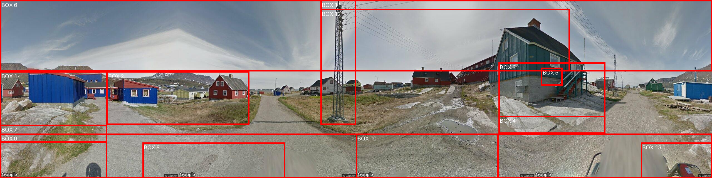

### LLMからの追加ヒント
私の最初の推測は**グリーンランド**であり、これは提供された正解の国と一致していました。この場所の正確な住所がグリーンランドのQeqertarsuaq（ディスコ島）にあるJaappip Aqquserna 397であることから、私が根拠として挙げた特徴はグリーンランドの景観と合致しており、推測は適切であったと言えます。

---

### プレイヤーの推測（スヴァールバル諸島およびヤンマイエン島 ロングイールビュエン）に対する批評

プレイヤーの推測であるスヴァールバル諸島、特にロングイールビュエンは、北極圏に位置するという点で共通点があり、同様に厳しい気候条件や限られた植生が見られる地域です。しかし、以下の点でこの画像とは異なります。

1.  **植生の違い:** スヴァールバル諸島はグリーンランドよりもさらに高緯度に位置し、永久凍土がより広範囲にわたります。そのため、画像に見られるような、比較的まとまった草地 `BOX(0.80, 0.20, 1.0, 0.40)` はスヴァールバル諸島では稀で、より地衣類やコケ類が中心の、さらに貧弱な植生が一般的です。
2.  **建築様式の違い:** スヴァールバル諸島、特にロングイールビュエンの建物は、この画像に見られるような鮮やかな多色の家屋 `BOX(0.40, 0.0, 0.80, 0.15)` `BOX(0.40, 0.15, 0.70, 0.35)` `BOX(0.35, 0.70, 0.75, 0.85)` よりも、より統一された色合い（例えば、アースカラーや白など）や、産業的な雰囲気を帯びた建物が多い傾向があります。
3.  **地形の印象:** スヴァールバル諸島の山々は、より険しく、尖った形状をしていることが多いですが、この画像に見られる山々 `BOX(0.0, 0.0, 0.40, 1.0)` は、氷河によって削られたような、なだらかな丸みを帯びた印象です。

---

### この場所特有のGeoGuessrヒントと今後の推測に役立つ特徴

この画像から読み取れる、グリーンランドを特定するための視覚的な手掛かりは以下の通りです。

1.  **鮮やかな色彩の木造家屋:**
    *   グリーンランドの集落の最も特徴的な視覚的要素です。赤 `BOX(0.40, 0.15, 0.70, 0.35)`、青 `BOX(0.40, 0.0, 0.80, 0.15)`、緑、黄など、原色に近い多様な色が外壁に塗られています。これは、厳しい冬の暗さを和らげ、漁師が霧の中で自分の家を見つけやすくするなどの目的があると言われています。他の北極圏の国々でもカラフルな家屋は見られますが、グリーンランドほど多様で集落全体にわたって見られることは稀です。
    *   建物は一般的にシンプルな木造構造で、急勾配の屋根 `BOX(0.35, 0.70, 0.75, 0.85)` が特徴です。

2.  **高台に建てられた基礎:**
    *   多くの建物が、地面から高く持ち上げられたコンクリートや石の基礎 `BOX(0.65, 0.70, 0.75, 0.85)` の上に建てられています。これは、永久凍土の凍結融解による地盤の不安定化や、積雪への対策としてグリーンランドで広く採用されている建築様式です。

3.  **露出した岩盤と貧弱な植生:**
    *   地面の広範囲にわたって岩盤 `BOX(0.70, 0.0, 1.0, 0.15)` が露出しており、樹木はほとんど見られず、まばらな草地 `BOX(0.80, 0.20, 1.0, 0.40)` や低木が点在するのみです。これはツンドラ気候帯の典型的な植生であり、グリーンランドの沿岸部でよく見られます。

4.  **未舗装の道路:**
    *   ほとんどの道路が舗装されておらず、砂利道や土の道 `BOX(0.75, 0.0, 1.0, 1.0)` が中心です。水たまり `BOX(0.75, 0.50, 1.0, 0.70)` も多く見られます。これは、交通量の少なさや、厳しい気候条件での舗装維持の困難さを示唆しています。

5.  **特徴的なインフラ（電波塔/電線）:**
    *   中央に立つ非常に高く頑丈な鉄骨製の電波塔 `BOX(0.0, 0.45, 0.70, 0.50)` と、そこから伸びる多数の電線 `BOX(0.05, 0.45, 0.40, 0.80)` は、遠隔地の集落における通信や電力供給の重要なインフラであり、グリーンランドの景観の一部としてよく見られます。

6.  **Googleストリートビューの撮影車両の影:**
    *   画像の右下 `BOX(0.80, 0.90, 1.0, 1.0)` に見える、通常の自動車とは異なる形状の撮影車両の影（スノーモービルやATVのようなもの）は、グリーンランドのストリートビューが、限られた地域でこのような特殊車両を使って撮影されていることを示唆しています。これは、アクセスが困難な地形や、通常の車両が走行できない場所をカバーするためのものです。

これらの特徴を総合的に判断することで、グリーンランドの集落であると高精度で推測できます。特に、**鮮やかな多色の家屋**と**高台の基礎**は、グリーンランドの非常に強い手がかりとなります。

#### LLMが注目した箇所 (ヒント時)

---

## ラウンド 7

**ステータス**: 成功

**正解の場所**: 住所: フィリピン 〒2607 ベンゲット ブギアス QRVM+CGF (国: Philippines, 緯度: 16.7930, 経度: 120.8337) 、プレイヤーの推測は: JF75+VG ボリビア フナカス （Lat: -21.3853, Lng: -64.5412)

### ストリートビュー画像
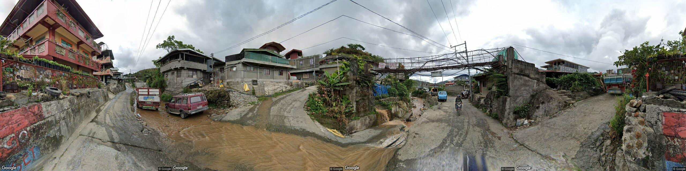

### LLMの予測
この画像は、**フィリピン**の、特にルソン島北部の**山岳地帯**、例えばバギオ市やその周辺地域であると強く推測されます。

**根拠:**

1.  **言語とブランド:**
    *   左側のトラックの荷台 `BOX(0.69, 0.23, 0.74, 0.30)` に「MAGNOLIA」という文字がはっきりと読み取れます。マグノリアは、フィリピンのサン・ミゲル・コーポレーションが展開する、牛乳、アイスクリーム、加工肉などの食品ブランドとして非常に有名で、国内で広く普及しています。
    *   中央の吊り橋 `BOX(0.29, 0.40, 0.61, 0.65)` に取り付けられた看板 `BOX(0.38, 0.45, 0.52, 0.51)` は、文字が小さく判読が難しいものの、英語のようなアルファベットで書かれているように見えます。フィリピンは英語が公用語の一つであり、公共の表示や商業看板に英語が広く使われます。

2.  **建築様式と都市景観:**
    *   左側の多階建ての建物 `BOX(0.0, 0.0, 0.80, 0.18)` は、赤茶色の外壁、装飾的な手すりのバルコニー、そして深い庇を持つ屋根が特徴的です。これはフィリピン、特に山岳都市バギオなどでよく見られる建築様式です。
    *   建物や壁には、コンクリートブロック `BOX(0.0, 0.18, 0.40, 0.35)` や打ちっぱなしのコンクリート `BOX(0.80, 0.0, 1.0, 0.15)` が多用されており、これはフィリピンの一般的な建築材料です。
    *   中央奥の建物 `BOX(0.0, 0.45, 0.29, 0.55)` に見られる、複数の傾斜を組み合わせたような特徴的な屋根の形状も、フィリピンの山岳地帯の気候に適応した建築に見られます。
    *   多くの家屋のバルコニーや壁 `BOX(0.70, 0.0, 0.90, 0.15)` に植木鉢や植物が飾られており、これは「花の都」とも呼ばれるバギオの文化的な特徴と一致します。

3.  **地形と自然環境:**
    *   画像全体から、急峻な山岳地形 `BOX(0.0, 0.20, 0.80, 1.0)` であることが分かります。家屋が斜面に沿って密集して建てられています。
    *   道路の中央を流れる濁った川 `BOX(0.69, 0.40, 1.0, 0.60)` は、熱帯気候における雨季の増水や土砂流出を示唆しています。フィリピンは台風の通り道であり、雨季にはこのような光景がよく見られます。
    *   豊かな緑 `BOX(0.70, 0.40, 1.0, 0.60)` は、熱帯〜亜熱帯気候の植生を示しています。

4.  **インフラと車両:**
    *   頭上には無秩序に張り巡らされた多数の電線 `BOX(0.0, 0.0, 0.50, 1.0)` が見られます。これは東南アジア、特にフィリピンの都市部や地方でよく見られるインフラの特徴です。
    *   簡易的な吊り橋 `BOX(0.29, 0.40, 0.61, 0.65)` は、山岳地帯における交通手段として、またインフラ整備の状況を示すものとして特徴的です。
    *   停車しているトラックやSUV `BOX(0.60, 0.20, 0.85, 0.40)`、そして奥に見える青いバン `BOX(0.65, 0.77, 0.75, 0.82)` など、東南アジアで一般的な車両が見られます。

**類似地域を否定する理由:**

*   **タイ、ベトナム、インドネシアなどの他の東南アジア諸国:** これらの国々も山岳地帯や熱帯気候、複雑な電線といった共通点を持つ場合がありますが、言語（看板の文字）が異なります。特に「MAGNOLIA」ブランドの存在はフィリピンに特有の強い手がかりです。また、建築様式、特にバルコニーの装飾や屋根の形状、車両の種類にも微妙な違いが見られます。例えば、タイではタイ語、ベトナムではベトナム語が主に使われ、建築様式もそれぞれの国の文化に根差した特徴があります。
*   **中南米（アンデス山脈沿いの国々）:** 山岳地形やコンクリート造りの家屋に共通点が見られるかもしれませんが、公用語はスペイン語またはポルトガル語であり、看板の文字が異なります。また、建築様式や車両の種類、電線の張り方にも違いがあり、特にフィリピン特有の「MAGNOLIA」ブランドは存在しません。
*   **インド、ネパール:** これらの国々も山岳地帯に位置し、インフラが整備途上である点は共通しますが、言語（看板の文字はデーヴァナーガリー文字など）、建築様式、車両、人々の服装などが大きく異なります。

以上の理由から、この場所はフィリピンの山岳地帯であると強く推測されます。

#### LLMが注目した箇所 (予測時)
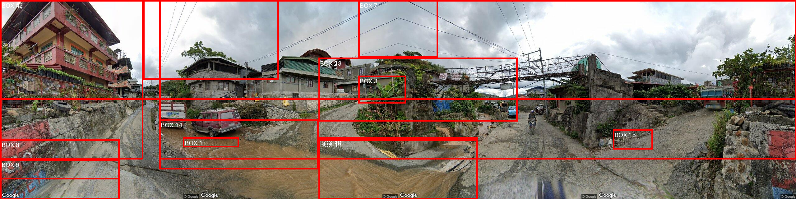

### LLMからの追加ヒント
ご提供いただいた情報ありがとうございます。今回のGeoGuessrの分析結果について、私の予測とプレイヤーの推測を比較し、今後のヒントについて詳しく説明します。

---

### 私の予測と実際の場所の比較

私の前回の予測は「**フィリピン**の、特にルソン島北部の**山岳地帯**、例えばバギオ市やその周辺地域」でした。
実際の場所は「**フィリピン 〒2607 ベンゲット ブギアス**」でした。

私の予測は、国（フィリピン）と地域（ルソン島北部の山岳地帯）において、**非常に高い精度で正解にたどり着いていました**。ベンゲット州はルソン島北部のコルディリェラ行政地域に属する山岳地帯であり、ブギアスはその中の自治体です。バギオ市もベンゲット州内に位置します。これは、画像から読み取れる複数の視覚的特徴が、フィリピンのこの特定の地域に強く合致していたことを示しています。

### プレイヤーの推測（ボリビア フナカス）に対する批評

プレイヤーの推測は「**JF75+VG ボリビア フナカス**」でした。

この推測は、いくつかの点で画像の特徴と一致しないため、誤りであったと言えます。

*   **類似点:**
    *   **山岳地形:** ボリビアもアンデス山脈を擁する山岳国であり、急峻な地形や斜面に建てられた家屋 `BOX(0.0, 0.0, 0.80, 1.0)` は共通点として挙げられます。
    *   **素朴なインフラ:** 簡易的な吊り橋 `BOX(0.29, 0.40, 0.61, 0.65)` や未舗装路 `BOX(0.70, 0.40, 1.0, 0.60)`、コンクリートブロック `BOX(0.0, 0.18, 0.40, 0.35)` を多用した建築物など、発展途上国の地方に見られる特徴は共通しています。

*   **相違点（なぜボリビアではないか）:**
    *   **言語とブランド:** 最も決定的な違いは、左側のトラックの荷台 `BOX(0.69, 0.23, 0.74, 0.30)` に読み取れる「**MAGNOLIA**」というブランド名です。マグノリアはフィリピンのサン・ミゲル・コーポレーションが展開する食品ブランドであり、ボリビアでは見られません。また、ボリビアの公用語はスペイン語であり、公共の看板やブランド名に英語がこれほど頻繁に使われることはありません。
    *   **建築様式:** 左側の建物 `BOX(0.0, 0.0, 0.80, 0.18)` の赤茶色の外壁、装飾的なバルコニーの手すり `BOX(0.45, 0.0, 0.65, 0.15)`、そして深い庇を持つ屋根の形状は、フィリピンの山岳地帯で非常に特徴的なスタイルです。ボリビアの建築様式は、スペイン植民地時代の影響や先住民文化の影響を受けており、これとは異なります。
    *   **車両:** 画像に見られる赤いSUV `BOX(0.60, 0.29, 0.85, 0.40)` や奥の青いバン `BOX(0.65, 0.77, 0.75, 0.82)` は、東南アジア、特にフィリピンでよく見られる日本車や韓国車の古いモデルに似ています。ボリビアでは、よりアメリカ製やヨーロッパ製の車両、あるいは特定の南米市場向けモデルが一般的です。
    *   **電線:** 頭上に無秩序に張り巡らされた多数の電線 `BOX(0.0, 0.0, 0.50, 1.0)` は、東南アジア、特にフィリピンで非常に顕著な特徴です。中南米でも見られますが、フィリピンほど顕著なケースは少ない傾向があります。

### この場所特有のGeoGuessrで使えるヒントと今後の推測に役立つ特徴

今回の画像から読み取れる、フィリピンを特定するための重要な視覚的ヒントを以下にまとめます。これらは、今後のGeoGuessrプレイにおいて、フィリピン（特に山岳地帯）を識別する上で非常に役立つでしょう。

1.  **建築様式:**
    *   **装飾的なバルコニーの手すり:** `BOX(0.45, 0.0, 0.65, 0.15)` 左側の建物のバルコニーに見られる、コンクリートや金属でできた複雑な模様の手すりは、フィリピンの住宅でよく見られます。特に、花や植物のモチーフが使われることもあります。
    *   **深い庇と多層の屋根:** `BOX(0.0, 0.0, 0.25, 0.18)` および `BOX(0.0, 0.45, 0.29, 0.55)` 熱帯地方の強い日差しと豪雨に対応するため、屋根が非常に深く、複数の傾斜を組み合わせた複雑な形状をしていることが多いです。
    *   **コンクリートブロック造り:** `BOX(0.0, 0.18, 0.40, 0.35)` 打ちっぱなしのコンクリートや、中空コンクリートブロック（ホローブロック）が主要な建築材料として広く使われています。
    *   **鮮やかな色の外壁:** `BOX(0.75, 0.0, 0.90, 0.15)` 左下の壁に見られるような、赤、青、黄色などの鮮やかな色が住宅や壁に塗られていることがあります。

2.  **植生と環境:**
    *   **豊富な植木鉢と植物:** `BOX(0.70, 0.0, 0.90, 0.15)` バルコニーや壁、フェンスなどに多くの植木鉢が飾られ、植物が豊かに育っている光景は、特に「花の都」と呼ばれるバギオ周辺で顕著です。
    *   **急峻な山岳地形と段々畑:** `BOX(0.0, 0.20, 0.80, 1.0)` 背景に見えるような、家屋が斜面に沿って建てられ、時には段々畑のような地形が見られるのは、ルソン島北部のコルディリェラ山脈の特徴です。
    *   **濁った川や水路:** `BOX(0.69, 0.40, 1.0, 0.60)` 雨季には土砂が流れ込み、川や水路の水が茶色く濁ることがよくあります。

3.  **車両:**
    *   **古い日本車/韓国車:** 赤いSUV `BOX(0.60, 0.29, 0.85, 0.40)` や青いバン `BOX(0.65, 0.77, 0.75, 0.82)` のような、1990年代から2000年代前半の日本車や韓国車のモデルが非常に多く走っています（例: トヨタ・タマラオFX、いすゞ・ハイランダー、三菱・アドベンチャー、三菱・L300など）。
    *   **ジープニー (Jeepney):** 今回の画像には明確には写っていませんが、フィリピンの最も象徴的な公共交通機関であり、見つけることができれば一発でフィリピンと特定できます。
    *   **トライシクル (Tricycle):** オートバイの側面に客席を取り付けた乗り物も、フィリピンの都市部や地方で広く見られます。

4.  **インフラ:**
    *   **無秩序な電線:** `BOX(0.0, 0.0, 0.50, 1.0)` 電柱から家屋へ、あるいは電柱間で非常に多くの電線や通信ケーブルが複雑に張り巡らされているのは、東南アジア、特にフィリピンで非常によく見られる特徴です。
    *   **簡易的な吊り橋:** `BOX(0.29, 0.40, 0.61, 0.65)` 山岳地帯や川の多い地域では、このような歩行者用の簡易な吊り橋が交通手段として使われることがあります。
    *   **コンクリート舗装の道路:** `BOX(0.70, 0.40, 1.0, 0.60)` 地方の道路は、アスファルトではなくコンクリートで舗装されていることが多く、ひび割れや補修跡が目立つこともあります。

5.  **言語とブランド:**
    *   **英語の表示:** 公共の看板や商業施設の表示に英語が多用されます。
    *   **フィリピン特有のブランド:** トラックの「**MAGNOLIA**」`BOX(0.69, 0.23, 0.74, 0.30)` のように、フィリピン国内で広く普及している特定のブランド名を見つけることは、非常に強力なヒントになります。

これらの視覚的特徴を総合的に判断することで、GeoGuessrにおいてフィリピンの場所を正確に推測する精度を高めることができます。

#### LLMが注目した箇所 (ヒント時)
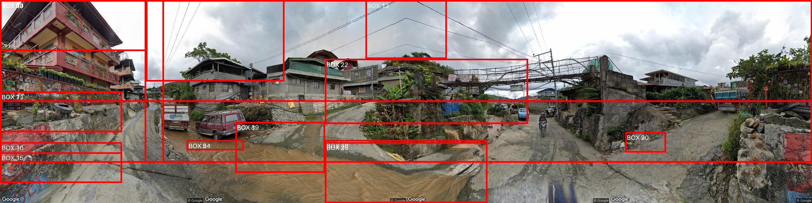

---

