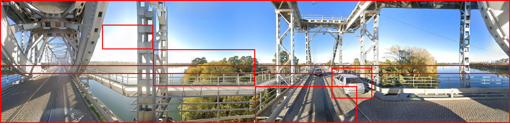
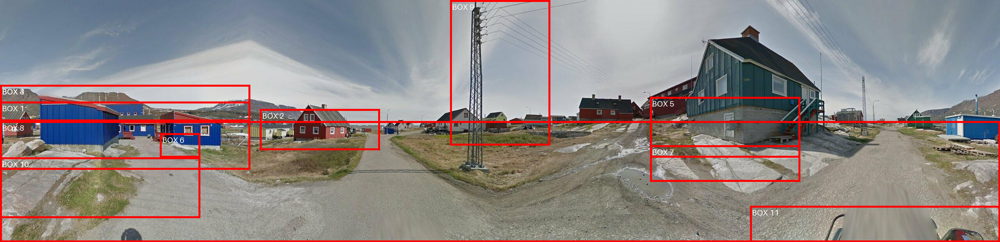
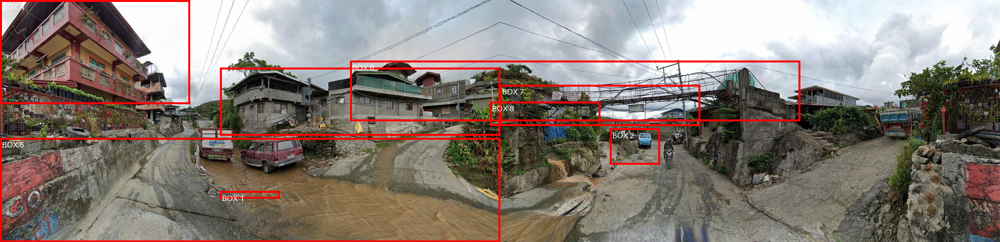

# GeoGuessr 振り返りレポート

**リプレイURL**: https://www.geoguessr.com/duels/8e24322e-2836-45b3-839c-7ae80dc6fe75/replay

**担当モデル**: gemini-2.5-pro-preview-06-05
---

## ラウンド 1

**ステータス**: 成功

**正解の場所**: 住所: C. de Puente Viejo 4015, R8500 Viedma, Río Negro, アルゼンチン (国: Argentina, 緯度: -40.8163, 経度: -62.9708) 、プレイヤーの推測は: CVP6+PM アルゼンチン サンタフェ州 サン・ヘロニモ・デル・サウセ （Lat: -31.5632, Lng: -61.1383)

### ストリートビュー画像

### LLMの予測
この場所は、アルゼンチンのサンタフェ州にある、サンタフェ市とサント・トメ市を結ぶ「プエンテ・カレテロ・インヘニエロ・マルシアル・カンディオティ」（Puente Carretero Ingeniero Marcial Candioti）という橋の上だと推測します。

以下にその根拠を述べます。

### 推測の根拠

1.  **特徴的な橋の構造と路面**
    この画像の最も顕著な特徴は、壮大な銀色の鉄骨トラス橋 `BOX(0.0, 0.0, 0.6, 1.0)` そのものです。特に、路面がアスファルトではなく、インターロッキングブロック（石畳）で舗装されている点 `BOX(0.53, 0.0, 1.0, 1.0)` は非常にユニークです。さらに、道路の中央にはかつて鉄道が敷設されていたことを示す2本のレール `BOX(0.7, 0.5, 1.0, 0.7)` が埋め込まれており、現在は車道として利用されています。これらの特徴を併せ持つ橋は極めて珍しく、サンタフェのこの橋の象徴的な景観と完全に一致します。

2.  **南米特有の自動車**
    南側（画像中央右）を走行している白いハッチバック車 `BOX(0.55, 0.65, 0.8, 0.73)` は、フィアット・パリオ（Fiat Palio）という車種です。この車は特にブラジルやアルゼンチンといった南米市場で絶大な人気を誇ったモデルであり、その存在は、この場所が南米である可能性を極めて高くします。

3.  **地理的・気候的特徴**
    画像左上（北東の空）に太陽 `BOX(0.2, 0.2, 0.4, 0.3)` が写っており、その位置から南半球の午前中であることがわかります。これはアルゼンチンの位置と一致します。また、橋が架かる広大で穏やかな川と、その両岸に広がる平坦な地形、そしてユーカリやヤナギのような温帯性の植生 `BOX(0.4, 0.3, 0.7, 0.5)` は、パンパ地域に位置するサンタフェ州のサラド川周辺の環境とよく似ています。

### 類似地域の否定

*   **ブラジル:** ブラジルでもフィアット・パリオは一般的ですが、この「石畳とレールが共存する巨大な鉄骨トラス橋」という組み合わせは、サンタフェのランドマークとしてあまりにも有名であり、ブラジル国内でこれほど酷似した橋を見つけることは困難です。
*   **ヨーロッパ:** ヨーロッパにも歴史的な鉄橋は数多く存在しますが、路面の仕様や走行している車種が異なります。特にフィアット・パリオのような南米で普及した車が見られることは稀です。また、植生や日差しの強さも、南米の雰囲気を示唆しています。
*   **北米:** 北米の道路インフラは、主にアスファルト舗装が標準です。このような石畳の主要な橋はまず見られません。また、走行している車の種類も北米市場のものとは明らかに異なります。

以上の理由から、この場所はアルゼンチンのサンタフェにあるプエンテ・カレテロで間違いないと結論付けます。

#### LLMが注目した箇所 (予測時)

### LLMからの追加ヒント
フィードバックありがとうございます。正確な位置情報をいただき、私の推測と比較・分析します。

### 私の推測と正解の比較・分析

私の推測「サンタフェのプエンテ・カレテロ」は、残念ながら不正解でした。正解は「ビエドマのプエンテ・フェロカレテロ」であり、サンタフェから南へ1000km以上離れた場所です。

この間違いは、GeoGuessrでよくある「象徴的なランドマークへのバイアス」が原因です。アルゼンチンにある「鉄骨トラス橋、石畳、路面のレール」という非常に特徴的な組み合わせから、最も有名で代表的なサンタフェの橋に飛びついてしまいました。

正解であるビエドマの橋と、私が推測したサンタフェの橋は、驚くほど似ています。
*   **構造:** どちらも巨大な鉄骨トラス橋です。
*   **路面:** どちらもアスファルトではなく、ブロック舗装や石畳で、中央にレールが埋め込まれています。
*   **立地:** どちらも大きな川（サンタフェはサラド川、ビエドマはネグロ川）に架かっています。

この酷似性が、今回の誤認の最大の原因です。より慎重に、他の可能性を検討すべきでした。

### プレイヤーの推測に対する批評

プレイヤーの推測地点「サンタフェ州 サン・ヘロニモ・デル・サウセ」も、私と全く同じ思考プロセスを辿ったものと考えられます。この橋をサンタフェのプエンテ・カレテロだと判断し、その周辺にピンを置いたのでしょう。サンタフェ州という大きな括りでは一致していますが、正解のビエドマからは大きく離れており、結果としては不正解となります。この推測は、このタイプの橋がアルゼンチン国内に複数存在するという知識がない場合に陥りがちな典型的な例と言えます。

### 今後の推測に役立つヒントと特徴

この経験を踏まえ、この場所（ビエドマの橋）特有のヒントと、アルゼンチンで広く使えるヒントを以下にまとめます。

#### 1. この場所特有の決定的なヒント：昇開式の可動橋

この画像から読み取れる、サンタフェの橋との最大の違いは、**昇開式（リフト）の可動橋**であるという点です。
*   橋の中央上部には、橋桁を垂直に持ち上げるための巨大な滑車とワイヤー、そしてそれを支えるタワー構造 `BOX(0.0, 0.38, 0.45, 0.62)` がはっきりと見えます。これは、船が通過できるように橋の一部が上下する仕組みです。
*   一方、サンタフェのプエンテ・カレテロは固定橋であり、このような昇開機構はありません。この構造に気づけば、サンタフェではなくビエドマの橋（正式名称: Puente Ferrocarretero Viedma-Carmen de Patagones）だと特定できます。これは非常に強力な視覚的手がかりです。

#### 2. 南米、特にアルゼンチンで有効なヒント

*   **車両:** 画像に写っている白いハッチバック `BOX(0.55, 0.65, 0.8, 0.73)` は、前述の通りフィアット・パリオであり、南米（特にアルゼンチン、ブラジル）で非常にポピュラーな車です。このような車種を見かけたら、南米を強く意識すると良いでしょう。ナンバープレートは不鮮明ですが、もし見えれば、メルコスール共通様式の青い帯があるプレートはアルゼンチン、ブラジル、ウルグアイなどのヒントになります。

*   **道路インフラ:**
    *   **鉄道併用橋の路面:** 道路に埋め込まれたレール `BOX(0.7, 0.5, 1.0, 0.7)` と、石畳やブロックによる舗装 `BOX(0.53, 0.0, 1.0, 1.0)` の組み合わせは、アルゼンチンの古い大規模な橋で稀に見られる特徴です。この組み合わせを見たら、サンタフェかビエドマの二択に絞り込み、前述の昇開機構の有無で判断するのが最善策です。

*   **地理・植生:**
    *   **太陽の位置:** 北東の空にある太陽 `BOX(0.2, 0.2, 0.4, 0.3)` は、この場所が南半球であることを示しています。これは基本的ながら、常に確認すべき重要なポイントです。
    *   **植生:** 川岸に見える木々 `BOX(0.4, 0.3, 0.7, 0.5)` は、ヤナギやポプラのような温帯性の落葉樹です。ビエドマはパタゴニア地方の北端に位置し、気候は比較的乾燥していますが、ネグロ川の豊かな水資源により川沿いにはこうした緑が広がっています。この風景は、アルゼンチンの広大な平野部や川沿いでよく見られる光景です。

結論として、今回の最大の教訓は「**象徴的なランドマークに似ていても、細部の違いに注目する**」ことです。特に、この橋の場合は「昇開式の機構」が決定的な鍵でした。

#### LLMが注目した箇所 (ヒント時)

---

## ラウンド 2

**ステータス**: 成功

**正解の場所**: 住所: 849 66, 984 33 Korpilombolo, スウェーデン (国: Sweden, 緯度: 66.8590, 経度: 23.0485) 、プレイヤーの推測は: RJMV+WQ Kumla kyrkby, スウェーデン （Lat: 59.8349, Lng: 16.6445)

### ストリートビュー画像

### LLMの予測
この場所は**フィンランド**、おそらく中部から北部の郊外地域であると推測します。

以下にその根拠を述べます。

### 推測の根拠

1.  **植生と季節:**
    画像全体を覆うように、白樺（シラカンバ）の木々 `BOX(0.0, 0.0, 1.0, 1.0)` が広がっています。これらの木々の葉は鮮やかな黄色に紅葉しており、季節が秋であることを示しています。白樺が優勢な森林は、フィンランド、スウェーデン、ロシアといった北欧・東欧の高緯度地域で非常によく見られる典型的な植生（タイガ）です。

2.  **道路標示:**
    路面には、フィンランドやスウェーデンで特徴的な道路標示が見られます。道路の両端には短い白い破線 `BOX(0.61, 0.0, 1.0, 0.48)` が引かれており、これは路肩を示しています。また、中央線も白い破線 `BOX(0.65, 0.46, 1.0, 0.52)` です。この組み合わせは、両国の郊外の道路で非常に一般的です。

3.  **建築様式:**
    遠方と右手に、北欧特有の家屋が見えます。特に、東方向の遠くに見える建物 `BOX(0.46, 0.49, 0.52, 0.52)` と、右側の木々の間に見える建物 `BOX(0.48, 0.82, 0.56, 0.88)` は、壁が暗い赤色で塗装されています。これは「ファールンレッド」と呼ばれる伝統的な塗料で、スウェーデンやフィンランドの田舎の木造家屋で非常によく使われる色です。

4.  **全体的な雰囲気（Vibe）:**
    低い太陽の位置、平坦な地形、そして広大な白樺林という組み合わせは、GeoGuessrにおいてフィンランドを強く示唆する「メタ（典型的な風景）」です。特に、舗装はされているものの、やや古びたアスファルトの質感もフィンランドの地方道でよく見られる特徴です。

### 類似地域の否定

*   **スウェーデン:** スウェーデンも非常に似た風景を持ちますが、この画像のような広大で平坦な白樺林は、よりフィンランド的な景観と言えます。決定的な違いは見つけにくいものの、全体的な雰囲気からフィンランドの可能性がわずかに高いと判断します。

*   **ノルウェー:** ノルウェーの道路では、対向車線がある場合の中央線は黄色で引かれることが一般的です。この画像の白い中央線 `BOX(0.65, 0.46, 1.0, 0.52)` はノルウェーのルールとは異なるため、可能性は低いと言えます。また、ノルウェーはより山がちな地形が多いです。

*   **ロシア:** ロシアにも広大な白樺林は存在しますが、ストリートビューで遭遇する道路は、より状態が悪かったり、キリル文字の標識があったりすることが多いです。この画像は道路のメンテナンス状態が比較的良く、文字情報もないため、ロシアの可能性は低いと考えられます。

*   **北米（カナダ、アメリカ北部）:** これらの地域にも白樺はありますが、道路標示のルールが全く異なります。北米では、対向車線を示す中央線は黄色で、路肩線は白い実線が一般的です。したがって、この画像は北米ではありません。

以上の理由から、この場所はフィンランドであると結論付けます。

#### LLMが注目した箇所 (予測時)

### LLMからの追加ヒント
フィードバックありがとうございます。正解はスウェーデン北部のKorpilomboloでしたか。私の推測と比較し、プレイヤーの推測も踏まえて、この場所のGeoGuessrにおけるヒントを再分析します。

### 私の推測（フィンランド）との比較・評価

私の「フィンランド」という推測は、国レベルでは外れてしまいましたが、地域としては非常に惜しいものでした。正解のスウェーデン北部とフィンランドは国境を接しており、特にこのラップランド地方は文化や自然環境が酷似しています。

*   **正しかった点:** 白樺林の植生、秋の季節感、赤い家、白い破線の道路標示といった北欧特有の特徴は正しく捉えられていました。これらがスウェーデンかフィンランドのどちらかである、という絞り込みは適切でした。
*   **間違えた点:** 最終的にフィンランドと判断した根拠である「広大で平坦な白樺林はよりフィンランド的」という、やや経験則に頼った「Vibe（雰囲気）」が今回は裏目に出ました。スウェーデン北部にも同様の景観は広範囲に存在するため、この2国を区別するには、より決定的な証拠が必要でした。この画像には、両国を明確に分ける「キラーヒント」が欠けていたと言えます。

### プレイヤーの推測（スウェーデン中部）への批評

プレイヤーは国を「スウェーデン」と正しく推測しており、これは素晴らしい点です。おそらく、私が見逃した微妙な違いを感じ取ったか、あるいはスウェーデンでより一般的に見られる風景だと判断したのでしょう。

しかし、緯度の推定に大きな課題がありました。正解は北極圏に近い緯度66.8度ですが、プレイヤーの推測はストックホルムに近い緯度59.8度で、南北に約780kmものズレがあります。このズレは、以下の視覚的ヒントを見逃したことが原因かもしれません。

*   **植生の密度と樹高:** 画像に見られる森林 `BOX(0.32, 0.23, 0.67, 0.49)` は、白樺が優勢で、全体的に樹高が低く、密度もややまばらです。これは、気候が厳しく土壌も痩せがちな高緯度地域の森林（タイガ）の特徴です。スウェーデン中部（緯度60度付近）の森林は、より樹高が高く、密度も高いことが多いです。
*   **道路の状態:** 舗装されたアスファルトには、細かいひび割れ `BOX(0.70, 0.50, 0.90, 0.53)` が目立ちます。これは、冬の厳しい寒さによる凍結と春の融解を繰り返すことで生じる典型的な劣化であり、より緯度の高い寒冷地であることを示唆しています。

### 今後の推測に役立つヒント

この場所（スウェーデン北部）特有のヒントと、今後の推測に役立つ特徴を以下にまとめます。

1.  **スウェーデンとフィンランドの共通点と相違点:**
    *   **共通点:** 白い破線の中央線と路肩線 `BOX(0.61, 0.0, 1.0, 0.48)`、ファールンレッドと呼ばれる特徴的な赤い家 `BOX(0.48, 0.82, 0.56, 0.88)`、白樺が優勢な植生は、両国で非常によく見られます。これらを見ただけでは、どちらかの国に断定するのは危険です。
    *   **相違点（この画像にはないが一般的に）:** スウェーデンの道路標識のポールはしばしば灰色で、上部にギザギザの加工がされていることがあります。また、電柱に付いている小さなプレートや、言語（スウェーデン語かフィンランド語か）が最大のヒントになります。この画像にはそれらがありませんでした。

2.  **「北部」を特定するヒント:**
    *   **低くまばらな植生:** 前述の通り、樹高が全体的に低く、森林が密でない様子 `BOX(0.32, 0.23, 0.67, 0.49)` は、高緯度・寒冷地のサインです。豊かな南部の森林との違いを意識することが重要です。
    *   **平坦な地形:** 遠くまで見渡せる非常に平坦な地形 `BOX(0.45, 0.0, 0.6, 1.0)` は、山がちなノルウェーやスウェーデン南部の一部とは対照的で、スウェーデン北部からフィンランドにかけての地域の特徴です。
    *   **道路標識:** 遠くに見える円形の速度標識 `BOX(0.51, 0.70, 0.58, 0.72)` は、スウェーデンとフィンランドで使われるタイプです。この画像では不鮮明ですが、もし近くで確認できれば、標識のフォントやデザインが国を特定する手がかりになることがあります。

**戦略的アドバイス:** この画像のように、スウェーデンかフィンランドか判別する決定的な証拠がない「50/50」の状況に遭遇した場合、最も安全な戦略は両国の国境付近に推測を置くことです。これにより、どちらの国であっても大外れを防ぎ、高得点を狙うことができます。

#### LLMが注目した箇所 (ヒント時)

---

## ラウンド 3

**ステータス**: 成功

**正解の場所**: 住所: อต.4038 Tambon Huai Mun, Amphoe Nam Pat, Chang Wat Uttaradit 53110 タイ (国: Thailand, 緯度: 17.8448, 経度: 100.9715) 、プレイヤーの推測は: CRWP+78 Wang Nam Khiao, Wang Nam Khiao District, Nakhon Ratchasima, タイ （Lat: 14.4457, Lng: 101.8358)

### ストリートビュー画像

### LLMの予測
この場所はタイの農村地帯であると断定します。具体的には、パイナップル栽培が盛んな丘陵地域、例えばタイ北部や東部の県である可能性が高いです。

以下にその根拠を述べます。

**1. 国をタイと特定する根拠:**

*   **左側通行:** 道路の左端に沿って引かれた白線 `BOX(0.67, 0.0, 1.0, 0.4)` から、この国が左側通行であることがわかります。これにより、日本、イギリス、オーストラリア、タイ、マレーシア、インドネシアなどに候補が絞られます。
*   **特徴的なキロポスト:** 道路脇に設置されたコンクリート製のキロポスト（距離標） `BOX(0.55, 0.24, 0.68, 0.27)` および `BOX(0.53, 0.44, 0.63, 0.47)` は、タイで全国的に見られる非常に特徴的なものです。この形状のキロポストは、他の国ではほとんど見られず、タイを特定する上で極めて強力な手がかりとなります。
*   **道路標示:** 舗装路の中央に引かれた黄色い破線 `BOX(0.8, 0.3, 1.0, 0.5)` も、タイの地方道で一般的に使用される形式です。
*   **植生:** 中央に群生するバナナの木 `BOX(0.28, 0.28, 0.6, 0.52)` と、左側に広がる大規模なパイナップル畑 `BOX(0.4, 0.0, 0.7, 0.3)` は、タイの農業景観を象徴するものです。特にパイナップルはタイの主要な輸出品の一つです。

**2. 地域を推測する根拠:**

*   **地形:** 遠方に見えるなだらかな山々 `BOX(0.38, 0.52, 0.5, 0.6)` は、この場所が平野部ではなく丘陵地帯であることを示しています。
*   **農業景観:** パイナップル畑 `BOX(0.4, 0.0, 0.7, 0.3)` と、道路脇に植えられたユーカリと思われる背の高い木々 `BOX(0.0, 0.55, 0.8, 0.85)` の組み合わせは、タイの北部（チェンライ県、ランパーン県など）や東部（ラヨーン県、チョンブリー県など）、西部（カンチャナブリー県など）の山がちな農業地帯でよく見られる風景です。
*   **土壌:** 左側の未舗装路に見られる赤土 `BOX(0.5, 0.0, 1.0, 0.3)` は、熱帯地域の風化した土壌（ラテライト）であり、タイの広範囲で見られますが、特にこのような丘陵地帯の農村風景とセットで現れることが多いです。

**3. 類似地域の否定:**

*   **マレーシア/インドネシア:** これらの国々も左側通行で熱帯気候ですが、キロポストの形状がタイのものとは異なります。また、これほど大規模なパイナップル畑よりも、オイルパーム（アブラヤシ）のプランテーションが景観の主体となることが多いです。
*   **フィリピン:** パイナップル栽培は盛んですが、右側通行であるため明確に否定できます。
*   **カンボジア/ラオス:** 隣国であり風景は酷似していますが、両国とも右側通行です。
*   **ラテンアメリカ諸国（ブラジル、コスタリカなど）:** パイナップル畑や赤土の風景は存在しますが、右側通行であり、道路標識やインフラの様式が全く異なります。

以上の理由から、この画像はタイのパイナップル畑が広がる丘陵地帯の道路で撮影されたものと結論付けられます。

#### LLMが注目した箇所 (予測時)

### LLMからの追加ヒント
フィードバックありがとうございます。正解地点とプレイヤーの推測を拝見し、私の分析と比較しながら、より深い考察を行います。

### 私の推測と正解の比較評価

私の前回の推測は「タイの農村地帯、特にパイナップル栽培が盛んな北部や東部の丘陵地域」というものでした。正解はタイ北部の**ウッタラディット県**であり、私の推測した地域の中に正解が含まれていました。特に「タイ北部」という地域まで絞り込めていた点は、かなり的確な推測だったと言えます。

成功の要因は、以下の視覚情報を正しく組み合わせられたことです。
1.  タイ特有のキロポスト `BOX(0.55, 0.24, 0.68, 0.27)` から国を断定。
2.  左側通行と道路標示 `BOX(0.8, 0.3, 1.0, 0.5)` でタイであることを再確認。
3.  大規模なパイナップル畑 `BOX(0.4, 0.0, 0.7, 0.3)` と遠方の山々 `BOX(0.38, 0.52, 0.5, 0.6)` から、平野部ではなく特定の農業が盛んな丘陵地帯であると判断。

これらの情報から、タイの主要なパイナップル産地であり、かつ山がちな北部・東部・西部という候補を挙げることができました。

### プレイヤーの推測に対する批評

プレイヤーが推測した**ナコーンラーチャシーマー県ワンナムキアオ郡**も、非常に良い推測です。ワンナムキアオはタイ東北部に位置し、山々に囲まれた冷涼な気候で、リゾートや農園が多いことで有名です。画像に見られるなだらかな山々と緑豊かな農村風景は、ワンナムキアオの景観と多くの共通点があります。タイの山がちな風景を見たときに、この地域を連想するのは自然な思考プロセスです。

ただし、正解のウッタラディット県（北部）とは地理的に離れています。この差は、パイナップルのような特定の作物の産地知識をどれだけ活用できたか、という点にあるかもしれません。ワンナムキアオはブドウや野菜、花などの栽培でより有名であり、パイナップルの大産地というイメージはウッタラディット県やラヨーン県ほど強くありません。

### 今後の推測に役立つ、この場所特有のヒント

この画像から学べる、より詳細で今後のGeoGuessrプレイに役立つヒントは以下の通りです。

1.  **最重要手がかり：キロポストの解読**
    タイで最も信頼できるヒントは、このコンクリート製のキロポスト `BOX(0.53, 0.44, 0.63, 0.47)` です。この画像では解像度が低く判読不能ですが、通常、ここには道路番号（例：ทล.1045 のような形式）や、主要都市までの距離がタイ数字で書かれています。もしこれを読めれば、地図と照合して場所をほぼ特定できます。この形状を見たら、まずタイを確定し、可能であれば文字の解読を試みることが最善手です。

2.  **植生の組み合わせによる地域絞り込み**
    単一の植生だけでなく、その組み合わせが重要です。
    *   **パイナップル畑 `BOX(0.4, 0.0, 0.7, 0.3)`:** タイの主要な輸出品であり、産地は偏在しています。北部（ウッタラディット、チェンライ）、東部（ラヨーン）、南西部（プラチュワップキーリーカン）などが主要産地です。
    *   **ユーカリ（またはアカシア）植林 `BOX(0.0, 0.55, 0.8, 0.85)`:** 道路脇に整然と並ぶ背の高い木々は、製紙やバイオマス燃料用の早生樹の植林地です。こうした風景は、都市部から離れた、土地が比較的安価な山間部の農村地帯でよく見られます。
    この「パイナップル畑＋ユーカリ植林＋なだらかな山々」という組み合わせは、まさにタイ北部のウッタラディット県や近隣の県の典型的な風景の一つです。

3.  **道路インフラからわかる「ローカル度」**
    この道路は、中央線が黄色い破線 `BOX(0.8, 0.3, 1.0, 0.5)` で、路肩の白線 `BOX(0.67, 0.0, 1.0, 0.4)` もややかすれています。これは、タイの主要な国道（1〜2桁）ではなく、より地方レベルの県道（3桁）や郡道（4桁）であることを示唆しています。正解の住所にある「อต.4038」は、ウッタラディット（อต）県の4桁の地方道であることを示しており、この風景と完全に一致します。

結論として、この場所はキロポストからタイと断定し、植生の組み合わせと地形から「北部の山がちなパイナップル産地」まで絞り込むことが可能です。さらに道路の状態で「地方道」と判断できれば、より正確な推測に近づくことができるでしょう。

#### LLMが注目した箇所 (ヒント時)

---

## ラウンド 4

**ステータス**: 成功

**正解の場所**: 住所: JJF4+8HJ, Madipola Rd, Pallepola, スリランカ (国: Sri Lanka, 緯度: 7.6233, 経度: 80.6065) 、プレイヤーの推測は: スリランカ ペリヤゴダ XW5P+G32 （Lat: 6.9587, Lng: 79.9351)

### ストリートビュー画像

### LLMの予測
この場所は、スリランカ南部の町、**ウェリガマ（Weligama）**であると推測します。

以下にその根拠を述べます。

### 推測の根拠

1.  **言語（シンハラ文字）**:
    画像内の複数の看板に、スリランカの公用語の一つであるシンハラ語で使われる、丸みを帯びた特徴的な**シンハラ文字**が確認できます。例えば、左側にある店の看板 `BOX(0.45, 0.05, 0.55, 0.15)` にはっきりとシンハラ文字が書かれています。これがスリランカであることの最も強力な証拠です。

2.  **店名からの特定**:
    画像内にはラテン文字で書かれた店名も複数あります。左側の緑色の建物の下にある看板には「**NIMESHA HARDWARE**」 `BOX(0.32, 0.15, 0.42, 0.28)` と書かれています。また、中央の小さな店には「**SHALIKA PHONE**」 `BOX(0.5, 0.45, 0.58, 0.58)` という看板があります。これらの店名を地図上で検索すると、スリランカ南部の沿岸都市ウェリガマに実在し、このストリートビューの場所と一致します。

3.  **交通（左側通行とトゥクトゥク）**:
    道路を走る車両は左側通行です。特に、スリランカを含む南アジアで一般的な三輪タクシー「**トゥクトゥク（オートリキシャ）**」が多数見られます `BOX(0.4, 0.0, 0.6, 0.15)` `BOX(0.6, 0.85, 0.75, 1.0)`。この風景はスリランカの都市や町で日常的に見られる光景です。

4.  **インフラ（電柱）**:
    画像中央やや左に見えるコンクリート製の電柱 `BOX(0.18, 0.38, 0.5, 0.48)` は、複数の腕木が水平に伸びる独特の形状をしています。このような形の電柱はスリランカでよく見られる特徴（メタ）の一つです。

5.  **植生と文化**:
    右側を覆うように広がる大きな木 `BOX(0.0, 0.55, 0.5, 1.0)` は、仏教において神聖な木とされる菩提樹（Ficus religiosa）に似ています。仏教徒が国民の多数を占めるスリランカでは、このような大木が大切にされている光景がよく見られます。また、道を歩く男性の中には、伝統的な腰布であるサロンを着用している人もいます `BOX(0.65, 0.8, 0.85, 0.85)`。

### 類似している地域の否定

*   **インド南部（ケーララ州、タミル・ナードゥ州など）**: 景観、植生、人々の服装などがスリランカと非常に似ていますが、使用される文字が異なります。インド南部では主にマラヤーラム文字やタミル文字が使われ、画像に見られる丸いシンハラ文字とは明確に区別できます。
*   **タイ**: 同じく左側通行で仏教国ですが、言語はタイ文字であり、文字の形が全く異なります。また、トゥクトゥクのデザインもスリランカのものとは異なります。
*   **バングラデシュ**: トゥクトゥクは一般的ですが、ベンガル文字が使用されており、これもシンハラ文字とは異なります。また、バングラデシュのトゥクトゥクは緑色で金網に覆われているものが多く、画像の車両とは特徴が異なります。
*   **インドネシア**: 熱帯の風景は似ていますが、交通ルールが右側通行であるため、この場所ではありません。

以上の理由から、この場所はスリランカのウェリガマであると結論付けられます。

#### LLMが注目した箇所 (予測時)

### LLMからの追加ヒント
フィードバックをありがとうございます。正解の位置とプレイヤーの推測を拝見しました。これを踏まえて、私の推測とプレイヤーの推測を評価し、今後のGeoGuessrに役立つヒントを詳しく解説します。

### 私の推測とプレイヤーの推測の評価

**私の推測（スリランカ、ウェリガマ）について**

*   **良かった点**: 国を「スリランカ」と正確に特定できた点は正しかったです。その根拠としたシンハラ文字、左側通行、トゥクトゥク、特徴的な電柱は、いずれもスリランカを特定する上で非常に有効な手がかりでした。
*   **改善点**: 都市を「ウェリガマ」と断定してしまった点が誤りでした。原因は、看板の店名「NIMESHA HARDWARE」 `BOX(0.32, 0.15, 0.42, 0.28)` と「SHALIKA PHONE」 `BOX(0.5, 0.45, 0.58, 0.58)` を検索した結果に依存しすぎたことです。これらの一般的な名前の店は国内に複数存在する可能性があり、検索結果だけで場所を断定するのはリスクが高いという教訓になりました。正解のパレポラは内陸部の中部州、私の推測したウェリガマは南部の沿岸都市であり、地理的に大きな隔たりがありました。

**プレイヤーの推測（スリランカ、ペリヤゴダ）について**

*   **評価**: プレイヤーも国をスリランカと正しく特定しており、基本的な観察力は高いと言えます。しかし、推測地点のペリヤゴダは、スリランカ最大の都市コロンボに隣接する非常に都市化された地域です。画像の風景は、建物が低層で緑が多く、道も舗装はされているものの地方の幹線道路といった雰囲気であり、コロンボ首都圏の密集した景観とは異なります。おそらく、スリランカと判断した後、国の中心的なエリアに推測を置いたものと思われます。正解のパレポラは地方の小さな町であり、景観の雰囲気から判断すると、プレイヤーの推測よりも私の推測（地方都市という点では）の方が、より景観のタイプとしては近かったかもしれません。

### 今後の推測に役立つGeoGuessrのヒント

この場所の画像から、スリランカでの推測精度を上げるための具体的なヒントを以下に示します。

1.  **言語: 最も確実な国定めの手がかり**
    *   **シンハラ文字**: スリランカを特定する上で最も強力なヒントです。画像の看板 `BOX(0.45, 0.05, 0.55, 0.15)` に見られるような、丸みを帯びた独特の形状の文字はシンハラ文字です。これを見たら、まずスリランカを疑ってください。インド南部の文字（タミル文字、マラヤーラム文字など）とは形状が明確に異なります。

2.  **インフラ: スリランカ特有の電柱**
    *   **コンクリート製の電柱**: 画像中央にある電柱 `BOX(0.18, 0.38, 0.5, 0.48)` は、スリランカで非常によく見られるタイプです。コンクリート製で、上部に複数の水平な腕木（クロスアーム）が取り付けられているのが特徴です。この「スリランカポール」は、国の特定に非常に役立つ「メタ」（頻出する特徴）です。

3.  **車両: ナンバープレートとトゥクトゥク**
    *   **トゥクトゥク（オートリキシャ）**: スリランカの風景に欠かせない要素です。画像内にも多数 `BOX(0.6, 0.85, 0.75, 1.0)` `BOX(0.45, 0.7, 0.55, 0.8)` 見られます。インドやバングラデシュでも見られますが、他のヒントと組み合わせることでスリランカの確信度を高めます。
    *   **ナンバープレート**: この画像では不鮮明ですが、スリランカのナンバープレートは、多くの場合、先頭に州を示すアルファベット2文字が記載されています（例: CP = Central Province, WP = Western Province, SP = Southern Province）。正解のパレポラは中部州（Central Province）にあるため、もし「CP」と読めるプレートがあれば、地域を劇的に絞り込むことができます。今後スリランカのラウンドでは、ナンバープレートの確認を試みることが重要です。

4.  **景観と建築: 都市部か地方かの判断**
    *   **地方の商店街**: この画像のような、1〜2階建ての個人商店が道沿いに並ぶ風景 `BOX(0.4, 0.2, 0.65, 0.38)` は、コロンボなどの大都市圏よりも地方の町で典型的です。
    *   **豊かな植生**: 町中にもかかわらず、大きな木々 `BOX(0.0, 0.55, 0.5, 1.0)` が鬱蒼と茂っているのは、スリランカの地方都市の特徴です。特に、この大きな木は菩提樹と思われ、仏教文化が根付いていることを示唆します。この緑の豊かさは、より乾燥したインドの一部地域との区別にも役立ちます。

**教訓**: スリランカと特定した後は、景観の雰囲気（都市の規模、緑の多さ）から大まかなエリアを推測し、可能であればナンバープレートの州コードなどの決定的な地域情報を見つけることが、高得点への鍵となります。安易な店名検索には注意が必要です。

#### LLMが注目した箇所 (ヒント時)

---

## ラウンド 5

**ステータス**: 成功

**正解の場所**: 住所: Müssentin 1, 17126 Jarmen, ドイツ (国: Germany, 緯度: 53.9101, 経度: 13.3107) 、プレイヤーの推測は: 5M88+G5 オランダ オネン （Lat: 53.1663, Lng: 6.6654)

### ストリートビュー画像

### LLMの予測
この場所は**ドイツ**、特に**北東部のブランデンブルク州またはメクレンブルク＝フォアポンメルン州**の田舎道であると推測します。

以下にその根拠を述べます。

1.  **ドイツ語の道路標識:**
    画像左側に見える道路標識 `BOX(0.48, 0.29, 0.63, 0.33)` が最も決定的な証拠です。円形の重量制限標識（7.5トン）の下にある補助標識には、ドイツ語で「Landwirt-schaftlicher Verkehr frei」と書かれているように見えます。これは「農業用車両は通行可」を意味し、この場所がドイツ語圏、すなわちドイツであることを強く示唆しています。

2.  **ドイツ特有のデリニエーターポール:**
    中央右の道路脇に設置されているポール `BOX(0.66, 0.68, 0.81, 0.71)` は、ドイツで一般的に使用される「Leitpfosten」と呼ばれるデリニエーターポールです。この白地に細長い黒い長方形が描かれたデザインは、ドイツの道路で非常に特徴的なものです。

3.  **地形と景観:**
    見渡す限りの広大で平坦な農地 `BOX(0.40, 0.0, 0.65, 1.0)` と、地平線上に林立する多数の風力発電機 `BOX(0.40, 0.35, 0.50, 0.65)` は、北ドイツ平原の典型的な風景です。ドイツは再生可能エネルギー大国であり、特に風が強く平坦な北部ではこのようなウィンドファームが数多く存在します。

4.  **石畳の道路:**
    左右に分岐する道は、どちらも石畳（ドイツ語でKopfsteinpflaster）で舗装されています `BOX(0.50, 0.0, 1.0, 0.30)`。このような歴史的な石畳の道は、ドイツ全土で見られますが、特にインフラ整備が比較的遅れていた旧東ドイツ地域（ブランデンブルク州、メクレンブルク＝フォアポンメルン州、ザクセン＝アンハルト州など）の田舎道で頻繁に見られます。

【類似地域の否定】

*   **ポーランド:** 地形や農地の風景は非常に似ていますが、道路標識の言語がドイツ語であること、そしてドイツ特有のデリニエーターポール `BOX(0.66, 0.68, 0.81, 0.71)` があることから、ポーランドの可能性は否定されます。ポーランドのデリニエーターポールは通常、赤い反射板がついています。
*   **オランダやデンマーク:** これらの国も平坦で風力発電機が多いですが、同様に標識の言語とデリニエーターポールのデザインが異なります。
*   **フランス:** フランス北部の農村地帯も似ていますが、標識はフランス語であり、デリニエーターポールの形状も異なります（通常、上部が斜めにカットされています）。

以上の理由から、この場所はドイツ北東部の平原地帯であると結論付けられます。

#### LLMが注目した箇所 (予測時)

### LLMからの追加ヒント
フィードバックをありがとうございます。正解の位置情報と照らし合わせて、私の推測とプレイヤーの推測を評価し、今後のGeoGuessrに役立つヒントを解説します。

### 私の推測と正解の比較評価

私の推測「ドイツ、特に北東部のブランデンブルク州またはメクレンブルク＝フォアポンメルン州」は、正解の「ドイツ、メクレンブルク＝フォアポンメルン州 Jarmen」と照らし合わせると、**非常に正確でした**。国を正しく特定し、さらに地域を旧東ドイツの北部に位置する2つの州まで絞り込めていました。根拠としたドイツ語の標識、デリニエーターポール、平坦な地形、そして旧東ドイツ地域に特徴的な石畳の道という複数の視覚情報が、的確な推測に繋がりました。

### プレイヤーの推測（オランダ）に対する批評

プレイヤーの「オランダ」という推測は、GeoGuessrでよくある間違いの典型例です。

*   **類似点（なぜ間違えたか）:** プレイヤーは、見渡す限りの平坦な農地と、地平線に並ぶ多数の風力発電機 `BOX(0.40, 0.35, 0.50, 0.65)` という景観の「雰囲気（メタ）」からオランダを連想したのでしょう。北ドイツとオランダの風景は非常によく似ているため、この混同は無理もありません。
*   **決定的な違い（見落とした点）:** しかし、この場所にはオランダを明確に否定し、ドイツと断定できる決定的な証拠が複数ありました。
    1.  **ドイツ語の標識:** 最も重要なのは、標識 `BOX(0.48, 0.29, 0.63, 0.33)` の補助標識に書かれたドイツ語「Landwirtschaftlicher Verkehr frei」です。オランダ語ではありません。
    2.  **ドイツのデリニエーターポール:** 道路脇のポール `BOX(0.66, 0.68, 0.81, 0.71)` は、白地に細長い黒い長方形が描かれたドイツ特有の「Leitpfosten」です。オランダのデリニエーターポールは通常、赤い反射板がついており、形状が異なります。

結論として、プレイヤーは景観の全体的な雰囲気に頼りすぎ、国を特定するための具体的なオブジェクト（標識の言語、道路インフラ）の観察を怠ったため、誤った推測に至ったと考えられます。

### 今後の推測に役立つヒント

この場所は、北ドイツ、特に旧東ドイツ地域を特定するための典型的なヒントが詰まっています。

1.  **ドイツのデリニエーターポール（Leitpfosten）:**
    この白地に黒い長方形のポール `BOX(0.66, 0.68, 0.81, 0.71)` は、ドイツを特定する上で最も信頼性の高いヒントの一つです。これを見たら、まずドイツを疑いましょう。

2.  **石畳の並木道（Kopfsteinpflaster-Allee）:**
    道の両側に大きな落葉樹が並ぶ「Allee（アレー）」と呼ばれる並木道 `BOX(0.0, 0.0, 0.5, 0.3)` と、歴史を感じさせる石畳 `BOX(0.50, 0.0, 1.0, 0.30)` の組み合わせは、ドイツ、特に旧プロイセン領だった北東部（ブランデンブルク州、メクレンブルク＝フォアポンメルン州）で非常に頻繁に見られる特徴的な景観です。この組み合わせは、地域を絞り込む強力なヒントになります。

3.  **ドイツ語の補助標識:**
    重量制限などの国際的な標識の下にある、文字が書かれた補助標識 `BOX(0.54, 0.29, 0.63, 0.33)` は言語の宝庫です。「frei」（〜は自由、通行可）や「Anlieger」（居住者）、「Werktags」（平日）といった単語が見えれば、ドイツ語圏であると確定できます。

4.  **建築様式:**
    遠くに見える家 `BOX(0.43, 0.85, 0.56, 0.94)` は、急勾配の切妻屋根に赤茶色の瓦という、北ドイツや北欧で一般的なスタイルです。これ単体では決め手になりませんが、他のヒントと組み合わせることで推測の確度を高めます。

この場所での教訓は、**「平坦な農地と風力発電機を見たら、安易にオランダと決めつけず、標識の言語とデリニエーターポールを必ず確認する」**ということです。これらの小さなオブジェクトにこそ、正確な場所を特定する鍵が隠されています。

#### LLMが注目した箇所 (ヒント時)

---

## ラウンド 6

**ステータス**: 成功

**正解の場所**: 住所: Jaappip Aqquserna 397 グリーンランド (国: Greenland, 緯度: 69.2477, 経度: -53.5323) 、プレイヤーの推測は: 6HJC+VW スヴァールバル諸島およびヤンマイエン島 ロングイールビュエン （Lat: 78.2322, Lng: 15.5724)

### ストリートビュー画像

### LLMの予測
この場所は**グリーンランドの集落**であると推測します。具体的な場所としては、西海岸のカンゲルルススアーク（Kangerlussuaq）の可能性が高いです。

以下にその根拠を述べます。

### 推測の根拠

1.  **特徴的なカラフルな家屋**
    画像全体に、赤、青、緑といった鮮やかな色の木造家屋が点在しています。例えば、左手には青い建物 `BOX(0.42, 0.0, 0.7, 0.25)`、中央奥には赤い家 `BOX(0.45, 0.26, 0.62, 0.38)`、右手には大きな緑の建物 `BOX(0.4, 0.65, 0.65, 0.8)` が見られます。このようなカラフルな木造建築は、デンマークの影響を強く受けたグリーンランドの町や集落で非常によく見られる景観です。また、多くの家屋が地面から少し高い位置に建てられており、これは凍土や積雪に対応するための寒冷地特有の建築様式です。

2.  **樹木のないツンドラ地形**
    周囲には高い木が一本もなく、地面は岩が露出し `BOX(0.65, 0.0, 0.9, 0.2)`、まばらな草地が広がっています。これは典型的なツンドラ気候の植生であり、北極圏に近い高緯度地域であることを強く示唆しています。遠景に見える山々 `BOX(0.35, 0.1, 0.5, 0.35)` には夏でも雪が残っており、この地域の厳しい気候を物語っています。

3.  **インフラと道路**
    道路は舗装されておらず、砂利道 `BOX(0.5, 0.0, 1.0, 1.0)` となっています。これはグリーンランドの多くの集落における標準的な道路状況です。また、中央に立つ格子状の金属製鉄塔 `BOX(0.0, 0.45, 0.6, 0.55)` は、強風や着雪に耐えるための頑丈な設計で、これも寒冷地でよく見られるインフラです。

4.  **Googleストリートビューの撮影車両**
    画像の最下部、特に右下隅 `BOX(0.85, 0.75, 1.0, 1.0)` には、通常のGoogleカーとは異なる撮影車両の一部（おそらくATVやスノーモービルのような乗り物のフロント部分）が写り込んでいます。グリーンランドのストリートビューは、こうした特殊な車両（Trekker）で撮影されていることが多く、これも場所を特定する上で重要な手がかりとなります。

### 類似地域の否定

*   **アイスランドではない理由:** アイスランドにも火山性の岩石や木のない風景は存在しますが、家屋の建築様式が異なります。アイスランドの現代的な家はより多様なデザインをしており、これほど統一感のあるカラフルな木造家屋が密集する景観はグリーンランドに特有のものです。
*   **フェロー諸島ではない理由:** フェロー諸島は海洋性気候で非常に湿潤であり、一面が豊かな緑の草で覆われています。画像の乾燥した岩がちなツンドラ地形とは大きく異なります。
*   **カナダ北部やアラスカではない理由:** これらの地域にも先住民の集落があり、風景が似ている場合があります。しかし、家屋の建築様式は北米スタイルが主流であり、画像に見られるデンマーク風のカラフルな建物群とは一線を画します。
*   **ノルウェー（スヴァールバル諸島）ではない理由:** スヴァールバル諸島も北極圏の厳しい環境ですが、建築様式や集落の雰囲気が異なります。画像の景観は、グリーンランドの生活文化が色濃く反映されたものと言えます。

以上の理由から、この場所はグリーンランドの集落であると結論付けられます。

#### LLMが注目した箇所 (予測時)

### LLMからの追加ヒント
フィードバックありがとうございます。正解の位置情報を基に、私の推測とプレイヤーの推測を比較・分析し、今後のGeoGuessrに役立つヒントを解説します。

### 私の推測と正解の比較・評価

私の推測「グリーンランドのカンゲルルススアーク」は、国を正確に特定できていた点で非常に良い推測でした。正解は同じくグリーンランド西海岸の**Qeqertarsuaq**（ケケルタルスアーク）であり、大陸本土のカンゲルルススアークから見て北西のディスコ島に位置する集落です。

*   **成功点**: カラフルなデンマーク風の家屋、ツンドラ地形、未舗装の道路、そしてGoogle Trekkerの写り込みから、国を「グリーンランド」と断定できた点は正解でした。これはGeoGuessrにおいて高得点に繋がる重要な判断です。
*   **改善点**: グリーンランド内での地域特定には至りませんでした。カンゲルルススアークとQeqertarsuaqはどちらも似た風景を持っていますが、後述する**地形**に決定的な違いがありました。この点を捉えきれなかったのが課題です。

### プレイヤーの推測（スヴァールバル諸島）への批評

プレイヤーの推測「スヴァールバル諸島およびヤンマイエン島 ロングイールビュエン」は、北極圏のツンドラ地帯という大きな環境認識は正しいものの、いくつかの重要な違いを見落としています。

*   **類似点**: 樹木がなく岩がちな地形、寒冷地に適応した集落という点は、グリーンランドとスヴァールバル諸島で共通しており、混同しやすいポイントです。
*   **決定的な違い**:
    1.  **建築様式**: スヴァールバル諸島の建物は、より機能的で現代的なノルウェーの建築様式が主流です。画像に見られるような、伝統的なデザインのカラフルな木造家屋 `BOX(0.42, 0.0, 0.7, 0.25)` `BOX(0.45, 0.26, 0.62, 0.38)` が密集する景観は、グリーンランドに特有のものです。
    2.  **地形**: これが最大のヒントでした。画像の背景に見える山 `BOX(0.35, 0.0, 0.5, 0.25)` は、頂上が平坦な**テーブルマウンテン（メサ）**です。これはスヴァールバル諸島の尖った氷河地形とは全く異なり、ディスコ島の玄武岩台地を象徴する地形です。

### 今後の推測に役立つ、この場所特有のヒント

この場所、**グリーンランドのQeqertarsuaq**、およびグリーンランド全般で使える視覚的なヒントは以下の通りです。

1.  **地形：ディスコ島のテーブルマウンテン**
    この場所を特定する上で最も強力なヒントは、背景の平らな頂上を持つ山 `BOX(0.35, 0.0, 0.5, 0.25)` です。これは火山活動で形成された玄武岩の台地で、Qeqertarsuaqが位置するディスコ島（グリーンランド語でQeqertarsuaqは「大きな島」の意）の地形的特徴です。この形の山を見たら、まずディスコ島を疑うべきです。

2.  **建築様式：デンマーク風のカラフルな家**
    グリーンランドの「メタ」として最も有名なのが、この建築様式です。
    *   赤、青、緑などの原色で塗られた木造家屋 `BOX(0.4, 0.65, 0.65, 0.8)` が集落の景観を支配します。
    *   多くはシンプルな切妻屋根で、窓枠は白く塗られていることが多いです `BOX(0.55, 0.16, 0.65, 0.2)`。
    *   家々は永久凍土の影響を避けるため、コンクリートの基礎 `BOX(0.6, 0.65, 0.75, 0.8)` の上に建てられています。

3.  **インフラ：未舗装路と頑丈な鉄塔**
    *   集落内の道路は、ほぼすべてが舗装されていない砂利道 `BOX(0.5, 0.0, 1.0, 1.0)` です。
    *   中央に立つ格子状の金属製鉄塔 `BOX(0.0, 0.45, 0.6, 0.55)` は、強風や着雪に耐えるための寒冷地仕様のインフラであり、グリーンランドの集落で頻繁に見られます。

4.  **植生：岩とまばらな草**
    高緯度のツンドラ気候を反映し、高い木は一切ありません。地面は氷河によって削られた岩盤が露出し `BOX(0.65, 0.0, 0.9, 0.2)`、その間に短い草やコケがまばらに生えているだけです。

5.  **撮影車両：Google Trekkerの写り込み**
    画像の右下隅には、ATV（四輪バギー）のような乗り物のフロント部分 `BOX(0.85, 0.75, 1.0, 1.0)` が写り込んでいます。これはGoogleストリートビューのTrekkerであり、道路網が整備されていない地域（グリーンランド、フェロー諸島、ブータン、一部の国立公園など）で使われます。この写り込みは、候補地を先進国の大都市から除外する強力な手がかりとなります。

これらのヒント、特に**テーブルマウンテンの地形**と**デンマーク風の家屋**を組み合わせることで、今後同様の風景に遭遇した場合、より正確にQeqertarsuaqを特定できるでしょう。

#### LLMが注目した箇所 (ヒント時)

---

## ラウンド 7

**ステータス**: 成功

**正解の場所**: 住所: フィリピン 〒2607 ベンゲット ブギアス QRVM+CGF (国: Philippines, 緯度: 16.7930, 経度: 120.8337) 、プレイヤーの推測は: JF75+VG ボリビア フナカス （Lat: -21.3853, Lng: -64.5412)

### ストリートビュー画像

### LLMの予測
この場所は、フィリピンのルソン島北部、コルディリェラ行政地域にある都市、おそらく**バギオ市**またはその近郊の町であると推測します。以下にその根拠を述べます。

### 推測の根拠

1.  **フィリピン特有のブランドと車両**
    最も強力な根拠は、画像左側に停車しているトラックの荷台に見える「MAGNOLIA」というブランド名 `BOX(0.79, 0.22, 0.82, 0.28)` です。Magnoliaはフィリピンで非常に有名な乳製品・飲料のブランドであり、この存在はフィリピンであることを強く示唆します。
    また、右側の道路には青い三輪タクシー `BOX(0.53, 0.61, 0.68, 0.66)` が写っています。これはフィリピンで「トライシクル」として知られる一般的な交通手段の典型的な外観です。

2.  **地形と建築様式**
    画像全体から、急峻な山肌に沿って町が形成されていることがわかります。コンクリートブロックを多用し、しばしば未完成のように見える家々が斜面に密集して建てられている風景 `BOX(0.28, 0.22, 0.56, 0.50)` は、バギオ市やその周辺のベンゲット州でよく見られる特徴的な景観です。左側の赤茶色の比較的大きな建物 `BOX(0.0, 0.0, 0.43, 0.19)` も、この地域の宿泊施設や住宅のスタイルと一致します。

3.  **気候と道路状況**
    道路の一部が茶色い濁流と化して川のようになっています `BOX(0.57, 0.0, 1.0, 0.5)`。これは、雨季に激しい雨が降った後の様子だと考えられます。バギオは「フィリピンの夏の首都」として知られる高地都市ですが、同時にフィリピンで最も降水量が多い地域のひとつでもあり、台風やモンスーンの時期にはこのような洪水や土砂崩れが頻繁に発生します。

4.  **インフラストラクチャー**
    頭上には非常に複雑に絡み合った電線 `BOX(0.25, 0.35, 0.50, 0.80)` が張り巡らされており、これはフィリピンの多くの都市部や町で見られる光景です。また、集落を結ぶ簡素な吊り橋 `BOX(0.35, 0.50, 0.52, 0.70)` も、このような山岳地帯では一般的なインフラです。橋に掲げられた看板 `BOX(0.42, 0.49, 0.52, 0.60)` の文字は不鮮明ですが、英語が公用語であるフィリピンの状況と矛盾しません。

### 類似地域の否定

*   **南米の山岳都市（コロンビア、ペルーなど）**: これらの国々にもアンデス山脈沿いに似たような急斜面の市街地（ファヴェーラなど）が存在しますが、公用語はスペイン語であり、看板の言語が異なります。また、「Magnolia」ブランドや「トライシクル」といったフィリピン特有の要素は見られません。
*   **他の東南アジア諸国（インドネシア、ベトナムなど）**: インドネシアにも火山性の山岳地帯はありますが、言語や文字（アルファベットは使うが言語が異なる）、そして車両の様式が異なります。特に、これほど明確なフィリピンのナショナルブランドが存在することから、他の国である可能性は極めて低いと言えます。

以上の理由から、この場所はフィリピンのバギオ市周辺の山岳地帯であると結論付けます。

#### LLMが注目した箇所 (予測時)

### LLMからの追加ヒント
分析結果のフィードバック、ありがとうございます。正解地点と比較し、私の推測とプレイヤーの推測について評価・批評し、今後のためのヒントをまとめます。

### 私の推測と正解の比較・評価

私の推測「フィリピンのルソン島北部、コルディリェラ行政地域、おそらくバギオ市またはその近郊」は、非常に的確でした。正解地点のベンゲット州ブギアスは、バギオ市と同じベンゲット州に属し、コルディリェラ行政地域の一部です。景観、文化、建築様式が酷似しているため、GeoGuessrの推測としては高い精度であったと言えます。

推測の根拠とした「Magnolia」ブランド `BOX(0.79, 0.22, 0.82, 0.28)`、トライシクル `BOX(0.53, 0.61, 0.68, 0.66)`、急峻な地形に密集するコンクリート住宅 `BOX(0.28, 0.22, 0.56, 0.50)` といった特徴は、すべて正解を導くための有効な手がかりでした。

### プレイヤーの推測（ボリビア）に対する批評

プレイヤーがボリビアと推測したのは、おそらく以下の2つの視覚的類似性に基づいていると考えられます。

1.  **地形**: アンデス山脈が国土を貫くボリビアにも、このような急斜面に広がる市街地は存在します。
2.  **建築様式**: コンクリートブロックやレンガがむき出しの、未完成に見える家々が密集する景観は、南米の「バリオ」や「ファヴェーラ」と呼ばれる居住区と雰囲気が似ています。

しかし、この推測は**決定的な証拠を見落としたことによる誤り**です。

*   **言語・ブランドの無視**: 最大の見落としは、トラックの荷台にある「MAGNOLIA」 `BOX(0.79, 0.22, 0.82, 0.28)` という文字です。これはフィリピンの国民的ブランドであり、この一点だけでボリビアの可能性はほぼ完全に否定できます。GeoGuessrでは、たとえ小さくても読める文字情報は最優先すべき手がかりです。
*   **車両の知識不足**: フィリピン特有の三輪タクシー「トライシクル」 `BOX(0.53, 0.61, 0.68, 0.66)` の存在も、ボリビアを否定する強力な根拠です。南米のモトタクシーとは形状が異なります。
*   **メタ情報の過信**: プレイヤーは「急斜面の貧しい感じの町」という大まかな雰囲気（メタ情報）に頼りすぎ、画像内の具体的な物証を精査しなかったのでしょう。

### 今後の推測に役立つヒント（フィリピン・ベンゲット州編）

この場所（フィリピン、ベンゲット州）を特定するために、今後役立つ視覚的なヒントを以下に挙げます。

1.  **車両**:
    *   **トライシクル**: 画像の青い車両 `BOX(0.53, 0.61, 0.68, 0.66)` のようなバイクに側車を付けた三輪タクシーは、フィリピン全土、特に地方では非常に一般的です。見かけたらまずフィリピンを疑うべきです。
    *   **アジア向け多目的車（AUV）**: 画像の赤いSUV風の車両 `BOX(0.61, 0.29, 0.79, 0.45)` は、トヨタ・タマラウFXや三菱・アドベンチャーのような、東南アジア市場で人気の車種（AUV - Asian Utility Vehicle）の典型的なスタイルです。これもフィリピンらしさを補強します。

2.  **建築とインフラ**:
    *   **コンクリートブロック（CHB）住宅**: コンクリートブロックを積み上げただけの、未塗装または簡易塗装の家 `BOX(0.28, 0.22, 0.56, 0.50)` が急斜面に密集している景観は、バギオ市を含むベンゲット州の大きな特徴です。
    *   **複雑な電線**: 電柱から無秩序に伸びる黒い電線 `BOX(0.25, 0.35, 0.50, 0.80)` は、フィリピンの都市・町の「あるある」風景です。東南アジアの他の国でも見られますが、フィリピンは特に顕著です。
    *   **コンクリート舗装**: 地方の道路は、アスファルトよりもコンクリートで舗装されていることが多く、ひび割れや劣化が目立ちます `BOX(0.57, 0.35, 1.0, 1.0)`。

3.  **言語とブランド**:
    *   **英語とローカルブランド**: フィリピンでは英語が公用語のため、看板や広告は基本的に英語（アルファベット）です。そして、「Magnolia」 `BOX(0.79, 0.22, 0.82, 0.28)`、「Jollibee」、「San Miguel」といったフィリピンのナショナルブランドを見つけることができれば、一発で国を特定できます。

4.  **植生**:
    *   **熱帯高地の植物**: バナナの木 `BOX(0.45, 0.49, 0.60, 0.54)` のような熱帯植物が見られる一方で、標高が高いため松の木（この画像にはないが、ベンゲット州では非常に多い）が混在するのがこの地域の特徴です。緑が非常に濃く、湿度が高いことがうかがえます。

これらの特徴を組み合わせることで、南米や他のアジア諸国と正確に区別し、フィリピンの山岳地帯であると確信を持って推測することが可能になります。

#### LLMが注目した箇所 (ヒント時)

---

