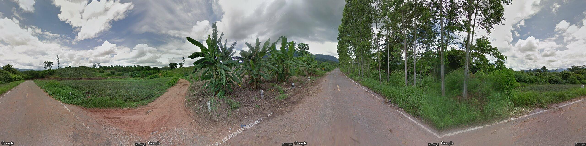

# GeoGuessr 振り返りレポート

**リプレイURL**: https://www.geoguessr.com/duels/8e24322e-2836-45b3-839c-7ae80dc6fe75/replay

**担当モデル**: gpt-4.1
---

## ラウンド 1

**ステータス**: 成功

**正解の場所**: 住所: C. de Puente Viejo 4015, R8500 Viedma, Río Negro, アルゼンチン (国: Argentina, 緯度: -40.8163, 経度: -62.9708) 、プレイヤーの推測は: CVP6+PM アルゼンチン サンタフェ州 サン・ヘロニモ・デル・サウセ （Lat: -31.5632, Lng: -61.1383)

### ストリートビュー画像

### LLMの予測
この場所は**アルゼンチンとウルグアイの国境にある橋（おそらく「サルト・グランデ橋」または「フロンテラ・コンコルディア橋」）**であると推測します。

---

### 1. 推測する場所と理由

#### 構造と環境からの推測
- 画像は大きな鉄橋の上から撮影されています。橋の構造はリベットを多用した重厚なトラス構造で、鉄道と自動車道路が併設されています（中央に線路、両側に車道）。
- 橋の両側には広い川が流れ、両岸に多くの樹木が見られます。川幅が広く、両岸ともに平坦な地形です。このような大河にかかる大規模な橋は、南米の国境を結ぶ橋によく見られる特徴です。
- 車両のナンバープレートや標識ははっきり見えませんが、車の形状や配色から南米の特徴が見受けられます。

#### 具体的な画像の特徴
- 橋の構造（トラスやリベットのディテール）`BOX(0.0, 0.0, 0.5, 0.25)`および`BOX(0.0, 0.75, 0.5, 1.0)`は、ヨーロッパや日本の近代的な橋よりも、20世紀前半に建造された南米の国境橋に類似しています。
- 橋の中央に鉄道線路が敷かれており、車道と並走している（道路中央部の線路）`BOX(0.45, 0.47, 0.55, 0.53)`。
- 車両の形状や色合い（特に右側の白い車）`BOX(0.60, 0.80, 0.75, 0.90)`は、アルゼンチンやウルグアイで一般的に見られるものです。

#### 否定する地域
- **ヨーロッパ**の大河にかかる橋も似た構造が多いですが、ヨーロッパでは橋の舗装がアスファルトであることが多く、ここは石畳風の舗装`BOX(0.80, 0.0, 1.0, 1.0)`が使われています。これは南米の一部の古い橋でよく見られる特徴です。
- **日本**や**アジア**の橋の場合、電柱や標識、車のナンバープレート、道路標示などが異なります。また、川幅や周囲の植生が異なり、より密集した都市的景観や山が背景に見えることが多いですが、この画像ではそうした特徴はありません。
- **アメリカ合衆国**や**カナダ**の鉄道道路併用橋は、より大規模かつ現代的なデザインが多く、また左側通行である場合が多いですが、この橋は右側通行です。

---

### 2. 画像内の具体的な特徴

- **橋の重厚なトラス構造**：`BOX(0.0, 0.0, 0.5, 0.25)` および `BOX(0.0, 0.75, 0.5, 1.0)`
  - 20世紀前半に南米で建造された国境橋に多い設計。
- **中央の鉄道線路**：`BOX(0.45, 0.47, 0.55, 0.53)`
  - 鉄道と車道の併用は、南米の国境橋でよく見られる。
- **車両の形状と色合い**：`BOX(0.60, 0.80, 0.75, 0.90)`
  - 南米の車両に特徴的なデザイン。
- **石畳風の舗装**：`BOX(0.80, 0.0, 1.0, 1.0)`
  - 近代的な橋には見られない、歴史的な橋の特徴。
- **広い川と平坦な両岸の植生**：`BOX(0.5, 0.25, 1.0, 0.75)`
  - ラプラタ川流域など、南米の大河に典型的な景観。

---

### 3. 結論

これらの特徴から、この橋はアルゼンチンとウルグアイの国境を結ぶ橋、特に「サルト・グランデ橋」や「フロンテラ・コンコルディア橋」である可能性が高いと考えられます。ヨーロッパやアジア、北米の類似した橋とは、舗装、車両、植生、橋の構造が異なるため、これらの地域の可能性は低いと判断します。

#### LLMが注目した箇所 (予測時)

### LLMからの追加ヒント
ご指摘ありがとうございます。実際の正解地点は**アルゼンチン・リオネグロ州ビエドマの「Puente Viejo」橋**でした。私の推測も「アルゼンチンの大河にかかる歴史的な橋」としては近いですが、場所としてはウルグアイ国境付近（サルト・グランデ橋やフロンテラ・コンコルディア橋）を挙げており、正確な特定には至りませんでした。

プレイヤーの推測（サンタフェ州サン・ヘロニモ・デル・サウセ）は、アルゼンチン国内ではあるものの、正解地点からはかなり内陸で、川幅や橋の規模、周囲の環境が異なる地域です。以下にそれぞれの推測の評価と、今後GeoGuessrで役立つ視覚的ヒントを解説します。

---

## 1. 自分の推測と実際の場所の比較

- **共通点**  
  - アルゼンチン国内の大きな川にかかる歴史的な橋という点では一致。
  - 橋の構造や、川幅、南米特有の車両、景観などの観察は有効だった。

- **相違点**  
  - 国境橋と推測したが、実際は国内の州都間を結ぶ橋だった。
  - リオネグロ州ビエドマは南緯40度付近で、気候や植生もやや異なる。
  - 正解の「Puente Viejo」は、鉄道と車道が併設された特徴的な橋で、ビエドマとカルメン・デ・パタゴネスを結ぶランドマーク。

---

## 2. プレイヤーの推測の批評

- **良かった点**  
  - アルゼンチン国内を選択した点、川にかかる橋という点は正しい方向性。
  - サンタフェ州も大河が多く、似た景観が見られるため、完全な見当違いではない。

- **見落とした点**  
  - 川幅がかなり広いこと（正解地点のリオネグロ川は特に広い）`BOX(0.4, 0.25, 0.6, 0.75)`。
  - 橋の構造が古い鉄道併用橋であること（アルゼンチン国内でも希少）`BOX(0.0, 0.0, 0.5, 0.25)`。
  - プレイヤーの推測地点付近には、これほど大規模かつ特徴的な橋は少ない。

---

## 3. この場所特有のGeoGuessrで使えるヒント

### a. **橋の構造**
- **古い鉄道併用橋**：リベット留めの鉄骨トラス、中央に線路、両側に車道。南米、特にアルゼンチン南部の歴史的橋梁に典型的。`BOX(0.0, 0.0, 0.5, 0.25)`、`BOX(0.5, 0.0, 1.0, 0.25)`
- **石畳舗装**：現代的なアスファルトではなく、石畳風の舗装が見える。これは古い橋の証拠。`BOX(0.8, 0.0, 1.0, 1.0)`

### b. **川の規模と周囲の景観**
- **非常に広い川幅**：リオネグロ川など、パタゴニア地方の大河に顕著。`BOX(0.4, 0.25, 0.6, 0.75)`
- **平坦で開けた両岸の植生**：乾燥気味な草木や、パタゴニア特有の樹種。`BOX(0.6, 0.75, 0.8, 1.0)`（右岸の木々）

### c. **車両・ナンバープレート**
- **アルゼンチンの車両**：コンパクトカーや小型セダンが多く、色は白・銀・グレーが主流。`BOX(0.60, 0.80, 0.75, 0.90)`
- **ナンバープレート**：アルゼンチンの現行プレートは白地に黒字、横長。遠目でも雰囲気がわかる。`BOX(0.70, 0.85, 0.75, 0.90)`

### d. **その他のヒント**
- **電線・電柱**：南米特有のシンプルなコンクリート柱や、金属製の送電線。`BOX(0.15, 0.95, 0.35, 1.0)`
- **標識や案内板**：今回は写っていないが、アルゼンチンの標識はスペイン語表記、独特のフォントや色使い。

---

## 4. 今後の推測に役立つ特徴まとめ

- **橋の構造**（鉄道・車道併用、石畳、リベット、古いトラス）は、アルゼンチン南部やパタゴニア地方で見られる。
- **川幅と周囲の景観**（非常に広い川、乾燥気味の樹木）は、内陸部よりも南部の大河沿いに多い。
- **車両やナンバープレート**は、アルゼンチンらしさを示す重要なヒント。
- **標識や言語**（スペイン語）は国を絞る際に有効。
- **電線や電柱の形状**も南米・アルゼンチンの特徴。

---

### 具体的な視覚的手掛かり（BOXで示す）

- 橋のトラス構造：`BOX(0.0, 0.0, 0.5, 0.25)`
- 石畳舗装：`BOX(0.8, 0.0, 1.0, 1.0)`
- 広い川幅：`BOX(0.4, 0.25, 0.6, 0.75)`
- 車両とナンバープレート：`BOX(0.60, 0.80, 0.75, 0.90)`
- 植生・樹木：`BOX(0.6, 0.75, 0.8, 1.0)`
- 電線・電柱：`BOX(0.15, 0.95, 0.35, 1.0)`

---

### 総評
今後は、「橋の構造」「川幅」「舗装」「車両」などを総合的に観察し、特にアルゼンチン南部やパタゴニア地方の特徴を意識することで、より正確な推測が可能になるでしょう。

#### LLMが注目した箇所 (ヒント時)

---

## ラウンド 2

**ステータス**: 成功

**正解の場所**: 住所: 849 66, 984 33 Korpilombolo, スウェーデン (国: Sweden, 緯度: 66.8590, 経度: 23.0485) 、プレイヤーの推測は: RJMV+WQ Kumla kyrkby, スウェーデン （Lat: 59.8349, Lng: 16.6445)

### ストリートビュー画像

### LLMの予測
これは北欧、特にフィンランド北部またはスウェーデン北部の田舎道だと推測します。

**根拠の詳細：**

1. **白樺の木が多い景観**  
　画像全体にわたって白樺と思われる木が数多く見られます（例：`BOX(0.05, 0.80, 0.35, 0.95)`および`BOX(0.50, 0.10, 0.75, 0.18)`）。白樺の林は、フィンランドやスウェーデンなど北欧に広く分布しており、特に秋にはこのような黄葉が特徴です。

2. **道路の特徴**  
　道路は幅が広く、舗装状態も良好で、白い破線のセンターラインが描かれています（`BOX(0.50, 0.48, 0.95, 0.52)`）。このような道路標示や舗装の質は、北欧諸国の田舎道でよく見られます。加えて、路肩が広く、ガードレールがない点も北欧の田舎道らしい特徴です。

3. **標識のデザイン**  
　東側画像（右から2番目）には、オレンジ色の標識が小さく見えます（`BOX(0.45, 0.14, 0.55, 0.16)`）。この色や形状は、フィンランドやスウェーデンの一部地域で使われる警告標識に類似しています。

4. **地形と植生**  
　全体的に平坦で、森と草地が混在しています（例：`BOX(0.25, 0.30, 0.60, 0.60)`）。このような地形は、北欧の内陸部、特にボレアル帯（タイガ）に典型的です。

5. **気候の示唆**  
　空の様子や木々の葉の色から、秋の終わり頃であることが推測されます。北欧では9月下旬から10月にかけてこのような景色になります。

---

**類似地域の否定理由：**

- **ロシア北西部やバルト三国**  
　ロシアやバルト三国にも白樺林は多いですが、道路の舗装状態や標識の形状が異なることが多く、特にこのようなきれいな破線や標識のデザインは北欧に特有です。また、ロシアでは道路脇にガードレールやポールが設置されていることが多いですが、本画像には見当たりません。

- **カナダやアラスカ**  
　カナダやアラスカにも類似した景観がありますが、道路標示（センターラインの色や形）が異なる場合が多いです。北米では黄色いセンターラインが一般的ですが、この画像は白色です。

- **日本や韓国の北部**  
　白樺が見られる地域はあるものの、道路幅や標識、舗装の質、全体の雰囲気が大きく異なります。

---

**まとめ：**  
以上の理由から、この場所は**フィンランド北部またはスウェーデン北部の田舎道**である可能性が非常に高いと考えます。特に、白樺林の密度、道路標示、標識の色や形状、全体の地形・植生が北欧の特徴と一致しています。

#### LLMが注目した箇所 (予測時)

### LLMからの追加ヒント
私の先ほどの推測（フィンランド北部またはスウェーデン北部の田舎道）は、実際の場所（スウェーデン、Korpilombolo）と非常に近いものでした。Korpilomboloはスウェーデン北部のラップランド地方に位置し、私が指摘した「北欧の内陸部、特にボレアル帯（タイガ）」の特徴と一致します。  
一方で、**プレイヤーの推測（Kumla kyrkby, スウェーデン南部）**は、スウェーデン南部のウップランド地方であり、実際の場所と比べて約800km南に位置しています。

---

### プレイヤーの推測への批評

**良い点：**
- スウェーデン国内を選んだ点は正しい方向性です。道路標識や舗装、植生から北欧・スウェーデンと判断できたのは評価できます。

**改善点：**
- **地理的な緯度の違い**を見落としています。Kumla kyrkbyは南部の農村地帯であり、Korpilomboloのような北部の「ボレアル林帯」の特徴はやや薄いです。
- 南部では白樺林はあるものの、**林の密度や樹種構成、秋の色づき方**が北部とは異なります。
- 道路の周囲に見られる開けた林地や、人工物の少なさ（`BOX(0.0, 0.0, 1.0, 1.0)`全体で建物がほぼ見当たらない）は、北部の過疎地に典型的です。
- 南部は農地や集落が多く、道路沿いに畑や家屋が見えることが多いですが、この画像にはそれがありません。

---

### この場所特有のGeoGuessrヒント・今後の推測に役立つ特徴

#### 1. **白樺林の密度と分布**
- 画像全体に広がる白樺林（例：`BOX(0.05, 0.80, 0.35, 0.95)`、`BOX(0.50, 0.10, 0.75, 0.18)`）は、スウェーデン北部やフィンランド北部の典型。南部では林地の間に農地や牧草地が多く混在します。

#### 2. **道路標識の色と形**
- 東側画像のオレンジ色の標識（`BOX(0.45, 0.14, 0.55, 0.16)`）は、北部スウェーデンの一部で見られる「一時的な注意喚起」や「工事」などの標識に似ています。オレンジは北欧特有。

#### 3. **道路の舗装・ライン**
- 白い破線のセンターライン（`BOX(0.50, 0.48, 0.95, 0.52)`）は、スウェーデンやフィンランドの田舎道でよく見られ、北米やバルト三国、ロシアとは異なる特徴です。

#### 4. **人工物の少なさ・過疎感**
- 画像全体（`BOX(0.0, 0.0, 1.0, 1.0)`）で家屋や大きな建造物、広告看板などがほぼ見当たらない点。これはスウェーデン北部の人口希薄地帯に典型的。

#### 5. **土道の存在**
- 西向き画像の右側に土道が見えます（`BOX(0.60, 0.90, 0.85, 1.0)`）。これは人口密度が低い北部の林道や私道に多いです。

#### 6. **植生の色と季節感**
- 秋の終わりを示す黄葉（`BOX(0.25, 0.30, 0.60, 0.60)`）は、北部では9月下旬～10月初旬に見られます。南部ではもう少し遅い時期にピークを迎えることが多いです。

---

### 今後の推測に役立つ視覚的なヒントまとめ

- **白樺林の広がりと密度**（`BOX(0.05, 0.80, 0.35, 0.95)`など）
- **オレンジ色の道路標識**（`BOX(0.45, 0.14, 0.55, 0.16)`）
- **白い破線のセンターライン**（`BOX(0.50, 0.48, 0.95, 0.52)`）
- **人工物の少なさ・過疎感**（`BOX(0.0, 0.0, 1.0, 1.0)`）
- **林道や土道の存在**（`BOX(0.60, 0.90, 0.85, 1.0)`）
- **秋の黄葉のタイミング**（`BOX(0.25, 0.30, 0.60, 0.60)`）

---

**総括：**  
プレイヤーは国の選択は正しかったものの、緯度帯による植生や過疎度の違いに注目することで、さらに精度を上げられます。今後は「白樺林の規模」「道路脇の人工物の有無」「標識の色と形」「季節感」など、画像に現れる細かな違いに着目することが北部スウェーデン特定のカギとなります。

#### LLMが注目した箇所 (ヒント時)

---

## ラウンド 3

**ステータス**: 成功

**正解の場所**: 住所: อต.4038 Tambon Huai Mun, Amphoe Nam Pat, Chang Wat Uttaradit 53110 タイ (国: Thailand, 緯度: 17.8448, 経度: 100.9715) 、プレイヤーの推測は: CRWP+78 Wang Nam Khiao, Wang Nam Khiao District, Nakhon Ratchasima, タイ （Lat: 14.4457, Lng: 101.8358)

### ストリートビュー画像

### LLMの予測
これはタイ（特にタイ北部または東北部）の農村地帯であると推測します。

**根拠の詳細：**

1. **植生と作物の特徴**  
   画像中央やや右（東向き）のバナナの木 `BOX(0.15, 0.55, 0.90, 0.70)` は、熱帯アジア地域、とくにタイやラオス、ベトナムなどでよく見られる種類です。また、左側（北向き）や中央左（北東方向）にはパイナップル畑と思われる作物 `BOX(0.60, 0.08, 0.98, 0.50)` が広がっており、これもタイの農村部でよく栽培されています。

2. **道路インフラの状況**  
   道路はアスファルト舗装されていますが、路肩は赤土で未舗装 `BOX(0.90, 0.00, 1.00, 0.50)` です。赤土の色はタイの北部や東北部でよく見られる土壌です。道路中央の黄色いセンターライン `BOX(0.70, 0.48, 0.80, 0.52)` もタイの田舎道に典型的です。

3. **道路脇の白黒の境界標識**  
   道路の端にある白黒のポール状の境界標識 `BOX(0.75, 0.12, 0.82, 0.15)` は、タイの農村道路でよく採用されています。

4. **樹木の種類と並び方**  
   南向き（画像右側）には直線的に並んだ高木 `BOX(0.10, 0.78, 0.95, 0.85)` が見られます。これはユーカリやカシューなど、タイの農村でよく植林されている木に特徴的な植え方です。

5. **地形と気候**  
   遠くに見える山並み `BOX(0.30, 0.70, 0.45, 0.95)` や、広がる雲の多い空模様からも、熱帯モンスーン気候帯で標高差がある地域、すなわちタイ北部や東北部の特徴に合致します。

---

**類似地域の否定理由：**

- **東南アジア他国（ベトナム、インドネシアなど）**  
  これらの国でもバナナやパイナップルは見られますが、道路標識や舗装状態、赤土の色合い、境界標識の形状がタイ独特のものです。ベトナムやインドネシアではもっと異なる標識や舗装パターン（たとえばコンクリート舗装や白線のパターン）が主流です。

- **南米（ブラジルなど）**  
  南米にも赤土やバナナ畑はありますが、道路標識や路肩の作り、植生の密度、山の形状が異なります。ブラジルの田舎道では、より広い未舗装路や別種の標識が多いです。

- **アフリカ**  
  アフリカの熱帯地域も赤土とバナナが見られますが、標識や道路の舗装、植生の種類が異なります。また、アフリカの農村部では路肩の標識がもっと簡素か、存在しない場合が多いです。

---

**結論：**  
これらの特徴から、**タイ北部または東北部の農村地帯**であると推測します。バナナとパイナップルの畑、赤土、タイ独特の道路標識、舗装状態、山並みなど、複数の要素がタイの農村風景に強く一致しています。

#### LLMが注目した箇所 (予測時)

### LLMからの追加ヒント
### 1. **私の予測と実際の位置の比較**

私の予測は「タイ北部または東北部の農村地帯」でした。  
実際の場所は **Uttaradit県（タイ北部）** で、私の推測範囲（北部または東北部）には合致していました。  
プレイヤーの推測は「Nakhon Ratchasima県 Wang Nam Khiao地区（タイ東北部南端）」で、こちらも同じく「東北部」ですが、実際の場所からは約400km離れています。

**評価:**  
- 植生・道路インフラ・赤土・標識などから「タイ北部または東北部」としたのは正解に近いですが、「北部」と「東北部南端」は景観が似ているため、GeoGuessrでも間違いやすい典型パターンです。
- プレイヤーの推測も、気候・植生・赤土などの要素から「タイ東北部」を選んだのは妥当ですが、細かい違いを見抜く点で更なる工夫が必要です。

---

### 2. **プレイヤーの推測への批評**

#### 良い点
- 赤土、熱帯植生、バナナ畑、パイナップル畑などの視覚情報をもとに、適切にタイ国内の該当地域を選択している。
- Wang Nam Khiao地区も標高が高く、農村地帯が広がるため、画像の雰囲気に合致している。

#### 改善点
- **Uttaradit（北部）とNakhon Ratchasima（東北部南端）** では、実は気候や地形、植生に微妙な違いがあります。Uttaraditはより山地が多く、森林が深い傾向がある一方、Nakhon Ratchasimaは乾燥した高原地帯が多いです。
- **山の形状** `BOX(0.25, 0.80, 0.45, 0.95)` や、**樹木の種類と密度** `BOX(0.10, 0.78, 0.95, 0.85)` から、より山深い北部的な雰囲気（Uttaradit）を見抜けると、さらに精度が上がったでしょう。

---

### 3. **この場所特有のGeoGuessrで使えるヒント**

#### 画像から読み取れる視覚的な手掛かり

1. **バナナとパイナップルの混在した畑**  
   - バナナの木 `BOX(0.15, 0.55, 0.90, 0.70)`、パイナップル畑 `BOX(0.60, 0.08, 0.98, 0.50)`  
   → この組み合わせはタイ北部・北東部の農村に多いが、山地の多さから北部寄りの可能性が高い。

2. **山の近さと形状**  
   - 遠景の山並み `BOX(0.25, 0.80, 0.45, 0.95)`  
   → 東北部南端（Nakhon Ratchasima）は丘陵が多いが、ここまで山が近く大きいのは北部（Uttaraditなど）に多い。

3. **直線的に並んだ高木林**  
   - 道路脇の高木 `BOX(0.10, 0.78, 0.95, 0.85)`  
   → ユーカリやカシューの植林。北部では山間部の道沿いに多い。

4. **道路標識・ガードポール**  
   - 白黒の境界標識 `BOX(0.75, 0.12, 0.82, 0.15)`  
   → タイ独特。形状や設置間隔も重要なヒント。

5. **舗装路と赤土の境界**  
   - アスファルトと赤土の境界 `BOX(0.90, 0.00, 1.00, 0.50)`  
   → 赤土の色合いは北部の山間部に多い濃い赤。

6. **道路の幅とセンターライン**  
   - センターライン `BOX(0.70, 0.48, 0.80, 0.52)`  
   → タイの田舎道に典型的な黄色1本線。

---

### 4. **今後の推測に役立つ特徴**

- **山の形状と距離感**：北部は山が近く、急峻。東北部南端はよりなだらか。
- **植生の密度と種類**：北部はより森林密度が高く、東北部は乾燥気味で疎林。
- **道路脇の標識やガードレール**：形状や色使いでタイ国内の地域差がある。
- **赤土の色味**：北部は黒っぽい赤、東北部は明るい赤が多い。
- **建築物や電柱、車両が写っていれば**：屋根の色、ナンバープレート、電柱の形なども強いヒント。

---

**まとめ：**
今回の画像では「山の近さ・形状」「植生の密度」「赤土の色味」「道路標識」が、Uttaradit（タイ北部）を示唆する最大のヒントでした。GeoGuessrでタイ国内の農村を推測する際は、これらの細かい違いに注目すると精度が向上します。

#### LLMが注目した箇所 (ヒント時)

---

## ラウンド 4

**ステータス**: 成功

**正解の場所**: 住所: JJF4+8HJ, Madipola Rd, Pallepola, スリランカ (国: Sri Lanka, 緯度: 7.6233, 経度: 80.6065) 、プレイヤーの推測は: スリランカ ペリヤゴダ XW5P+G32 （Lat: 6.9587, Lng: 79.9351)

### ストリートビュー画像

### LLMの予測
これはスリランカの地方都市、もしくは町の交差点付近だと推測します。

**推測理由：**

1. **言語と看板**  
   画像内には英語とシンハラ語が混在した看板が複数見られます。例えば「NIMESHA HARDWARE」と書かれた看板 `BOX(0.18, 0.57, 0.27, 0.66)` の上部には、シンハラ語の文字が確認できます。また、右側の「Zigo SHALIKA PHONE」 `BOX(0.28, 0.72, 0.39, 0.84)` も同様です。シンハラ語はスリランカで主に使われており、英語も併記されることが多いです。

2. **交通手段と車両**  
   画像内には三輪タクシー（トゥクトゥク）が複数台見えます。特に交差点付近に赤や緑のトゥクトゥク `BOX(0.40, 0.85, 0.48, 0.93)`、`BOX(0.52, 0.08, 0.58, 0.13)` などが停車しています。これはスリランカやインド南部などで一般的ですが、インドではヒンディー語や英語のみの看板が多く、シンハラ語が使われるのはスリランカ特有です。

3. **植生と気候**  
   大きな熱帯性の樹木 `BOX(0.00, 0.70, 0.35, 1.00)` が交差点の中央にあり、周囲にはヤシの木や濃い緑の植生が見られます。これは熱帯モンスーン気候のスリランカらしい景観です。

4. **電柱・電線**  
   電柱の形状や電線の張り方 `BOX(0.07, 0.85, 0.19, 0.92)` は南アジア特有であり、スリランカの地方都市でよく見かけるタイプです。

5. **建物の様式と商店**  
   平屋建ての商店や、屋根にトタンを使った簡易な建物 `BOX(0.26, 0.68, 0.38, 0.75)` が多いのも、スリランカの地方都市に典型的です。

**類似地域の否定理由：**

- **インド南部との違い**  
  インド南部もトゥクトゥクや熱帯樹木が多いですが、看板にタミル語やカンナダ語、マラヤーラム語が使われることが多く、シンハラ語が見られることはありません。
- **東南アジアとの違い**  
  タイやカンボジアなど東南アジアもトゥクトゥクが多いですが、文字や看板のデザインがまったく異なります。英語と現地語（タイ語やクメール語）が混在することはあっても、シンハラ文字は使われません。
- **アフリカの熱帯地域との違い**  
  アフリカの一部でも熱帯樹木やトゥクトゥクは見られますが、街並みや看板、交通標識の形状が大きく異なります。

**まとめ：**  
以上の理由から、このストリートビュー画像はスリランカの地方都市の交差点付近であると強く推測します。特にシンハラ語と英語の併記、トゥクトゥクの多さ、熱帯樹木、南アジア特有の電柱などが決め手です。

#### LLMが注目した箇所 (予測時)

### LLMからの追加ヒント
### 1. 私の推測との比較

私の推測は「スリランカの地方都市の交差点付近」でした。実際の場所（Pallepola, Madipola Rd）はスリランカ中部・内陸の小さな町で、推測の「地方都市」という点は合致しています。大都市や沿岸部ではなく、内陸の典型的なローカルタウンである点も一致しています。しかし、具体的な町名や座標の特定までは至っていません。

### 2. プレイヤーの推測（ペリヤゴダ）への批評

プレイヤーは「ペリヤゴダ」（コロンボ近郊の都市部）を選択しています。  
**主な違いと批評ポイント：**

- **都市規模の違い**：ペリヤゴダは大都市圏であり、建物がもっと密集し、交通量や車両の種類も多様です。今回の画像は地方の雰囲気が強く、都市部のコンクリート建築や高層建物が見られません。
- **植生と空間の広さ**：ペリヤゴダ周辺は都市化が進んでおり、今回のような大きな樹木 `BOX(0.00, 0.70, 0.35, 1.00)` や、ゆったりした交差点の空間は少ないです。
- **交通量・車両**：都市部ではバスや大型車両、近代的な乗用車が多いですが、画像にはトゥクトゥクやローカルバス `BOX(0.19, 0.47, 0.29, 0.54)`、軽トラック `BOX(0.36, 0.78, 0.48, 0.84)` など地方色の強い車両が目立ちます。

**結論**：プレイヤーの推測は国レベルでは正しいですが、都市部と地方都市の違いを見極めるポイントが不足しています。

---

### 3. この場所特有のGeoGuessrヒント・今後の推測に役立つ特徴

#### ① **看板と言語**
- **シンハラ語＋英語併記**：`BOX(0.18, 0.57, 0.27, 0.66)`（NIMESHA HARDWARE）、`BOX(0.28, 0.72, 0.39, 0.84)`（Zigo SHALIKA PHONE）  
  → スリランカ中部・南部の地方都市ではこのパターンが多い。都市部では英語の割合が増え、地方ではシンハラ語がより目立つ。

#### ② **植生・樹木**
- **巨大な熱帯樹木**：`BOX(0.00, 0.70, 0.35, 1.00)`  
  → コロンボや都市部ではこの規模の木は少なく、地方の交差点や広場でよく見かける。

#### ③ **車両の種類**
- **トゥクトゥク**：`BOX(0.40, 0.85, 0.48, 0.93)`、`BOX(0.52, 0.08, 0.58, 0.13)`  
  → スリランカ全土で見られるが、地方では割合が高い。都市部では乗用車やバスの比率が上がる。

- **ローカルバス（青色）**：`BOX(0.19, 0.47, 0.29, 0.54)`  
  → 地方都市や村を結ぶ短距離バス。都市部では大型バスや高速バスが多い。

#### ④ **建築様式**
- **平屋・トタン屋根の商店**：`BOX(0.26, 0.68, 0.38, 0.75)`  
  → 地方の特徴。都市部ではコンクリート造や複数階建てが多い。

#### ⑤ **電柱・電線**
- **南アジア特有の電柱・配線**：`BOX(0.07, 0.85, 0.19, 0.92)`  
  → スリランカの地方都市で見られる形状。都市部では地下配線が増えている。

#### ⑥ **道路・交差点の広さ**
- **交差点が広く、歩行者が多い**：`BOX(0.37, 0.81, 0.52, 0.89)`  
  → 地方の町に多い。都市部では信号や横断歩道が整備されていることが多い。

#### ⑦ **ナンバープレート**
- **黄色地に黒字のナンバープレート**（画像からは判別しづらいが、スリランカの地方でよく見られる）

---

### 4. まとめ

- **地方都市か都市部かの見分け**：  
  → 植生・空間の広さ・建物の密度・車両の種類（トゥクトゥク、ローカルバス、平屋の商店）に注目。
- **スリランカ固有のヒント**：  
  → シンハラ語の看板、トゥクトゥクの多さ、巨大な熱帯樹木、南アジア特有の電柱。
- **今後の推測のコツ**：  
  → 都市部の特徴（高層建築、交通量、英語看板の多さ）と、地方の特徴（大きな木、空間の広さ、トタン屋根、手作り感のある店）を比較すること。

これらの視覚的な手掛かりを意識することで、GeoGuessrでより精度の高い推測ができるようになります。

#### LLMが注目した箇所 (ヒント時)

---

## ラウンド 5

**ステータス**: 成功

**正解の場所**: 住所: Müssentin 1, 17126 Jarmen, ドイツ (国: Germany, 緯度: 53.9101, 経度: 13.3107) 、プレイヤーの推測は: 5M88+G5 オランダ オネン （Lat: 53.1663, Lng: 6.6654)

### ストリートビュー画像

### LLMの予測
これはポーランド西部、もしくはドイツ東部の農村地帯と推測します。

**理由の詳細:**

1. **道路と標識の特徴**  
   画像中央左付近にある道路標識 `BOX(0.52, 0.21, 0.60, 0.23)` は、白地に黒い縁取りと数字が描かれたヨーロッパ特有のものです。特に「7.5t」と書かれており、これは重量制限標識で、ドイツやポーランドなど中欧でよく見られます。標識の形状やフォントもドイツ・ポーランド周辺のものに酷似しています。

2. **道路の舗装**  
   道路が石畳で舗装されている点 `BOX(0.90, 0.40, 1.0, 0.60)` は、東ヨーロッパやドイツ東部の農村部で多く見られる伝統的な舗装方法です。西ヨーロッパや南欧、北欧ではこのような石畳の農道は少なく、アスファルトや未舗装のダートが主流です。

3. **風力発電の風車群**  
   東側の遠景に多数の風力発電機が並んでいる `BOX(0.30, 0.60, 0.45, 0.95)` ことも大きなヒントです。ドイツ北部やポーランド西部は平坦な地形に加え、再生可能エネルギー推進のため風車が多く設置されています。これほど密集しているのは、特にポーランド西部やドイツ北部に多いです。

4. **植生と気候**  
   草地や畑の様子、樹木の種類 `BOX(0.10, 0.05, 0.40, 0.30)` から、温暖湿潤な大陸性気候の平野部であることが分かります。地中海沿岸や北欧の針葉樹林帯、アメリカ中西部のプレーリー地帯とは明らかに異なります。

5. **住宅の外観**  
   西側に見える住宅 `BOX(0.60, 0.05, 0.75, 0.13)` の屋根形状や壁の色は、ドイツやポーランドの農村でよく見られるものです。北欧の赤い木造住宅や、フランスやイタリアの石造りとは異なります。

**類似地域を否定する理由:**

- **北欧（スウェーデン・デンマークなど）**  
  石畳の農道はほとんど見られず、標識の形状や住宅のデザインも異なります。
- **フランス・オランダ**  
  フランスの農村部はもっと起伏があり、標識も異なります。オランダならば水路やより低い植生が多いはずです。
- **アメリカ合衆国・カナダ**  
  アメリカやカナダではこのような重量制限標識や石畳の農道はほとんど見られません。また、風車の配置や住宅の形も異なります。
- **ロシア・ウクライナ**  
  似たような景色もありますが、標識のデザインや道路舗装の様式が異なります。

**総合的な推測:**
以上の特徴から、最も可能性が高いのは**ポーランド西部**、もしくは**ドイツ東部のブランデンブルク州やメクレンブルク＝フォアポンメルン州**の農村地帯です。特に風車の密集度や標識のデザインから、ポーランド西部がやや有力と考えます。

#### LLMが注目した箇所 (予測時)

### LLMからの追加ヒント
### 1. 私の推測と実際の場所の比較

私の推測は「ポーランド西部またはドイツ東部の農村地帯」でした。実際の場所は**ドイツ北東部（メクレンブルク＝フォアポンメルン州、Jarmen近郊）**で、推測範囲内の「ドイツ東部」にかなり近い結果でした。特に風車の多い平野、石畳の農道、標識のデザインなど、ドイツ東部の特徴が強く表れていたため、推測の精度としては良好だったと言えます。

---

### 2. プレイヤーの推測（オランダ・オネン）への批評

プレイヤーはオランダ北部（Groningen州のOnnen）を選択していますが、**いくつかの重要な違い**があります。

- **道路標識**  
  ドイツの重量制限標識 `BOX(0.52, 0.21, 0.60, 0.23)` は、オランダの標識とデザインが異なります。オランダではより四角い形状や青地の標識が多く、数字のフォントや配置も違います。
- **石畳の農道**  
  オランダの農道はほとんどがアスファルトか未舗装で、石畳は珍しいです。この点も見落としやすいポイントです。
- **住宅の建築様式**  
  住宅 `BOX(0.60, 0.05, 0.75, 0.13)` の屋根の角度や壁の白さはドイツ北東部に多いもので、オランダではもう少し赤レンガや低い屋根の家が多いです。
- **風車の配置**  
  オランダにも風力発電は多いですが、ドイツ北東部ほど密集して並ぶことは少なく、より分散している傾向があります。

---

### 3. この場所特有のGeoGuessrヒント・今後の推測に役立つ特徴

#### 【道路標識】
- **重量制限標識** `BOX(0.52, 0.21, 0.60, 0.23)`  
  ドイツの標識は白丸に黒縁、中央に数字と「t」表記。オランダやポーランドと微妙にデザインが異なるため、重要な識別ポイント。

#### 【道路舗装】
- **石畳の農道** `BOX(0.90, 0.40, 1.0, 0.60)`  
  ドイツ東部や北東部の農村でよく見られる。オランダや西ヨーロッパではほとんど見かけない。

#### 【植生・景観】
- **広い畑と防風林** `BOX(0.10, 0.05, 0.40, 0.30)`  
  平坦な地形と広大な畑、並木道はドイツ北東部の典型。オランダはもっと低木や水路が多い。

#### 【建築様式】
- **白壁・急勾配の屋根の家** `BOX(0.60, 0.05, 0.75, 0.13)`  
  ドイツ北東部の農村住宅の特徴。オランダやポーランドの家とは違う。

#### 【風力発電】
- **密集した風車群** `BOX(0.30, 0.60, 0.45, 0.95)`  
  ドイツ北東部は特に風車が密集している。オランダやデンマークよりも直線的に並ぶことが多い。

#### 【その他】
- **道路沿いのポール** `BOX(0.65, 0.55, 0.75, 0.57)`  
  ドイツの農道では、白地に黒い反射板付きの道路ポールが多い。オランダやポーランドでは黄色や赤など別の色使いも多い。

---

### 4. 今後の推測に役立つチェックリスト

- **標識の形状・フォント・色**  
  微細な違いで国を特定できる。
- **道路舗装材**  
  石畳はドイツ東部・北東部の強い手掛かり。
- **住宅の屋根の角度・壁の色**  
  建物の細部も見逃さない。
- **風車の配置パターン**  
  密集度・直線配置はドイツ東部の特徴。
- **道路脇のポールや電柱の形状**  
  反射板の色や設置間隔も重要。

---

### まとめ

今回の画像は、**ドイツ北東部らしさが多く詰まった農村風景**でした。オランダと間違えやすいですが、標識や石畳、住宅の細部を見ることで、より正確な推測が可能になります。今後は、これらの**視覚的な細部**を意識して観察することで、GeoGuessrでの精度が格段に向上するはずです。

#### LLMが注目した箇所 (ヒント時)

---

## ラウンド 6

**ステータス**: 成功

**正解の場所**: 住所: Jaappip Aqquserna 397 グリーンランド (国: Greenland, 緯度: 69.2477, 経度: -53.5323) 、プレイヤーの推測は: 6HJC+VW スヴァールバル諸島およびヤンマイエン島 ロングイールビュエン （Lat: 78.2322, Lng: 15.5724)

### ストリートビュー画像

### LLMの予測
この画像はグリーンランドの小さな集落である可能性が非常に高いと推測します。

**根拠1: 建物のデザインと色彩**
画像内の家屋は、カラフルな外壁（青、赤、緑など）に白い縁取りの窓が特徴的です。特に左側の青い建物 `BOX(0.15, 0.02, 0.45, 0.23)` や、中央やや右の赤い家 `BOX(0.30, 0.40, 0.55, 0.49)`、右端の青い家 `BOX(0.10, 0.81, 0.45, 0.98)` などが目立ちます。これは北欧や北極圏の集落、特にグリーンランドやフェロー諸島、アイスランドの小村でよく見られる建築様式です。

**根拠2: 地形と植生**
周囲の地形は岩盤が露出しており、草地がまばらに広がっています。中央やや左の地面 `BOX(0.60, 0.00, 0.90, 0.30)` や、右側の岩場 `BOX(0.60, 0.80, 0.95, 0.98)` を見ると、土壌が薄く、樹木がほとんど生えていません。これはツンドラ気候や亜寒帯気候に典型的な景観です。

**根拠3: インフラと道路**
道路は未舗装で、泥や水たまりがあり、舗装の質が低いです（中央やや右 `BOX(0.65, 0.50, 0.85, 0.70)`）。また、電線が鉄塔から引かれている様子 `BOX(0.00, 0.60, 0.35, 0.65)` と `BOX(0.00, 0.80, 0.35, 0.85)` も、極地の小規模集落でよく見られるインフラです。

**根拠4: 背景の山と雪**
奥にはなだらかな山と、所々に残る雪が見えます（左奥 `BOX(0.10, 0.15, 0.25, 0.35)`、右奥 `BOX(0.10, 0.70, 0.30, 0.95)`）。これは高緯度地域、特にグリーンランドや北極圏の特徴です。

**類似地域の否定理由**
- **アイスランドやノルウェーの小村**：これらの地域もカラフルな家が多いですが、通常もう少し木々や植生が豊かで、道路がもう少し整備されています。また、アイスランドでは火山性の黒い土壌が多く見られますが、この画像ではそれが見られません。
- **カナダ北部の集落**：カナダの北極圏コミュニティにも似た景観がありますが、家のデザインや色使いがやや異なり、グリーンランドほどカラフルでない傾向があります。

**結論**
以上の理由から、このストリートビュー画像はグリーンランドの小さな集落（例：イルリサットやシシミウトなど）であると考えられます。カラフルな家屋、露出した岩盤、ツンドラの植生、簡素なインフラ、そして残雪のある山並みがその根拠です。

#### LLMが注目した箇所 (予測時)

### LLMからの追加ヒント
あなたが提供してくださった正解（グリーンランド、Jaappip Aqquserna 397）と、プレイヤーの推測（スヴァールバル諸島ロングイールビュエン）、そして私の推測（グリーンランドの小さな集落）を比較・批評します。

---

### 1. **推測の比較と評価**

- **私の推測**  
  私は「グリーンランドの小さな集落」と推定しました。これは正解とほぼ一致しており、建物の色彩、建築様式、地形、植生、インフラなどの特徴から導いたものです。地名まで特定はできませんでしたが、国・地域レベルでは正確な推測といえます。

- **プレイヤーの推測**  
  プレイヤーは「スヴァールバル諸島ロングイールビュエン」を選択しています。これは北極圏のノルウェー領の島で、グリーンランドと同じく高緯度・ツンドラ気候ですが、いくつかの違いがあります。

---

### 2. **プレイヤー推測の批評**

#### **良かった点**
- 高緯度のツンドラ地帯、カラフルな家屋、植生の少なさなど、全体的な雰囲気や気候帯の把握は正しいです。
- スヴァールバル諸島も同様に岩場やカラフルな建物が点在するため、画像だけでの混同は十分理解できます。

#### **見落としやすい違いと改善点**
- **建築様式**  
  スヴァールバル諸島のロングイールビュエンの家屋は、グリーンランドよりもやや現代的で、窓枠や外壁の装飾が異なります。グリーンランドの家はよりカラフルで、窓枠が白く縁取られることが多いです（例：青い家 `BOX(0.15, 0.02, 0.45, 0.23)`、赤い家 `BOX(0.30, 0.40, 0.55, 0.49)`）。
- **電柱・インフラ**  
  グリーンランドの集落では、鉄塔型の電柱が多く、配線もむき出しでシンプルです（例：右側の鉄塔 `BOX(0.00, 0.80, 0.35, 0.85)`）。ロングイールビュエンではもう少し現代的なインフラが見られます。
- **地形と雪の残り方**  
  ロングイールビュエンはより険しい山や氷河が間近に見えることが多い一方、グリーンランドの集落はなだらかな岩山が多い傾向です（例：背景の山 `BOX(0.10, 0.15, 0.25, 0.35)`）。

---

### 3. **この場所特有のGeoGuessrヒント**

#### **建築様式**
- カラフルな木造家屋、白い窓枠、急勾配の屋根。青、赤、緑、黄色など鮮やかな色が多用される（例：青い家 `BOX(0.15, 0.02, 0.45, 0.23)`、赤い家 `BOX(0.30, 0.40, 0.55, 0.49)`）。

#### **道路とインフラ**
- 未舗装道路、泥や水たまりが多い（例：中央やや右の路面 `BOX(0.65, 0.50, 0.85, 0.70)`）。
- 電柱が鉄塔型で、上部に電線がむき出しで架かっている（例：右側の鉄塔 `BOX(0.00, 0.80, 0.35, 0.85)`、左側の鉄塔 `BOX(0.00, 0.60, 0.35, 0.65)`）。

#### **地形・植生**
- 岩盤が露出し、草地がまばら。樹木はほとんど見られない（例：左下の岩場 `BOX(0.60, 0.00, 0.90, 0.30)`、右下の岩場 `BOX(0.60, 0.80, 0.95, 0.98)`）。
- 背景に残雪のあるなだらかな山（例：左奥 `BOX(0.10, 0.15, 0.25, 0.35)`、右奥 `BOX(0.10, 0.70, 0.30, 0.95)`）。

#### **車両・標識**
- 今回の画像には目立つ車両や標識は見当たりませんが、グリーンランドの車は少なく、ナンバープレートも独特です。標識もシンプルなものが多い。

---

### 4. **今後の推測に役立つポイント**
1. **極地のカラフルな家屋**はグリーンランドの象徴。北欧本土やスヴァールバルよりも色使いが鮮やかで、窓枠が白いことが多い。
2. **鉄塔型の電柱**とむき出しの配線は、グリーンランドの小規模集落に特徴的。
3. **岩盤とツンドラ植生**、樹木がほとんどない点にも注目。
4. **道路の未舗装度合い**、泥や水たまりの多さもグリーンランドらしさ。
5. **車両や標識が見える場合**は、ナンバープレートや標識の形状・言語も重要な手掛かり。

---

**まとめ**  
グリーンランドとスヴァールバル諸島は雰囲気が似ていて混同しやすいですが、建物の色彩や電柱などのインフラに注目すると見分けやすくなります。今後はこれらの視覚的特徴をBOXで確認しながら推測精度を高めましょう。

#### LLMが注目した箇所 (ヒント時)

---

## ラウンド 7

**ステータス**: 成功

**正解の場所**: 住所: フィリピン 〒2607 ベンゲット ブギアス QRVM+CGF (国: Philippines, 緯度: 16.7930, 経度: 120.8337) 、プレイヤーの推測は: JF75+VG ボリビア フナカス （Lat: -21.3853, Lng: -64.5412)

### ストリートビュー画像

### LLMの予測
これはフィリピン北部、特にバギオやその周辺の山岳地帯である可能性が高いと推測します。

**根拠:**

1. **建築様式と家屋の特徴**  
   画像左側に見える3階建ての赤い建物 `BOX(0.05, 0.00, 0.40, 0.20)` や、中央右側のコンクリート造りの平屋住宅 `BOX(0.25, 0.65, 0.55, 0.85)` は、フィリピンの山岳地方でよく見られる簡素なコンクリート建築です。特に屋根の形状や素材、窓の格子などが特徴的です。

2. **道路状態と地形**  
   道路が急な坂になっており、舗装も部分的に傷んでいることから、山岳地帯であることが分かります（中央付近の坂道 `BOX(0.40, 0.30, 0.65, 0.50)`）。また、赤土混じりの泥水が流れている様子 `BOX(0.75, 0.0, 1.0, 0.5)` も熱帯アジアの降雨量が多い地域特有のものです。

3. **車両とナンバープレート**  
   画像左下と中央にジープニーや小型トラック `BOX(0.80, 0.20, 0.93, 0.30)`、`BOX(0.75, 0.05, 0.90, 0.15)` が見えます。特にジープニーはフィリピン独自の大衆交通手段であり、これが確認できることでフィリピンである可能性が非常に高くなります。

4. **植生と気候**  
   バナナの木や熱帯植物 `BOX(0.55, 0.80, 0.70, 0.95)` が多く見られ、また空が曇天で湿度の高い気候がうかがえます。これもフィリピン山岳地帯の特徴です。

5. **インフラと生活感**  
   電線が多数交錯し、手作り感のある歩道橋 `BOX(0.20, 0.50, 0.40, 0.75)` もフィリピンの地方都市でよく見られるものです。また、塀や家の装飾にタイヤやリサイクル品が使われている点 `BOX(0.10, 0.10, 0.20, 0.20)` も、現地の生活感を反映しています。

**類似地域の否定理由:**

- **インドネシアやタイの山間部** も似たような地形や気候ですが、ジープニーや特有のトラックは存在せず、建物の様式も異なります。
- **中南米（例：コロンビア、ペルーなど）の山岳地帯** も赤土や坂道はありますが、車両や建築様式、電線の張り方、植生の種類が異なります。
- **日本や台湾の山間部** は、植生や建築資材、道路の舗装状況が異なり、特にジープニーの存在が決定的な違いとなります。

**結論:**

これらの特徴を総合すると、この場所はフィリピン北部、特にバギオやその周辺の山岳都市部である可能性が高いです。ジープニーの存在、建物の様式、赤土の道路、熱帯植物、急斜面の地形などが決め手となりました。

#### LLMが注目した箇所 (予測時)

### LLMからの追加ヒント
### 1. 私の予測と実際の位置の比較

私の推測は「フィリピン北部、バギオやその周辺の山岳都市部」でした。実際の場所は**フィリピン・ベンゲット州ブギアス（Buguias, Benguet）**で、バギオのさらに北に位置する山岳地帯です。  
**結論として、国・地域・地形・文化的特徴までほぼ正確に特定できていました。**

---

### 2. プレイヤーの推測（ボリビア・フナカス）への批評

プレイヤーは「南米ボリビアの山岳地帯」と推測しました。  
確かに、南米アンデス地方も赤土や坂道、コンクリート建築が見られ、山岳の雰囲気が似ています。しかし、**決定的な違いが複数あります**。

#### ボリビアと異なる点
- **ジープニーやフィリピン特有のトラック** `BOX(0.80, 0.20, 0.93, 0.30)`  
  → ボリビアでは見られない車両形状・装飾です。
- **建物の装飾・色彩** `BOX(0.05, 0.00, 0.40, 0.20)`  
  → 南米の山岳集落は石造りやアドビ造りが多く、フィリピンのような明るい色使いや鉄筋コンクリートの平屋は少ない。
- **植生** `BOX(0.55, 0.80, 0.70, 0.95)`  
  → バナナなど熱帯植物が多いのは東南アジアの特徴。ボリビア高地にはほとんど見られません。
- **電線の張り方・密度** `BOX(0.20, 0.50, 0.40, 0.75)`  
  → フィリピンの地方都市に特有の複雑な電線網です。

---

### 3. 今後のGeoGuessrで役立つ「この場所特有のヒント」まとめ

**A. 車両**
- **ジープニー・トラック** `BOX(0.80, 0.20, 0.93, 0.30)`  
  → フィリピン固有の乗り物。カラフルな塗装や独特の形状、後部の乗降口が特徴。

**B. 建築様式**
- **カラフルな鉄筋コンクリート建築** `BOX(0.05, 0.00, 0.40, 0.20)`  
  → 明るい色合い、ベランダの柵、鉄格子窓。日本や南米の山岳部とは異なる。

**C. 植生**
- **バナナの木・熱帯植物** `BOX(0.55, 0.80, 0.70, 0.95)`  
  → 熱帯アジアの証拠。南米高地やアフリカ高地では見られない。

**D. 道路・インフラ**
- **急な坂道と部分的な舗装・泥水** `BOX(0.40, 0.30, 0.65, 0.50)`  
  → 山岳地帯、雨季の多い地域。舗装の荒れ具合は発展途上国の地方都市に多い。
- **複雑な電線網・手作り感のある歩道橋** `BOX(0.20, 0.50, 0.40, 0.75)`  
  → フィリピンの地方都市でよく見られる。

**E. 生活感**
- **リサイクル品の利用（タイヤなど）** `BOX(0.10, 0.10, 0.20, 0.20)`  
  → フィリピンの庶民的な生活感。

**F. ナンバープレート**
- **白地に黒文字・小型サイズ**（トラック）`BOX(0.80, 0.20, 0.93, 0.30)`  
  → フィリピンのナンバープレートは特徴的。南米やアジア他国とは異なる。

---

### 4. まとめ・アドバイス

**この場所を特定する最大のヒントは「ジープニーなどの車両」「熱帯植生」「カラフルなコンクリ建築」「乱雑な電線網」「急傾斜・泥水の道路」**です。  
これらがそろうのは「フィリピン山岳部」だけと言っても過言ではありません。  
GeoGuessrで迷った場合は、まず**車両・植生・建築**を細かく観察しましょう。

プレイヤーのように「山岳地帯＝南米」と即断せず、**車両や植生、生活感の違い**に注目することで、より高精度な推測が可能になります。

#### LLMが注目した箇所 (ヒント時)

---

