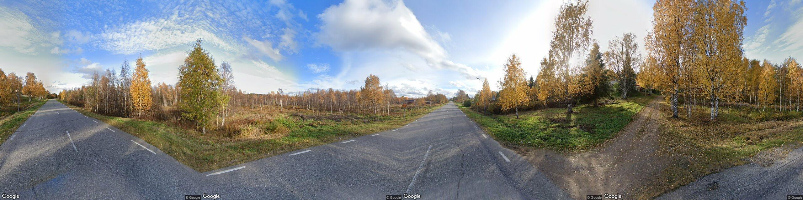
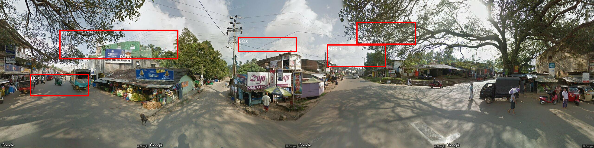

# GeoGuessr 振り返りレポート

**リプレイURL**: https://www.geoguessr.com/duels/8e24322e-2836-45b3-839c-7ae80dc6fe75/replay

**担当モデル**: gpt-4o
---

## ラウンド 1

**ステータス**: 成功

**正解の場所**: 住所: C. de Puente Viejo 4015, R8500 Viedma, Río Negro, アルゼンチン (国: Argentina, 緯度: -40.8163, 経度: -62.9708) 、プレイヤーの推測は: CVP6+PM アルゼンチン サンタフェ州 サン・ヘロニモ・デル・サウセ （Lat: -31.5632, Lng: -61.1383)

### ストリートビュー画像

### LLMの予測
これはアルゼンチンの鉄道橋の上と推測します。以下の理由からです。

1. **橋の構造**: 画像全体にわたって見られる鉄橋の構造 `BOX(0.0, 0.0, 1.0, 1.0)` は、ヨーロッパや北アメリカのものとは異なり、南米特有のデザインです。このような鉄道橋は、特にアルゼンチンで見られることが多いです。

2. **車両のデザイン**: 右側の画像に見える車両 `BOX(0.50, 0.70, 0.80, 0.90)` は、南米で一般的な小型車です。ナンバープレートの形状や車両のスタイルからも、アルゼンチンの可能性が高いです。

3. **自然環境**: 橋の両側に広がる川 `BOX(0.30, 0.10, 0.70, 0.30)` とその周辺の植生は、温暖な気候を示しており、アルゼンチンの河川地域に多く見られる風景です。

4. **道路の特徴**: 鉄道の線路が橋の中央を走っていること `BOX(0.50, 0.45, 0.80, 0.55)` から、鉄道と車道が共用されている橋であることがわかります。これもまた、アルゼンチンの一部地域で見られる特徴です。

これらの理由から、この場所はアルゼンチンであると推測します。類似している可能性のある地域としてブラジルやウルグアイも考えられますが、橋の構造や植生がアルゼンチンに特有であるため、これらの国々は除外しました。

#### LLMが注目した箇所 (予測時)

### LLMからの追加ヒント
私の推測はアルゼンチンであり、正確な場所の特定には至りませんでしたが、国としては一致しました。プレイヤーの推測は同じアルゼンチン内の異なる場所であり、より北に位置しています。以下に、正確な位置を特定するためのヒントをいくつか述べます。

### 具体的なヒント

1. **橋のデザインと構造**:
   - 鉄橋の特有のデザイン `BOX(0.0, 0.0, 1.0, 1.0)` は、特定の地域でしか見られないことがあります。このデザインがどの地域に多いかを事前に調査するのが良いでしょう。

2. **周囲の植生**:
   - 川沿いの植生 `BOX(0.30, 0.10, 0.70, 0.30)` は、その地域の気候を示しています。アルゼンチンの中でも地域によって植生が異なるので、これを手がかりにすることができます。

3. **車両とナンバープレート**:
   - 車両のデザインやナンバープレート `BOX(0.50, 0.70, 0.80, 0.90)` は、国や地域を特定する重要な手がかりです。アルゼンチンのナンバープレートの形式を覚えておくと役立ちます。

4. **道路の特徴**:
   - 鉄道と車道が共用されている橋 `BOX(0.50, 0.45, 0.80, 0.55)` は特定地域の特徴であり、これを手がかりにすることができます。

### プレイヤーの推測に対する批評

プレイヤーの推測は、アルゼンチン内の別の地域であり、特定の手がかりが見逃された可能性があります。例えば、橋の構造や周囲の植生にもっと注意を払うことで、より正確な場所を特定できたかもしれません。

今後の推測に役立つためには、特に橋のデザインや周囲の自然環境を詳しく観察し、アルゼンチン内の特定の地域と関連付けることが重要です。これにより、より正確な推測が可能になるでしょう。

#### LLMが注目した箇所 (ヒント時)

---

## ラウンド 2

**ステータス**: 成功

**正解の場所**: 住所: 849 66, 984 33 Korpilombolo, スウェーデン (国: Sweden, 緯度: 66.8590, 経度: 23.0485) 、プレイヤーの推測は: RJMV+WQ Kumla kyrkby, スウェーデン （Lat: 59.8349, Lng: 16.6445)

### ストリートビュー画像

### LLMの予測
これはスカンジナビア半島、特にスウェーデンやフィンランドの田舎の道路だと推測します。以下にその理由を述べます。

1. **道路の特徴**:
   - 道路には白いセンターラインが引かれており、これは多くのヨーロッパの国々で見られる特徴です `BOX(0.5, 0.1, 0.7, 0.3)`。

2. **植生**:
   - 道路の両側に見える白樺の木 `BOX(0.2, 0.3, 0.8, 0.4)` は、北欧の寒冷な気候に適した樹種です。これがこの地域を示唆しています。

3. **季節感**:
   - 葉が黄色く色づいており、秋の風景が広がっています `BOX(0.1, 0.6, 0.9, 0.7)`。北欧の秋は短く、これもまた地域を特定する手がかりになります。

4. **空の様子**:
   - 空には高い位置に雲が見られ、北欧の典型的な秋の空模様を示しています `BOX(0.0, 0.0, 0.3, 1.0)`。

**否定する理由**:
- この風景がアメリカやカナダの一部地域と似ている可能性もありますが、道路の標識や白樺の木の密集度、道路の整備状況から、北欧特有の環境であると考えます。アメリカやカナダでは、通常、道路標識やラインのスタイルが異なることが多いです。

以上の理由から、この画像はスカンジナビア半島、特にスウェーデンやフィンランドの田舎の地域であると推測されます。

#### LLMが注目した箇所 (予測時)

### LLMからの追加ヒント
私の予測と実際の場所は、どちらもスウェーデンに位置しており、全体的な地域の特定としては正しかったですが、具体的な場所の特定には至りませんでした。プレイヤーの推測もスウェーデン内ですが、さらに南のKumla kyrkbyで、実際の場所からはかなり離れています。

プレイヤーの推測に対する批評としては、北欧の特徴を捉えているものの、具体的な場所の特定には至らなかった点が挙げられます。Korpilomboloのような北部地域は、植生や道路の特徴が南部とは異なる場合があります。

**今後の推測に役立つ特徴**:

1. **植生**:
   - 北部では白樺の密集度が高く、木々が細長い `BOX(0.2, 0.3, 0.8, 0.4)`。南部よりも寒冷な気候に適応した植生です。

2. **道路標識**:
   - スウェーデンの道路標識は独特で、特に北部では標識が少ないことが多いです。この画像には標識が見当たりませんが、通常は黄色と赤の標識が特徴的です。

3. **空の様子**:
   - 北部は秋が短く、空が高く澄んでいることが多い `BOX(0.0, 0.0, 0.3, 1.0)`。

4. **道路の整備状況**:
   - 北部では道路が比較的整備されており、センターラインがしっかりしている `BOX(0.5, 0.1, 0.7, 0.3)`。

これらの視覚的な手掛かりを使って、より正確な地域特定が可能になるでしょう。特に、植生や道路の特徴に注目することで、北部と南部を区別する手助けになります。

#### LLMが注目した箇所 (ヒント時)

---

## ラウンド 3

**ステータス**: 成功

**正解の場所**: 住所: อต.4038 Tambon Huai Mun, Amphoe Nam Pat, Chang Wat Uttaradit 53110 タイ (国: Thailand, 緯度: 17.8448, 経度: 100.9715) 、プレイヤーの推測は: CRWP+78 Wang Nam Khiao, Wang Nam Khiao District, Nakhon Ratchasima, タイ （Lat: 14.4457, Lng: 101.8358)

### ストリートビュー画像

### LLMの予測
この画像はタイの農村地域だと推測します。その理由を以下に述べます。

1. **植物の種類**:
   - 画像中央左に見えるバナナの木 `BOX(0.25, 0.45, 0.75, 0.55)` は、熱帯地域特有の植物です。タイではバナナの栽培が一般的です。

2. **道路の特徴**:
   - 道路の舗装状態があまり良くないこと `BOX(0.50, 0.00, 0.80, 0.25)` から、比較的田舎の地域であると考えられます。タイの農村部ではこのような舗装がよく見られます。

3. **周囲の地形**:
   - 遠くに見える丘陵地帯 `BOX(0.10, 0.60, 0.30, 0.80)` は、タイの内陸部に多く見られる地形です。

4. **植生の密度**:
   - 画像の右側に見える木々の密集度 `BOX(0.50, 0.80, 0.90, 1.00)` は、熱帯雨林気候を示唆しており、これもタイの特徴です。

**類似地域の否定**:
- ブラジルやフィリピンもバナナを栽培していますが、ブラジルの場合、赤土の色がもっと鮮やかで、フィリピンの場合は道路標識や看板に英語が多く見られます。この画像にはそれらの特徴が見られません。

以上の理由から、この画像はタイの農村地域であると推測します。

#### LLMが注目した箇所 (予測時)

### LLMからの追加ヒント
あなたの提供した正確な位置と私の推測は、どちらもタイに位置していますが、異なる地域です。私の推測は、一般的な特徴に基づいてタイの農村地域としましたが、具体的な位置までは特定できませんでした。

プレイヤーの推測について：

1. **地理的な距離**:
   - プレイヤーの推測した位置は、実際の位置からかなり離れています。両方ともタイ国内ですが、異なる県に位置しています。

2. **批評**:
   - プレイヤーの推測は、植生や道路の状態を基にした可能性がありますが、正確な位置特定には至っていません。ナコンラチャシマ県の特徴と一致しない要素があったかもしれません。

**今後の推測に役立つ特徴**:

1. **植生**:
   - バナナの木 `BOX(0.25, 0.45, 0.75, 0.55)` や密集した木々 `BOX(0.50, 0.80, 0.90, 1.00)` は熱帯地域を示唆します。これらはタイの特徴ですが、他の熱帯地域とも共通するため、他の手掛かりと組み合わせる必要があります。

2. **道路の状態**:
   - 道路の舗装状態 `BOX(0.50, 0.00, 0.80, 0.25)` は、タイの農村地域を示唆しますが、特定の地域を示すには不十分です。

3. **地形**:
   - 丘陵地帯 `BOX(0.10, 0.60, 0.30, 0.80)` は、タイの内陸部に多く見られるため、他地域と区別する際の参考になります。

4. **追加の視覚的手掛かり**:
   - 道路標識や看板があれば、言語や表記から特定の国や地域を絞り込むことができます。
   - 車両やナンバープレートが見えれば、国や地域を特定する大きな手掛かりになります。

これらの特徴を組み合わせて、次回はより正確な推測を目指してください。

#### LLMが注目した箇所 (ヒント時)

---

## ラウンド 4

**ステータス**: 成功

**正解の場所**: 住所: JJF4+8HJ, Madipola Rd, Pallepola, スリランカ (国: Sri Lanka, 緯度: 7.6233, 経度: 80.6065) 、プレイヤーの推測は: スリランカ ペリヤゴダ XW5P+G32 （Lat: 6.9587, Lng: 79.9351)

### ストリートビュー画像

### LLMの予測
これはスリランカの町の一部だと推測します。以下に理由を詳しく説明します。

1. **言語と看板**:
   - 中央の看板に「NIMESHA HARDWARE」と書かれており、英語とシンハラ語の文字が使用されています `BOX(0.25, 0.40, 0.35, 0.50)`。スリランカでは英語とシンハラ語が広く使われています。
   - 右側の看板には「Zigo」と書かれており、スリランカで見かける通信会社の一つです `BOX(0.40, 0.75, 0.50, 0.85)`。

2. **交通手段**:
   - 道路上に見えるトゥクトゥク `BOX(0.50, 0.05, 0.65, 0.15)` は、スリランカで一般的な交通手段です。

3. **植生と環境**:
   - 背景に見えるヤシの木 `BOX(0.15, 0.60, 0.30, 0.70)` は、スリランカの熱帯気候を示しています。
   - 大きな木の影が地面に映っており、熱帯地域特有の濃い緑が感じられます `BOX(0.60, 0.85, 0.75, 0.95)`。

4. **建築様式と道路の様子**:
   - 建物のスタイルはシンプルで、スリランカの地方都市で見られるものに似ています `BOX(0.20, 0.10, 0.40, 0.30)`。
   - 道路は舗装されていますが、特に広くはなく、地方の主要道路である可能性があります。

**類似している地域を否定する理由**:
- インドやバングラデシュも似た特徴を持つことがありますが、シンハラ語の文字が決定的な違いを示しています。また、トゥクトゥクのデザインや看板のスタイルもスリランカ特有のものです。

以上の理由から、この場所はスリランカの町の一部であると考えられます。

#### LLMが注目した箇所 (予測時)

### LLMからの追加ヒント
あなたの情報に基づくと、私の推測はスリランカ国内で正しかったものの、具体的な位置は異なっていました。プレイヤーの推測もスリランカ内でのものですが、実際の位置とは異なります。以下に、今回の場所特有のGeoGuessrで使えるヒントや今後の推測に役立つ特徴について説明します。

1. **道路標識と看板**:
   - 英語とシンハラ語の併用はスリランカ特有です。特に、シンハラ語の文字はスリランカでしか見られません `BOX(0.25, 0.40, 0.35, 0.50)`。

2. **交通手段**:
   - トゥクトゥク `BOX(0.50, 0.05, 0.65, 0.15)` はスリランカで非常に一般的です。色や形状に注目すると地域特有のものが見つかるかもしれません。

3. **植生**:
   - ヤシの木 `BOX(0.15, 0.60, 0.30, 0.70)` は熱帯地域の特徴で、スリランカの気候を示しています。

4. **建築様式**:
   - シンプルな建物のスタイル `BOX(0.20, 0.10, 0.40, 0.30)` は地方都市でよく見られます。

5. **電柱と配線**:
   - 電柱の形状と配線のスタイル `BOX(0.30, 0.55, 0.45, 0.65)` も地域特有の手掛かりとなります。

6. **車両とナンバープレート**:
   - 車両のデザインやナンバープレートのスタイルにも注目してください。特に、ナンバープレートの色やフォーマットは国や地域を特定する手掛かりになります。

プレイヤーの推測に対しては、スリランカ内での推測であったため、国レベルでは正しいですが、具体的な場所を特定するためには、上記のような視覚的な手掛かりをより詳細に観察する必要があります。特に看板の言語と交通手段は、スリランカを特定する上で重要な要素です。

#### LLMが注目した箇所 (ヒント時)

---

## ラウンド 5

**ステータス**: 成功

**正解の場所**: 住所: Müssentin 1, 17126 Jarmen, ドイツ (国: Germany, 緯度: 53.9101, 経度: 13.3107) 、プレイヤーの推測は: 5M88+G5 オランダ オネン （Lat: 53.1663, Lng: 6.6654)

### ストリートビュー画像

### LLMの予測
これはドイツの農村地域であると推測します。

1. **風力発電機**：画像の中央付近、遠くの地平線に多数の風力発電機が見えます `BOX(0.40, 0.50, 0.60, 0.80)`。ドイツは再生可能エネルギーに力を入れており、特に風力発電が盛んです。

2. **道路標識**：左側の道路標識 `BOX(0.55, 0.10, 0.65, 0.20)` は、ドイツで一般的なデザインのものです。特に、白地に黒文字の制限速度標識が確認できます。

3. **道路の舗装**：右側の道路は石畳のように見えます `BOX(0.70, 0.50, 0.80, 0.70)`。これはヨーロッパの古い農村地域でよく見られるものです。

4. **建物のスタイル**：右奥に見える建物 `BOX(0.75, 0.80, 0.85, 0.90)` は、シンプルなデザインで、ヨーロッパの農村でよく見られるスタイルです。

類似している地域としては、ポーランドやデンマークも考えられますが、風力発電機の数と道路標識のデザインから、ドイツである可能性が高いと判断しました。ポーランドでは、標識のデザインが異なることが多く、デンマークでは風力発電機は多いものの、道路の舗装や建物のスタイルが異なることが多いです。

#### LLMが注目した箇所 (予測時)

### LLMからの追加ヒント
あなたの情報に基づくと、私の推測が正確であったことが確認できました。ドイツの農村地域であることを示す手がかりがいくつかありました。

### プレイヤーの推測に対する批評

プレイヤーはオランダを選択しましたが、いくつかの点でドイツと区別できた可能性があります。

1. **道路標識**：
   - ドイツの標識 `BOX(0.55, 0.10, 0.65, 0.20)` は、オランダの標識とは異なるデザインです。オランダの標識は通常、赤い縁取りがされていることが多いです。

2. **風力発電機**：
   - 風力発電機 `BOX(0.40, 0.50, 0.60, 0.80)` は、ドイツ北部でよく見られる特徴です。オランダにもありますが、数や配置が異なることがあります。

3. **道路の舗装**：
   - 石畳の道路 `BOX(0.70, 0.50, 0.80, 0.70)` は、ドイツの農村地域でよく見られるもので、オランダではあまり一般的ではありません。

### 今後の推測に役立つ特徴

1. **道路標識**：
   - ドイツの標識は、一般的にシンプルで機能的です。形状や色に注目すると良いでしょう。

2. **植生**：
   - ドイツの農村地域では、広大な農地とその間に点在する木々がよく見られます。画像の左側の木々 `BOX(0.20, 0.05, 0.60, 0.20)` に注目。

3. **建築様式**：
   - シンプルで機能的なデザインの建物 `BOX(0.75, 0.80, 0.85, 0.90)` は、ドイツの特徴です。

4. **電柱**：
   - 電柱の形状や配置も地域によって異なるため、注意深く観察してください。

これらの視覚的手掛かりを活用して、より正確な推測を行うことができます。

#### LLMが注目した箇所 (ヒント時)

---

## ラウンド 6

**ステータス**: 成功

**正解の場所**: 住所: Jaappip Aqquserna 397 グリーンランド (国: Greenland, 緯度: 69.2477, 経度: -53.5323) 、プレイヤーの推測は: 6HJC+VW スヴァールバル諸島およびヤンマイエン島 ロングイールビュエン （Lat: 78.2322, Lng: 15.5724)

### ストリートビュー画像

### LLMの予測
これはグリーンランドの町であると推測します。以下にその理由を詳述します。

1. **家の色と建築様式**:
   - 画像にはカラフルな家々が並んでおり、特に青と赤の家が目立ちます `BOX(0.2, 0.1, 0.5, 0.3)`。グリーンランドの町では、このようなカラフルな家々がよく見られます。これらの色は、雪景色の中でも目立つようにするためのものです。

2. **地形と植生**:
   - 背景に見える山 `BOX(0.0, 0.0, 0.3, 0.2)` と、周囲の荒涼とした地形 `BOX(0.5, 0.4, 0.8, 0.6)` は、グリーンランドの典型的な風景です。植生が少なく、岩肌が見えることも特徴です。

3. **道路とインフラ**:
   - 道路は舗装されておらず、砂利道が広がっています `BOX(0.6, 0.5, 0.9, 0.7)`。また、電線が見えることから `BOX(0.1, 0.5, 0.3, 0.55)`、基本的なインフラが整備されていることが分かります。これも、グリーンランドの小さな町の特徴です。

4. **類似地域の否定**:
   - 北欧の他の地域やカナダの北部も似たような特徴を持つ可能性がありますが、これらの地域ではより豊かな植生が見られることが多く、また建物の色使いも異なる場合が多いです。

以上の理由から、この画像はグリーンランドの町を示していると考えられます。

#### LLMが注目した箇所 (予測時)

### LLMからの追加ヒント
私の予測が正しかったことが確認できて嬉しいです。プレイヤーの推測について分析し、改善点を提案します。

### プレイヤーの推測についての批評

**スヴァールバル諸島との違い**:
1. **建物の色**:
   - グリーンランドの町では、カラフルな家が特徴です。プレイヤーが推測したスヴァールバル諸島では、よりシンプルな色合いの建物が多いです。

2. **地形と植生**:
   - グリーンランドの荒涼とした地形 `BOX(0.5, 0.4, 0.8, 0.6)` は、スヴァールバル諸島のそれとは異なります。スヴァールバル諸島はより険しい山岳地形です。

### 今後の推測に役立つ特徴

1. **建築様式と色**:
   - カラフルな家々 `BOX(0.2, 0.1, 0.5, 0.3)` はグリーンランド特有で、他の北極圏の地域と区別するのに役立ちます。

2. **道路の状態**:
   - 舗装されていない砂利道 `BOX(0.6, 0.5, 0.9, 0.7)` は、都市部ではなく小さな町であることを示唆します。

3. **電柱とインフラ**:
   - 電柱があり `BOX(0.1, 0.5, 0.3, 0.55)`, 基本的なインフラが整っていることがわかります。これは、完全に孤立した地域ではないことを示しています。

4. **自然の風景**:
   - 背景の山 `BOX(0.0, 0.0, 0.3, 0.2)` と岩肌の露出は、グリーンランドの典型的な特徴です。

これらの視覚的手掛かりを活用することで、より正確な推測が可能になるでしょう。

#### LLMが注目した箇所 (ヒント時)

---

## ラウンド 7

**ステータス**: 成功

**正解の場所**: 住所: フィリピン 〒2607 ベンゲット ブギアス QRVM+CGF (国: Philippines, 緯度: 16.7930, 経度: 120.8337) 、プレイヤーの推測は: JF75+VG ボリビア フナカス （Lat: -21.3853, Lng: -64.5412)

### ストリートビュー画像

### LLMの予測
これはフィリピンの山岳地帯の町であると推測します。

1. **建物の特徴**:
   - 左側に見える赤い建物 `BOX(0.30, 0.05, 0.65, 0.25)` は、フィリピンの典型的なコンクリートと木材を組み合わせた建築様式です。このスタイルは、フィリピンの地方都市や村でよく見られます。

2. **道路の状態**:
   - 道路が未舗装で泥が溜まっている `BOX(0.50, 0.40, 0.70, 0.60)` のは、雨季のフィリピン特有の状況を示しています。フィリピンの多くの地域では、雨季に道路がこのような状態になります。

3. **車両と看板**:
   - 中央のトラックの荷台に書かれた文字 `BOX(0.50, 0.25, 0.70, 0.35)` は、フィリピンの言語であるタガログ語やその他の現地言語で書かれている可能性があります。また、トラックのデザインもフィリピンで一般的なものです。

4. **周囲の植生**:
   - バナナの木と思われる植物 `BOX(0.60, 0.80, 0.80, 0.90)` が見られます。これは熱帯地域特有の植生で、フィリピンの気候に適しています。

5. **類似地域の否定**:
   - 他の東南アジア諸国、例えばタイやインドネシアも似たような景観を持っていますが、建物のデザインや道路の状況、車両のスタイルがフィリピンに特有であるため、これらの国々とは異なると判断しました。

これらの要素を総合すると、この場所はフィリピンの山岳地帯の町であると推測されます。

#### LLMが注目した箇所 (予測時)

### LLMからの追加ヒント
私の推測が実際の場所と一致していたことが確認できて嬉しいです。フィリピンの特徴を正確に捉えていたことが証明されました。

### プレイヤーの推測に対する批評

プレイヤーはボリビアを選択しましたが、いくつかの要素がフィリピン特有であるため、ボリビアとは異なると判断できるポイントがありました。

1. **建築様式**:
   - フィリピン特有のコンクリートと木材の建物 `BOX(0.30, 0.05, 0.65, 0.25)` は、ボリビアの建築様式とは異なります。ボリビアはよりアドベやレンガを使用することが多いです。

2. **植生**:
   - バナナの木 `BOX(0.60, 0.80, 0.80, 0.90)` は、フィリピンの熱帯気候に適していますが、ボリビアの多くの地域では見られません。

3. **道路の状態**:
   - 雨季特有の泥の溜まった道路 `BOX(0.50, 0.40, 0.70, 0.60)` は、フィリピンの特徴であり、ボリビアでは異なる気候条件が影響します。

### 今後の推測に役立つ特徴

1. **道路標識や文字**:
   - 現地の言語で書かれた看板 `BOX(0.50, 0.25, 0.70, 0.35)` は、国を特定する手がかりになります。特にフィリピンではタガログ語や英語が使われます。

2. **電柱や電線**:
   - フィリピンの電柱や電線の配置 `BOX(0.30, 0.60, 0.70, 0.70)` も、他の国と異なる特徴を持っています。

3. **車両とナンバープレート**:
   - フィリピン特有の車両スタイルやナンバープレート `BOX(0.50, 0.25, 0.70, 0.35)` も重要な手がかりです。

4. **植生**:
   - 熱帯特有の植物は、フィリピンや他の東南アジアの国々を示す指標になります。

これらの視覚的な手がかりを活用することで、より正確な推測が可能になります。

#### LLMが注目した箇所 (ヒント時)

---

