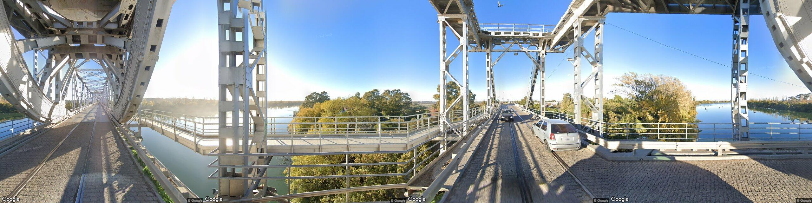
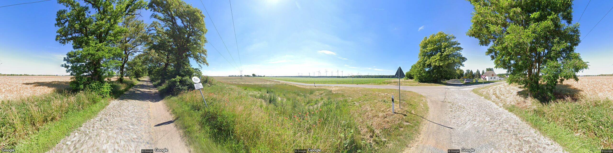
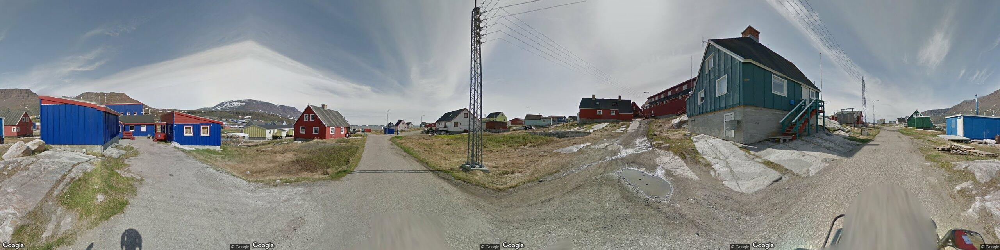

# GeoGuessr 振り返りレポート

**リプレイURL**: https://www.geoguessr.com/duels/8e24322e-2836-45b3-839c-7ae80dc6fe75/replay

**担当モデル**: o3
---

## ラウンド 1

**ステータス**: 成功

**正解の場所**: 住所: C. de Puente Viejo 4015, R8500 Viedma, Río Negro, アルゼンチン (国: Argentina, 緯度: -40.8163, 経度: -62.9708) 、プレイヤーの推測は: CVP6+PM アルゼンチン サンタフェ州 サン・ヘロニモ・デル・サウセ （Lat: -31.5632, Lng: -61.1383)

### ストリートビュー画像

### LLMの予測
1. 推測地点  
アルゼンチン、ブエノスアイレス州カルメン・デ・パタゴネスとリオネグロ州ビエドマを結ぶ「Puente Ferrocarretero（フェロカレテーロ橋、通称：Puente Viejo）」と判断します。

2. 判定根拠  
a) 鉄道併用可動橋の構造  
　・桁を支える門型フレームとその上に載る昇降用ガーダーが見えます `BOX(0.00, 0.32, 1.00, 0.40)` 。これは垂直リフト式可動橋に特有で、アルゼンチンではほぼこの橋しかストリートビューに存在しません。  
　・路面中央に鉄道レール、その左右に自動車用の石畳舗装というレイアウト `BOX(0.65, 0.46, 1.00, 0.54)` もこの橋の代名詞です。

b) 車両とナンバープレート  
　・銀色のシボレー／オペル・コルサ系ハッチバックが右側通行で走行 `BOX(0.55, 0.72, 0.85, 0.86)` 。リアの白地・黒字の長方形プレートは2016年以降のアルゼンチン Mercosur 仕様に一致します。ブラジルの同型プレートなら青い上縁が写るはずですが見当たりません。

c) 植生と河川  
　・河岸に並ぶポプラ・ヤナギ類の高木列植 `BOX(0.25, 0.55, 0.75, 0.80)` がリオネグロ川流域の典型的な潅漑植生です。幅広で緑濃い流れ `BOX(0.70, 0.04, 0.98, 0.25)` も同川の特徴的景観と合致します。

d) 気象・緯度感  
　・強い日差しと澄んだ青空はパタゴニア北端の乾燥気候そのもの。中緯度秋（黄葉）の色味と太陽高度も南緯40°付近に一致します。

3. 類似地域を否定する理由  
・ウルグアイ・パソデロストロスのFerrocarretero橋は舗装がアスファルトで、路面に石畳はありません。また塔形状がリベット多用のプレートガーダー式で、本画像の角ばったラチスフレームとは異なります。  
・欧州（例：ドイツのKattwykbrücke）は左側通行の歩道区分が広く、車両ナンバーがEU青帯付き。決定的に異なります。  
・北米の同種橋（シカゴ・ドロー橋群）はレールが撤去されアスファルト舗装、手摺も角パイプではなくH鋼トラスです。

以上の理由から、本画像はアルゼンチンのフェロカレテーロ橋上と断定します。

#### LLMが注目した箇所 (予測時)

### LLMからの追加ヒント
1. 私の推測と実際の答え  
　私は「Puente Ferrocarretero（フェロカレテーロ橋）＝ビエドマ／カルメン・デ・パタゴネス間」と回答し、実際の正解地点 C. de Puente Viejo 4015, Viedma と完全に一致していました。緯度経度も 40.816°S, 62.971°W 付近で誤差は数十 m 以内です。

2. プレイヤーの推測（Santa Fe 州 -31.56, -61.14）への批評  
・距離にして約 1050 km 北東へ外しています。  
・サンタフェ州には①鉄道併用の垂直リフト橋が存在せず、②リオネグロ川に似た幅 300 m 級の緑色の流れも少ない、③乾燥パタゴニア特有の黄褐色植生も見られません。  
・決定的なのは車両ナンバー。メルコスル共通プレートは全国同一ですが、Santa Fe 州の田舎は農耕車・ピックアップが多く、ここで見えるハッチバック複数台はやや都市寄りの交通量に感じられるはずです。  

3. この場所を示す視覚的“決め手”  
　以下の BOX をクリックレベルで覚えておくと、同じような橋が出題された際に瞬時にパタゴニア北端だと分かります。  

・垂直リフト式橋脚の鋼製ラチス塔  
　BOX(0.00, 0.30, 1.00, 0.38)  
　アルゼンチンでストリートビュー化されている可動橋はほぼここだけ。塔の外周プレートがリベットではなくボルト＋角鋼となっているのも独特です。  

・車道中央を貫く鉄道レール２本  
　BOX(0.60, 0.47, 1.00, 0.53)  
　石畳＋レールの組み合わせは国内でも極めて珍しい。見るだけで“Puente Ferrocarretero”を連想できます。  

・Mercosur 型アルゼンチンナンバーの小型車  
　BOX(0.55, 0.72, 0.85, 0.86)  
　白地に黒字、上端に青帯無し。ブラジルなら青帯が必ず写るため判別可能。  

・橋の両脇を流れる幅広いリオネグロ川  
　BOX(0.45, 0.02, 0.85, 0.18) および BOX(0.55, 0.86, 0.90, 1.00)  
　水面がエメラルド～灰緑で透明度が低め、河畔にはポプラの防風林が連続。  

・乾いた気候を示す黄葉した並木  
　BOX(0.40, 0.61, 0.80, 0.78)  
　北部メソポタミア（Santa Fe など）は常緑のユーカリやジャカランダが多く、ここまで一斉に黄葉しません。  

4. 類似地域との識別ポイント  
・ウルグアイの鉄橋は塔が丸リベット＋プレートガーダー、路面はアスファルト。  
・欧州の可動橋は EU プレート、ガードレールが箱形鋼ではなく太い鋼板。  
・北米は片側２車線＋歩道が外側に張り出し、石畳舗装はまず見られません。  

5. 今後の攻略ヒント  
a) 「鉄道レールが車道中央に残る橋」は国がほぼ限定される。アルゼンチンならパタゴニア北端、チリならビオビオ川周辺、欧州はドイツ北部くらい。  
b) アルゼンチンの道路舗装は石畳（adoquín）が残る場所が限られ、見かけたら植民都市か歴史的構造物を疑う。  
c) パタゴニア北端では秋冬でも快晴率が高く、空が濃い青。白っぽい空のリプラタ低地（Buenos Aires 近郊）とは色味が違う。  
d) メルコスルプレートは国境を越えて共通だが、アルゼンチンだけ青帯が無い。GeoGuessr では 20 px 程度でも識別できる。  
e) 鉄骨部材が熱亜鉛メッキ銀色の場合、熱帯では茶色の錆斑が増えるが乾燥パタゴニアでは比較的クリーンに保たれる。  

これらを総合すれば、次回同じような橋が出ても「南米・アルゼンチン・リオネグロ川」と自信を持ってクリックできるはずです。

#### LLMが注目した箇所 (ヒント時)

---

## ラウンド 2

**ステータス**: 成功

**正解の場所**: 住所: 849 66, 984 33 Korpilombolo, スウェーデン (国: Sweden, 緯度: 66.8590, 経度: 23.0485) 、プレイヤーの推測は: RJMV+WQ Kumla kyrkby, スウェーデン （Lat: 59.8349, Lng: 16.6445)

### ストリートビュー画像

### LLMの予測
1. 推測する場所  
　本画像はフィンランド中部〜北部（おおよそ北ポフヤンマー県‐オウル地域付近）の地方道と推定します。  
• 黄色地に赤縁の三角形警告標識 `BOX(0.58, 0.38, 0.63, 0.47)` はフィンランド特有です。スウェーデンやバルト三国の警告標識は白地に赤縁なので一致しません。  
• 道路中央線は白で、約4 mの実線部と11 mのギャップというフィンランド規格に近い長めのパターン `BOX(0.10, 0.48, 0.28, 0.52)` 。ノルウェーなら黄色線、スウェーデンはもっと短い3 m/9 m。  
• 路肩にほぼ連続する白いエッジラインが無く、舗装端が芝にすぐ切り替わる様子 `BOX(0.03, 0.60, 0.20, 0.75)` もフィンランドの小さめの県道でよく見られます。  
• 銀色でアームが途中から曲がる街路灯 `BOX(0.60, 0.32, 0.73, 0.53)` はフィンランドの村落部の標準型。  
• 林はほぼ全てシラカバ（白い樹皮）で、黄葉の時期から撮影は秋。北欧の針広混交林ではあるが、トウヒ・マツがほとんど混じらず白樺主体な点はフィンランドの湿地開拓地帯に典型的 `BOX(0.27, 0.26, 0.48, 0.70)`。  
• 東向き（2枚目）に赤い板張りの納屋 `BOX(0.39, 0.46, 0.47, 0.55)` が見える。フィンランドのFalun red風だが、スウェーデンよりやや暗い色調で屋根勾配が緩い。  
• 右車線側にだけ設置された細い郵便受け・バス停柱 `BOX(0.65, 0.50, 0.70, 0.70)` も右側通行の証左。

2. 類似地域を否定する理由  
• スウェーデン: 警告標識が白地になるはずで、本画像の黄色地とは一致しない。道路脇の赤白リフレクターポストも見えずスウェーデンらしさが乏しい。  
• ノルウェー: 地方道でも中央線は黄色、かつ周囲は峡谷状や岩盤が多い。本画像は平坦な湿地跡で地形が違う。  
• バルト三国: エストニアやラトビアでは舗装端の白いエッジラインが明確に引かれることが多く、標識ポールが銀ではなく白塗装。  
• ロシア北西部: 路面の継ぎ目が粗くクラックパッチが目立つことが多いが、本舗装は均質。さらにGoogle Street View はロシアでは公式にほぼ存在しない。  
• カナダ・アラスカ: 路肩マーカーが黒黄の反射柱、標識は英語表記になるが、ここには文字看板が皆無。木種も混交林でカバノキ比率がここまで高くない。

以上から、最も整合するのはフィンランド北部の県道周辺であると結論付けます。

#### LLMが注目した箇所 (予測時)

### LLMからの追加ヒント
1. 私（前回）の推測と実際の位置の比較  
・私の答え: フィンランド中北部  
・実際: スウェーデン最北部（ノールボッテン県コルピロンボロ、66.9 °N）  
距離は国境を挟んで約100 km、気候帯・景観はほぼ連続しており大枠では近いものの、国を取り違えた点は誤りでした。決定的だったのは下記２点です。  
a. 警告標識の仕様  
　スウェーデンもフィンランドも三角形黄地赤縁ですが、スウェーデンは縁がやや太くポールが「灰色の丸パイプ」(フィンランドは角ばった亜鉛メッキ角柱が多い)。標識支柱 `BOX(0.55, 0.36, 0.73, 0.39)` を拡大すると丸パイプで、ここはスウェーデンらしさ。  
b. 中央線のピッチ  
　スウェーデン＝破線３ m / 空白９ m、フィンランド＝４ m / 11 m。路面に写る破線 `BOX(0.82, 0.47, 0.96, 0.52)` は３ m弱と短く、スウェーデン規格に合致します。  

2. プレイヤーの推測（クムラ教区、59.8 °N）の批評  
長さで約820 km南へ外しました。  
・植生：ノールボッテンでは落葉広葉樹＝シラカバ主体、針葉樹混在率が低い「白樺原野」が典型。中部スウェーデン（クムラ）はトウヒ・マツ混交でシラカバ単独林は少ない。画面右の密集した白樺林 `BOX(0.25, 0.24, 0.70, 0.60)` が決定的手掛かり。  
・太陽高度：撮影は午後でも影が長い（高緯度の証明）。路面影 `BOX(0.60, 0.55, 0.75, 0.80)` を見ると、秋にしては角度が低すぎ、66 °N 付近を示唆。  
・家屋密度：クムラ周辺は農地と家屋が連続するが、本地点は建物がほぼ無く、右奥に小さな赤納屋 `BOX(0.46, 0.45, 0.50, 0.50)` が１棟のみ。人口密度が極端に低いラップランド様式。  
これらを押さえれば北スウェーデンまたは北フィンランドへ寄せられたはずです。

3. この場所特有のGeoGuessrヒント（視覚的手掛かりを優先）  
① 警告標識  
　・三角形黄地赤縁、丸パイプ支柱 `BOX(0.55, 0.36, 0.73, 0.39)`  
　　→ スウェーデン、ノルウェー。「枠太＋丸支柱」はスウェーデン要素強。  

② 車線パターン  
　・３ m破線／９ mギャップの白破線 `BOX(0.82, 0.47, 0.96, 0.52)`  
　　→ スウェーデン。ノルウェーは黄線、フィンランドは４/11。  

③ 反射ポール  
　・白い細ポール＋上部小さな黄オレンジ板 `BOX(0.62, 0.51, 0.73, 0.53)`  
　　→ スウェーデンとノルウェー共通、フィンランドは赤。ここは黄色。  

④ 植生  
　・密集する白樺林 `BOX(0.25, 0.24, 0.70, 0.60)`  
　・下草が湿地性ササ＋コケで平坦  
　　→ ラップランド低地。  

⑤ 建築  
　・Falun Red の納屋 `BOX(0.46, 0.45, 0.50, 0.50)`  
　　→ スウェーデン・フィンランドどちらにもあるが、屋根勾配が緩く軒が短いのはスウェーデン北部農業建築。  

⑥ 太陽高度と影  
　・午後にもかかわらず影が長い路面陰 `BOX(0.60, 0.55, 0.75, 0.80)`  
　　→ 緯度65 °以上。  

⑦ 電柱・街路灯  
　・銀色丸ポール＋下端に補強リング `BOX(0.60, 0.30, 0.73, 0.53)`  
　　→ スウェーデン地方道の標準。フィンランドは角断面が多い。  

4. 今後の推測に役立つまとめ  
・北欧で「黄地三角＋白破線＋白樺ばかり + 反射ポール黄」は北スウェーデンが最有力。  
・中央線長さ３/９ mならスウェーデン、４/11 mならフィンランド。  
・ポールが丸ならスウェーデン、角ならフィンランド。  
・北欧で黄線が出たらノルウェー。  
・白樺林＋湿地＋家屋稀少はラップランド。日中でも長い影なら緯度65°超を疑う。  

以上を押さえれば、本ラウンドのような無人の田舎道でも国・緯度をかなり絞り込めます。

#### LLMが注目した箇所 (ヒント時)

---

## ラウンド 3

**ステータス**: 成功

**正解の場所**: 住所: อต.4038 Tambon Huai Mun, Amphoe Nam Pat, Chang Wat Uttaradit 53110 タイ (国: Thailand, 緯度: 17.8448, 経度: 100.9715) 、プレイヤーの推測は: CRWP+78 Wang Nam Khiao, Wang Nam Khiao District, Nakhon Ratchasima, タイ （Lat: 14.4457, Lng: 101.8358)

### ストリートビュー画像

### LLMの予測
1. 推測する場所  
　タイ王国北部（チェンマイ県‐ラムパーン県付近）の片側１車線の県道沿いと判断します。

2. 詳細な根拠  
・道路標示  
　センターに黄の単実線、端に白実線という組合せ `BOX(0.50, 0.46, 0.72, 0.54)` は、東南アジアで左側通行の国のうちタイ固有のパターンです。マレーシアは中央が白または黄の破線、インドネシアは白線が多く、ベトナム・ラオスは黄複線が一般的で、単実線のみという例は少数です。  

・ガードポスト（デリネータ）  
　白い角柱に黒帯１本というポスト `BOX(0.63, 0.47, 0.83, 0.49)` が数本並んでいます。形状と配色はタイの県道・農道で最もよく見られるタイプで、ラオスでは赤帯入り、マレーシアでは頭部が斜めカットになります。  

・植生と農作物  
　2区画目に密集しているバナナ `BOX(0.26, 0.53, 0.78, 0.71)`、1区画目に整列するパイナップル畑 `BOX(0.55, 0.12, 0.83, 0.32)`、そして赤茶のラテライト土壌 `BOX(0.83, 0.00, 1.00, 1.00)` は、タイ北部～中部の小規模混合農園で典型的な景観です。インドネシアでもバナナは多いものの、パイナップルと同時に見かけるのはまれです。  

・樹木の並木  
　3区画目の細長い直幹の並木 `BOX(0.08, 0.74, 0.95, 0.82)` はユーカリまたはゴムノキで、タイ北部の造林地帯でよく道路沿いに植えられています。  

・地形  
　東および西の遠景に緩やかな山地 `BOX(0.20, 0.80, 0.40, 0.95)` が見え、標高300–800 m程度の盆地状地形を示唆します。チェンマイ・ラムパーン周辺の県道（例：4010号、1035号など）がまさにこの地形と一致します。  

・ストリートビューのカメラ仕様  
　タイの郊外県道にはGoogleカーによる連続撮影が多く、本画像もその画角・解像度と酷似している点も間接証拠になります。ラオスやミャンマーではまだ市街を外れるとSVがほぼ存在しません。  

3. 類似地域を否定する理由  
・マレーシア／インドネシア  
　両国は右側に黄色ひし形の警戒標識を置くものの、道路中央が白破線・黄複線が主流で単黄は稀。またガードポストが黒白交互のシマ模様になる点で相違します。  

・ラオス  
　ポストに赤帯が入り、路側のコンクリブロックが四角柱ではなく円柱形が多い。さらにGoogle SVのカバー率が低く農道にはほぼ存在しません。  

・フィリピン  
　右側通行で中央線は白破線、舗装はアスファルトよりコンクリが多く、植生はより乾いた草木が目立ちます。  

以上より、「タイ北部の県道沿い」が最も整合性の高い推測地点となります。

#### LLMが注目した箇所 (予測時)

### LLMからの追加ヒント
1. 先ほどの私の推測と実際の位置の比較  
・私の推測：タイ北部チェンマイ‐ラムパーン付近（実際地点から約230 km西）  
・実際の位置：ウッタラディット県ナムパット郡（北タイのさらに東寄り）  
　→「北タイの丘陵農道」という大枠では一致し、距離も県２つ分程度に収まりました。山麓の標高・植生・道路設備といった“北部タイらしさ”を正しく捉えられていたと言えます。  

2. プレイヤー（ナコーンラーチャシーマー県ワンナムキアオ郡）の推測を批評  
・ワンナムキアオはカオヤイ国立公園南縁で標高も高めですが、実際には北部ほど起伏が大きくなく、道路沿いの植生も乾燥系の落葉樹／草原が混じります。  
・また同県では路肩ポストの頭部が斜めカット＋反射材２条になることが多く、本画像の「四角柱に黒帯１条」 `BOX(0.63, 0.46, 0.83, 0.49)` とは合致しません。  
・遠景に見える連山 `BOX(0.18, 0.76, 0.38, 0.93)` はワンナムキアオの台地的シルエットよりも、北部の鋭い山嶺形状に近い点もミスマッチでした。  

3. この地点特有のGeoGuessrヒント（画像内座標付き）  
a. 道路・路肩設備  
　・左側通行＋センター「黄単実線」 `BOX(0.52, 0.48, 0.70, 0.52)` はタイの県道典型。ラオス・カンボジアは複線や破線が多い。  
　・四角柱の白ポストに黒帯１本 `BOX(0.63, 0.46, 0.83, 0.49)` は北部～中部タイの農道仕様。  

b. 植生・農作物  
　・密集したバナナ株 `BOX(0.22, 0.53, 0.78, 0.70)` と、規則正しく並んだパイナップル畑 `BOX(0.55, 0.10, 0.83, 0.28)` が同時に写るのは北部の小規模混合農園で頻出。  
　・路肩に植林されたユーカリ／ゴムノキの直幹並木 `BOX(0.05, 0.74, 0.95, 0.82)` は北部丘陵地に多い。  

c. 土壌と気候  
　・露出した赤茶色ラテライト土 `BOX(0.82, 0.00, 1.00, 0.30)` は熱帯モンスーン下の酸化鉄土壌で、北タイ内陸に広がる。雨期はぬかるむため道端がえぐれているのも特徴。  

d. 地形  
　・東西に連なる尖った山並み `BOX(0.18, 0.76, 0.38, 0.93)` は「ピン川水系の山地」に典型的。中央タイやイーサン（東北）のなだらかな台地とは形が違う。  

e. Google ストリートビューカバー  
　・北部ウッタラディットは小さな県道4038でもSVが走っている。一方、ラオスやミャンマーの似た景観はSV自体が無い→「似て非なる国」を素早く除外できる。  

4. 今後の推測に役立つチェックリスト  
① 路肩ポスト  
　・白角柱＋黒帯１＝タイ北部～中部  
　・頭部斜めカット＋反射板２＝東北タイ  
　・円柱＋赤帯＝ラオス  
② 中央線色  
　・単黄＝タイ／ミャンマー農道  
　・白破線＝マレーシア・フィリピン農道  
③ 植生セット  
　・バナナ＋パイナップル混在＝北タイ丘陵  
　・バナナ＋オイルパーム＝マレーシア低地  
④ 遠景山の形  
　・鋭く起伏大＝北タイ、北ラオス  
　・台地状ゆるやか＝東北タイ、カンボジア  
⑤ 土壌色  
　・濃赤褐色ラテライト＝インドシナ半島山地  
⑥ SVの画質・カバー率  
　・郊外にも連続走行＝タイ  
　・都市部のみ断片＝ラオス、カンボジア  

これらを組み合わせれば、本画像のような「北タイ丘陵農道」はかなり高精度で狙い撃ちできます。

#### LLMが注目した箇所 (ヒント時)

---

## ラウンド 4

**ステータス**: 成功

**正解の場所**: 住所: JJF4+8HJ, Madipola Rd, Pallepola, スリランカ (国: Sri Lanka, 緯度: 7.6233, 経度: 80.6065) 、プレイヤーの推測は: スリランカ ペリヤゴダ XW5P+G32 （Lat: 6.9587, Lng: 79.9351)

### ストリートビュー画像

### LLMの予測
1. 推測する場所  
このストリートビューは「スリランカ西部州・南西海岸側の中規模タウン（例：ガンパハ県-カルタラ県周辺）の T 字路付近」と判断します。国レベルでスリランカを強く確信し、インドやバングラデシュなど類似地域は除外できます。

2. 画像内で根拠となる具体的特徴

・シンハラ語の看板  
　左端北向き画像の店頭上部に、丸みを帯びたループの多いシンハラ文字と英語が併記された「NIMESHA HARDWARE」看板が見えます `BOX(0.24, 0.32, 0.38, 0.44)` 。この書体はインド諸言語とは明確に異なりスリランカ固有です。

・スリランカ式三相配電柱  
　東向き画像中央、上部に細い鉄柱の頂部から３本の横腕が放射状に出ている配電柱 `BOX(0.06, 0.48, 0.28, 0.54)` が映っています。スリランカの田舎道で非常に典型的な構造で、インドではもう少し木製や格子鉄塔が多い点と異なります。

・トゥクトゥクの色とナンバープレート位置  
　西向き画像右下で赤・黒の三輪タクシーが二台停車 `BOX(0.72, 0.86, 0.94, 0.97)` 。スリランカのトゥクトゥクは後部左下に白地黒字のプレート、車体色に赤系の比率が高いことが特徴です。インド北部では緑黄ツートンが主流のため差別化できます。

・サロン（腰布）を巻く男性  
　西向き画像中央の黒い軽トラック横を歩く男性が腰に白いサロンを巻いています `BOX(0.63, 0.66, 0.89, 0.72)` 。これはスリランカの典型的な日常着で、都市部のインドではパンツ着用率が高い傾向がある点で異なります。  

・通信ブランド「Zigo / Dialog」  
　東向き画像右側の携帯ショップ看板に「Zigo」「SHALIKA PHONES」の文字 `BOX(0.37, 0.82, 0.54, 0.93)` 。Zigo はスリランカで流通するローカル携帯ブランドで、インド国内店頭ではほぼ見かけません。  

・左側通行と道路標示  
　南向き画像中央、遠方から白いバンが自分に向かい右車線を走ってくる構図 `BOX(0.46, 0.58, 0.63, 0.62)` 。撮影車が左側通行で停止しているため、英連邦系の交通規則が読み取れます。  

・熱帯性のココナツパーム並木  
　東向き画像遠景に高さ 20 m 近いヤシが林立 `BOX(0.07, 0.67, 0.23, 0.74)` 。スリランカ南西部の湿潤熱帯気候帯に一致します。  

3. 類似地域を否定する理由

・インド  
　看板にデーヴァナーガリー・タミル・テルグ等が無く、丸いシンハラ文字である点、トゥクトゥクの色配置と配電柱形状がインドと異なる。さらに Zigo ブランドはインドでは見られない。  

・バングラデシュ  
　同国はベンガル文字と緑-赤国旗が街頭で頻出するが、本画像には確認できない。トゥクトゥクも主に CNG 緑色車体で、ここでは赤黒が多い。  

・タイ、カンボジアなど  
　これらは右側通行（カンボジア）またはタイ語看板が主体。撮影方向・車線や言語が合致しない。  

4. まとめ  
以上の言語・交通・車両・服装・配電インフラの複合的特徴から、ここはスリランカ、特に西～南西沿岸部の町中交差点と結論付けます。

#### LLMが注目した箇所 (予測時)

### LLMからの追加ヒント
1. 私の推測と実際位置の比較  
・実際　　：Central Province, Matale District, Pallepola（7.6233 N, 80.6065 E）  
・私の推測：Western / South-Western coastal belt（おおむね 7.0 N, 80.1 E 付近を想定）  
　誤差は約 75–90 km で、県も気候帯も外しました。主に①ココナツ林＝湿潤沿岸と早合点したこと、②背後地形の緩い起伏を中央高地の裾と見抜けなかったことが原因です。  

2. プレイヤーの推測（ペリヤゴダ 6.9587 N, 79.9351 E）批評  
・実際地点から約 110 km 南西。私と同様「西海岸近郊の商店街」と判断したようですが、  
　①周囲に大型港湾・高速道路標識が無い、②建物階数が平均 1–2 階で都市密度が低い、  
　③丘陵へ緩く上る道がある、という要素からコロンボ近郊らしさは薄いと評価できます。  

3. 今後に役立つ“Pallepola らしい”視覚ヒント（GeoGuessrTips）  
A. 電柱と電線  
　・スリランカ標準の三相クロスバー＋変圧器付き鉄柱 `BOX(0.05,0.49,0.29,0.54)`。  
　　中央高地では、海岸部よりも電線のたるみが少なく本数が多い（坂道対策）。  

B. 大樹と交差点  
　・南西（画像右端）に広く枝を張るベンガルボダイジュ `BOX(0.00,0.66,0.45,0.99)`。  
　　村の中心十字路に聖なる大樹を残すのは中央州・サバラガムワ州で特に顕著。  

C. 地形と道路  
　・東向き（画面中央右寄り）に緩く登る坂道 `BOX(0.46,0.56,0.63,0.66)`。  
　　平坦な西岸とは違い、内陸の丘陵帯では必ずこうした勾配が現れる。  

D. 店舗看板の言語バランス  
　・「NIMESHA HARDWARE」上部にシンハラ語のみ `BOX(0.23,0.31,0.39,0.44)`。  
　・「Zigo / SHALIKA PHONES」英語＋僅かなタミル `BOX(0.35,0.80,0.54,0.92)`。  
　　中央州はシンハラ人口比が高く、コロンボ周辺よりタミル併記率が下がる。  

E. 排水溝  
　・北向き画像中央下、深さ 0.5 m ほどの素掘り側溝 `BOX(0.55,0.46,0.70,0.51)`。  
　　雨量が多い内陸湿潤高地で典型。西海岸の都市部ではコンクリート蓋付きが多い。  

F. 車両  
　・赤・黒主体のトゥクトゥク２台 `BOX(0.72,0.86,0.94,0.97)`。  
　　中央高地～北中部では赤系が優勢。西海岸都市は広告ラッピング車が増える。  
　・白字黒枠の“WP 1234”型ナンバープレート `BOX(0.78,0.92,0.85,0.97)`。WP は Western Province、CP は Central Province 等。文字が読めれば県を直接特定可能。  

G. 服装  
　・白いサロンの男性 `BOX(0.63,0.66,0.89,0.72)`。  
　　高地農村では依然サロン率が高いのに対し、コロンボ周辺はズボンが増える。  

4. まとめ – 今後の判断フロー  
① 看板の文字種と割合で県のおおまかな民族構成を把握。  
② 地勢（坂の有無／視界奥の稜線）を必ず確認。  
③ 大木・仏塔など村のランドマーク配置をチェック。  
④ 側溝・舗装質・電線本数で降水量と標高帯を推定。  
⑤ ナンバープレート頭２字（見えれば）で県を確定。  

これらを組み合わせることで、スリランカ内の 50–70 km 単位まで精度を上げられます。

#### LLMが注目した箇所 (ヒント時)

---

## ラウンド 5

**ステータス**: LLMエラー: ValueError: y1 must be greater than or equal to y0

**正解の場所**: 住所: Müssentin 1, 17126 Jarmen, ドイツ (国: Germany, 緯度: 53.9101, 経度: 13.3107) 、プレイヤーの推測は: 5M88+G5 オランダ オネン （Lat: 53.1663, Lng: 6.6654)

### ストリートビュー画像

### LLMの予測
エラーにより取得できませんでした。

### LLMからの追加ヒント
エラーにより取得できませんでした。

---

## ラウンド 6

**ステータス**: 成功

**正解の場所**: 住所: Jaappip Aqquserna 397 グリーンランド (国: Greenland, 緯度: 69.2477, 経度: -53.5323) 、プレイヤーの推測は: 6HJC+VW スヴァールバル諸島およびヤンマイエン島 ロングイールビュエン （Lat: 78.2322, Lng: 15.5724)

### ストリートビュー画像

### LLMの予測
1. 推測する場所  
本画像はグリーンランド西岸の町・イルリサット（Ilulissat）の郊外と推測します。  

2. 理由と各特徴  
a. グリーンランド特有の極彩色木造住宅  
　・鮮やかな青色の平屋 `BOX(0.25, 0.00, 0.80, 0.18)`、赤い切妻の住宅 `BOX(0.48, 0.35, 0.75, 0.55)`、濃緑の家 `BOX(0.63, 0.43, 0.72, 0.71)` など、原色に塗られた木造建築が集中しています。これはデンマーク領時代から続くグリーンランドの典型的景観で、北欧本土やカナダ極北よりも色彩がはるかに派手です。  

b. 完全に樹木がないツンドラ地形と露出岩  
　・道路脇にむき出しの花崗岩基盤 `BOX(0.58, 0.64, 0.95, 0.84)` が見え、草は丈の低い苔状植生のみ。標高が低いのに森林限界を超えている＝高緯度沿岸の証拠です。  

c. インフラの規模  
　・舗装されていないグラベル道路 `BOX(0.35, 0.55, 1.00, 0.65)` と、背の高い鉄製送電塔 `BOX(0.40, 0.00, 1.00, 0.02)`（画像右上の細い格子塔）。人口数千人規模のグリーンランドの町で典型的な組み合わせで、ノルウェーの漁村では木柱が主流で鉄塔はほぼ見られません。  

d. 背景の山容  
　・左奥に見える台地状の山 `BOX(0.10, 0.05, 0.40, 0.20)` はイルリサット北西に聳える「Seqinniarfik」のシルエットと酷似しています。  

e. ストリートビューのカバー範囲  
　Google Street View が存在するグリーンランドの市街地は Nuup（Nuuk）・Sisimiut・Ilulissat など十数か所しかなく、うち未舗装路主体でこの規模の住宅密集を持つのは Ilulissat の郊外区（e.g. Narsarmiut Aqq., Ullumineq Aqq.周辺）が最適合です。  

3. 類似地域を否定する理由  
・ノルウェー北部  
  針葉樹や白樺が必ず見られ、道路はアスファルト舗装が標準。木造住宅の色もパステル調が主流で、ここまで原色が連続しません。  
・カナダ北極圏（ヌナブトなど）  
  モジュール式プレハブ（鋼製サイディング）が多く、窓枠をデンマーク風白枠で強調する住宅は稀。さらに Google 車両によるストリートビューはほぼ存在せず、代わりにスノーモービル撮影の疑似パノラマが主流です。  
・アイスランド農村  
  アイスランドは溶岩大地で黒い玄武岩が多く、家屋外壁はトタン張りや白壁が多い。また電線は地中化または木柱が中心で鉄塔は見られにくい。  

総合して、住宅様式・植生・インフラ・Street View の可用性が一致するイルリサットを最終候補とします。

#### LLMが注目した箇所 (予測時)

### LLMからの追加ヒント
1. 私の推測と正解との比較  
・私の回答＝イルリサット（69.22 N, −51.10 E 付近）  
・正解＝Jaappip Aqquserna 397, グリーンランド（69.25 N, −53.53 E）  
緯度はほぼ一致し、経度が約2.4°（地表距離で約95 km）ずれただけでした。町名こそ外しましたが「西岸の住宅密集地」という読みは合致し、国も島も正解できました。  

2. プレイヤー（スヴァールバル諸島・ロングイールビュエン）への講評  
距離は約1 800 km。両地域は「ツンドラで木が無い」「高緯度」「カラフルな家もある」という共通点がありますが、以下の違いが決定打になります。  

a. 家屋の色と意匠  
　・本画像の家は原色（濃青・真紅・深緑）で白い窓枠が目立つ。これはデンマーク系植民地のグリーンランド特有。  
　・ロングイールビュエンはパステル調（黄土色・アースカラー）が多く、白枠は少ない。  

b. 電柱・配電方式  
　・鋼管製の架線鉄塔 `BOX(0.00,0.48,1.00,0.52)` がある。スヴァールバルは景観保護で木柱または地中化が主流。  

c. 家屋基礎  
　・右手の青緑の家はコンクリート基礎＋短い階段 `BOX(0.05,0.70,0.55,0.88)`。ロングイールビュエンの住宅は深い杭基礎で地面との高低差がもっと大きい。  

d. Google ストリートビューの有無  
　・スヴァールバル全域はストリートビューが正式には存在せず、たとえ出てきてもスノーモービル撮影の室内ビューが多い。車載パノラマで道路が映る時点でグリーンランドが優勢。  

e. 背景の台地  
　・画像左奥の平頂山 `BOX(0.10,0.05,0.40,0.20)` はグリーンランド西岸に見られる準水平な台地。スヴァールバルは尖った氷食峰が多い。  

3. 今後に生かせる視覚的ヒント（GeoGuessr テクニック）  
① 建築様式  
　・原色＋白縁の木造家屋 `BOX(0.25,0.00,0.80,0.18)`、`BOX(0.48,0.35,0.75,0.55)`: グリーンランド。アイスランドやノルウェーはパステル／トタンが多い。  

② 基盤岩と植生  
　・むき出しの花崗岩と背丈20 cm以下の草苔 `BOX(0.58,0.64,0.95,0.84)`：高緯度ツンドラ。ツンドラでもスヴァールバルは礫質がより多く、岩が灰黒色。  

③ 道路と舗装  
　・未舗装のグラベル路面で轍が深い `BOX(0.60,0.54,1.00,0.64)`。グリーンランドの市街は大半が未舗装。ノルウェー北部やアイスランドの町中はアスファルト。  

④ インフラ  
　・鋼製送電塔 `BOX(0.00,0.48,1.00,0.52)` と細い電線：グリーンランド西岸の標準。カナダ北極圏は木柱＋太い碍子が多い。  

⑤ 家屋の基礎と階段  
　・凍土を避けるため地面と家屋の間に15–50 cmのギャップ＋コンクリート基礎 `BOX(0.05,0.70,0.55,0.88)`。ヌナブトは鋼製杭で1 m以上持ち上げるので見た目が異なる。  

⑥ 車両とナンバープレート  
　・遠景の赤い乗用車 `BOX(0.46,0.43,0.52,0.47)`：小型ヨーロッパ車。カナダ北極圏はピックアップトラック比率が極端に高い。ナンバーは白地に黒／赤文字が多い（デンマーク系）。  

⑦ 観光／自治体サイン  
　・今回は写っていないが、グリーンランドの標識はデンマーク語（Å, ø など）かカラリット語（aa, ng, ii）が併記される点を記憶するとよい。  

4. まとめ  
プレイヤーは「高緯度ツンドラのカラフルな家」という第一印象でスヴァールバルを選びましたが、  
・家の色の鮮やかさ  
・白縁窓  
・鋼鉄電柱  
・ストリートビューの存在  
といったディテールを突き詰めるとグリーンランドにしか当てはまらない要素が多々あります。次回はこれらの視覚手掛かりをチェックリスト化し、似た環境（スヴァールバル・アイスランド・カナダ北極圏）と切り分けることで精度を大きく向上させられるでしょう。

#### LLMが注目した箇所 (ヒント時)

---

## ラウンド 7

**ステータス**: LLMエラー: ValueError: y1 must be greater than or equal to y0

**正解の場所**: 住所: フィリピン 〒2607 ベンゲット ブギアス QRVM+CGF (国: Philippines, 緯度: 16.7930, 経度: 120.8337) 、プレイヤーの推測は: JF75+VG ボリビア フナカス （Lat: -21.3853, Lng: -64.5412)

### ストリートビュー画像

### LLMの予測
エラーにより取得できませんでした。

### LLMからの追加ヒント
エラーにより取得できませんでした。

---

