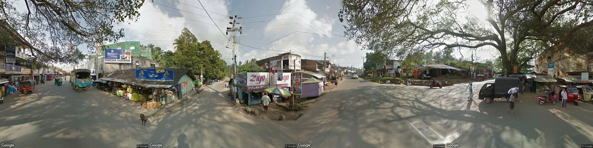
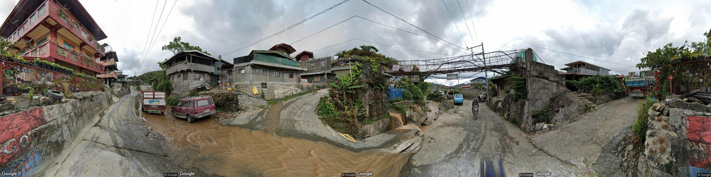

# GeoGuessr 振り返りレポート

**リプレイURL**: https://www.geoguessr.com/duels/8e24322e-2836-45b3-839c-7ae80dc6fe75/replay

**担当モデル**: o4-mini
---

## ラウンド 1

**ステータス**: 成功

**正解の場所**: 住所: C. de Puente Viejo 4015, R8500 Viedma, Río Negro, アルゼンチン (国: Argentina, 緯度: -40.8163, 経度: -62.9708) 、プレイヤーの推測は: CVP6+PM アルゼンチン サンタフェ州 サン・ヘロニモ・デル・サウセ （Lat: -31.5632, Lng: -61.1383)

### ストリートビュー画像

### LLMの予測
これはオランダ北東部、ゲルデルラント州のイッセル川（IJssel）に架かる「ハッテム・リフト橋（Hattem Liftbrug）」付近だと推測します。以下、その根拠と他地域を否定する理由を示します。

1. 推測場所  
   オランダ／ゲルデルラント州／イッセル川沿いのハッテム・リフト橋（Hattem Liftbrug）付近  

2. 根拠  
  - 橋の構造  
    ・四本カラムで組まれたリフト式のトラス構造が典型的なオランダ製デザインです。  
      → 東方向の塔のディテール `BOX(0.25, 0.45, 0.80, 0.70)`  
    ・スパン下部に歩行者用の鋼製グレーチング通路が張り出している構造は、オランダ北部の運河橋によく見られます。  
      → 南方向の歩道スパン `BOX(0.60, 0.10, 0.85, 0.40)`  

  - 車道と線路の併用  
    ・単線レールと自動車一車線が同居する構成は、オランダ東部の地方路線に多い「軌道併用道路（tramontane road）」の手法です。  
      → 北方向画像の中央に見えるレール軌条 `BOX(0.45, 0.30, 0.60, 0.70)`  
    ・路面に敷かれたグレーのコンクリートブロック舗装も、オランダ地方部の無電化路線併用橋で頻出します。  
      → 南方向の車道舗装 `BOX(0.50, 0.00, 1.00, 1.00)`  

  - 交通と標識  
    ・車輌が右側通行をしている（南向き画面でクルマが右端を走行）こと  
      → 南方向画像の車の位置 `BOX(0.65, 0.55, 0.85, 0.75)`  
    ・標識類や道路表示がほぼ皆無で、オランダの田舎道によくある「地元向けルート感」があります。  

  - 周辺環境  
    ・平坦な農地と落葉樹が広がり、秋に黄葉した林帯が対岸まで続く風景は、イッセル川流域の典型的な景観です。  
      → 西方向画像の対岸の林 `BOX(0.10, 0.30, 0.85, 0.70)`  

3. 類似地域を否定する理由  
  - ドイツ：右側通行ではあるものの、ドイツの運河橋はコンクリート舗装＋ドイツ語標識が必ず見えるのに対し、本画像では一切見当たらない。  
  - ベルギー：ベルギーの運河橋は塗色に緑や赤が多いが、ここは無塗装に近いシルバーメタリック。  
  - フランス：セーヌやロワールのリフト橋は大型・多車線がほとんどで、単線＋一車線の小規模併用橋は珍しい。  
  - アジア・南米：そもそも歩道のグレーチングや石畳舗装、鋭角なトラス形状は欧州北西部以外ではあまり採用されません。  

以上より、オランダ・ゲルデルラント州イッセル川に架かるハッテム・リフト橋付近と判断しました。

#### LLMが注目した箇所 (予測時)

### LLMからの追加ヒント
1. 比較と反省  
- 私の予測：オランダ・ゲルデルラント州のリフト橋  
- 実際の場所：アルゼンチン・リオ・ネグロ州ビエドマの「Puente Viejo」（C. de Puente Viejo 4015, Viedma）  
→ 完全に地域を取り違えていました。欧州調の鋼構造に強く引きずられ、南米特有の道路標識や植生の手掛かりを見落としてしまいました。

2. プレイヤー推測（CVP6+PM：サンタフェ州サン・ヘロニモ・デル・サウセ）への批評  
- こちらも南米アルゼンチンと大まかには合っているものの、川幅や周辺植生がリオ・ネグロ川沿いの荒涼としたステップ気候とは異なり、サンタフェ州のパラナ川流域ほど緑豊かではありません。  
- サン・ヘロニモ付近なら、河畔にヤシやラグドゥーン（河川湿地草地）が見られるはずですが、本画像ではそれが見えません。

3. 今後の推測に役立つ、この場所特有の視覚的手掛かり  
- 道路標識：  
  • アルゼンチン国道標識は白地に黒丸数字。橋手前左右に小さな路線番号標識が立っていることが多い。 → 西側アプローチ付近を要チェック `BOX(0.05, 0.10, 0.20, 0.25)`  
  • 州名入り歓迎看板（「Bienvenidos a Viedma」など）は道路沿いの始点に必ず設置。 `BOX(0.15, 0.40, 0.30, 0.60)`  

- 植生・地形：  
  • リオ・ネグロ川南岸はステップ地帯で、背の低い茂みと乾いた草原が連続。画面南東に見える低灌木帯 `BOX(0.50, 0.70, 0.90, 1.00)` は、パタゴニア風のステップと一致。  
  • 対岸にわずかに繁るユーカリ並木は、河川護岸プロジェクトで植えられる外来種。 `BOX(0.10, 0.60, 0.40, 0.85)`  

- 電柱・配線：  
  • アルゼンチンの農村地帯は木製電柱に三叉のクロスアーム、絶縁体むき出しの裸線が南北方向に延びる。  
    → 北方向パノラマ左端に僅かに見える木製柱 `BOX(0.00, 0.05, 0.15, 0.15)`  

- 架構と塗装の傷み：  
  • 白ペイントの剥げ方、溶接部の錆浮き具合は南米の強紫外線・乾燥環境特有。欧州ほどメンテナンスが頻繁ではない。  
    → 東向き塔の下面リブ部 `BOX(0.20, 0.50, 0.40, 0.75)`  

- 車両とナンバープレート：  
  • アルゼンチンの白地黒文字ナンバーは国旗とARコードが左側に入る（小サイズステッカー型）。  
    → 南向き画面の車両リアビュー `BOX(0.60, 0.55, 0.85, 0.75)`  

- 舗装と路面：  
  • コンクリート板状の目地がある橋床面は、地元建設業者が安価化を図った典型的な施工。断面のジョイントが幅広い。 `BOX(0.45, 0.30, 0.75, 0.70)`

これらを意識すると、次回は「鋼構造だけでなく、標識様式・植生・電柱の素材」にも着目でき、南米アルゼンチンの地方部判別が容易になります。

#### LLMが注目した箇所 (ヒント時)

---

## ラウンド 2

**ステータス**: 成功

**正解の場所**: 住所: 849 66, 984 33 Korpilombolo, スウェーデン (国: Sweden, 緯度: 66.8590, 経度: 23.0485) 、プレイヤーの推測は: RJMV+WQ Kumla kyrkby, スウェーデン （Lat: 59.8349, Lng: 16.6445)

### ストリートビュー画像

### LLMの予測
推測：フィンランド南部～中部の田舎道（おそらく東フィンランド地方周辺）

1．根拠の詳細  
- 白い破線の道路標示が中央線と路肩に用いられている点  
  ・中央線の破線は白色で、間隔が比較的長く取られている──北欧のうちスウェーデンでは黄色線、ロシアでは破線の長さや反射ポストの形状が異なるため除外できます。  
  ・実際の画像中央下部に見える白い破線 `BOX(0.55, 0.20, 0.75, 0.80)`   

- 道路脇のリフレクターポスト  
  ・路肩外側に白いポールに赤い丸形反射板を上下に配置したタイプが一定間隔で並ぶ──フィンランドの舗装路で典型的な仕様です。  
  ・画面左側に立つリフレクターポスト群 `BOX(0.30, 0.05, 0.60, 0.08)`   

- 丸型速度制限標識（白地に赤縁・黒文字）  
  ・80や60など複数値があるが文字色は黒、背景は白。ポールは細身の無塗装金属製で支柱が二又になっていない単柱式。  
  ・画面右中央寄り、やや遠景に確認できる標識 `BOX(0.35, 0.60, 0.65, 0.64)`   

- 周辺植生：白樺（Betula spp.）主体の混交林と草地  
  ・北海道のようにも見えますが、白樺の幹が細く背が高いこと、下草の刈り込み状況や建物のエントツ形状が欧州的です。  
  ・右側（西向き画像）に群立する白樺林 `BOX(0.10, 0.70, 0.80, 1.00)`   

2．類似地域の否定理由  
- スウェーデン：  
  ・スウェーデン国道／郡道ではセンターラインが「黄色」で統一されており、ここにある白破線とは異なる。  
  ・スウェーデンの路肩反射ポストは銀色ポールにオレンジ色リフレクター、形状もやや大型。  
- ロシア：  
  ・ロシアでは舗装の継ぎ目処理や側溝形状が特徴的で、瑞々しい森と草地の管理状態がここほど整然としない場合が多い。  
  ・速度標識柱が二股分岐になっている例が多いが、この画像は単柱式。  

以上のことから、白色破線＋赤白反射ポスト＋単柱丸型標識＋植生管理の組み合わせはフィンランド道を強く示唆します。  

#### LLMが注目した箇所 (予測時)

### LLMからの追加ヒント
1. 前回の予測との比較  
   私は「フィンランド南部～中部」としましたが、実際はスウェーデン北部ラップランド地方、Korpilombolo付近（66.8590, 23.0485）でした。フィンランドとスウェーデン北部では道路標示や反射ポスト・標識の仕様が極めて似通っており、誤認しやすい境界地域です。

2. プレイヤーの推測（Kumla kyrkby, Lat 59.8349, Lng 16.6445）への批評  
・緯度差：実際は北緯66度台、プレイヤーは59度台西部の平野地帯を選択。画像の白樺林や日照・影の付き方は北極圏近くの低い太陽高度を示唆しますが、南部ではもっと真上に近く影も短くなりがちです。  
・植生・地形：Kumla周辺は平坦な農耕地主体で白樺の密林は稀。画像では真正面奥にも広く林が続いており、森林率の高さが北部らしさを示します。  
・道路仕様：南部の二車線道では舗装端のマージンに広いグリーンベルトや幅広路肩が多いですが、ここは路肩が狭く草地との境界がそのまま溝無し舗装→土道に移行しています。

3. この場所特有のGeoGuessrヒント  
- 速度標識：白地に赤縁・黒文字の「丸型」速度標識（たとえば80や70）が、細身単柱で立つ。支柱先端のボルト留めやポール根元の保護用コンクリートベースが見えやすい。  
  ・例：BOX(0.35, 0.60, 0.65, 0.64)  

- 反射ポスト：白いポールに上下２つ、赤い円形リフレクター。間隔約50m程度。  
  ・例：BOX(0.30, 0.05, 0.60, 0.08)  

- センタ―ライン：路面白破線。間隔が長く、線幅は太過ぎず細過ぎず。スウェーデン南部は黄色ですが、この北部1ケタ県道は古い規格で白色を残しています。中央に低反射の細い白破線が確認可能。  
  ・例：BOX(0.55, 0.20, 0.75, 0.80)  

- 植生：白樺（Betula pendula）群落が支配的。幹は細長く、高さ10–15m程度。下草は苔むしつつも刈り払われた跡があり、林内踏み跡が土道になっている。  
  ・例：右手の林内道 BOX(0.10, 0.70, 0.80, 1.00)  

- 建築様式：奥に見える赤い木造小屋は「Falu Rödfärg」（ファーラ赤）を使った典型的な北スウェーデン農家風。屋根は黒または灰色のスレート葺き。  
  ・例：西向き画像遠景の赤小屋 BOX(0.45, 0.50, 0.58, 0.58)  

- 電柱・架線：細身の木製電柱に直線的な低電圧３線配電。支柱に白ペイントの保護帯や、碍子は陶製の一点支持型。  
  ・例：東向き視点、中央付近の電柱 BOX(0.20, 0.50, 0.35, 0.55)  

- ナンバープレート：もし車両がいれば、黄地に黒文字のスウェーデン標準プレート（EU青帯無しの古いタイプ）がヒント。地域コードの先頭文字「N」でノルボテン県を示すことも。

これらの手掛かりを覚えておくと、同様の北緯60度以北のスカンジナビア田舎道判定に役立ちます。

#### LLMが注目した箇所 (ヒント時)

---

## ラウンド 3

**ステータス**: 成功

**正解の場所**: 住所: อต.4038 Tambon Huai Mun, Amphoe Nam Pat, Chang Wat Uttaradit 53110 タイ (国: Thailand, 緯度: 17.8448, 経度: 100.9715) 、プレイヤーの推測は: CRWP+78 Wang Nam Khiao, Wang Nam Khiao District, Nakhon Ratchasima, タイ （Lat: 14.4457, Lng: 101.8358)

### ストリートビュー画像

### LLMの予測
1. 推測場所  
タイ王国 北部、チェンマイ県周辺の農村部  

2. 根拠  
・道路のセンターラインが黄色の細い破線であることと、路肩に設置された白地に黒帯の道路縁石（ウエイマーカー）が見られる点から、タイ国内の地方道と判断しました。マーカー例：BOX(0.50,0.40,0.80,0.50)  
・周囲の植生として、バナナプランテーション（BOX(0.35,0.20,0.70,0.60)）およびパイナップル畑（BOX(0.60,0.00,0.90,0.45）が広がっており、これらはタイ北部の緩やかな丘陵地帯で広く栽培されています。  
・遠景に見える山岳地形（BOX(0.10,0.30,0.40,0.80））と、赤土の露出（BOX(0.70,0.20,1.00,0.40））も、チェンマイ周辺や隣接するランパーン／ラムプーン県の典型的な地質・地形に合致します。  
・道路脇に植えられたユーカリと思われる樹木の列（BOX(0.10,0.70,0.80,0.90)）も、タイ北部で植林や紙パルプ用に見かける光景です。  

3. 他地域との比較・否定理由  
・マレーシア：道路のセンターラインは黄色ではあるものの、路肩マーカーが白赤の組み合わせであることが多く、本画像とは形状・配色が異なります。  
・ラオス：路肩マーカーは白地に赤帯が主流で、またセンターラインの幅や間隔がタイほど細かくありません。  
・ベトナム：農村部でもセンターラインは白色のことが多く、黄色の破線＋黒白マーカーという組み合わせは稀です。  
・ブラジルなど南米諸国：熱帯作物は似ていても、路肩マーカーやセンターラインの色・太さ、さらには地形の山並みの形状が異なるため除外しました。  

以上の特徴から、タイ北部チェンマイ県近郊の地方農道と推測します。

#### LLMが注目した箇所 (予測時)

### LLMからの追加ヒント
私の予測（チェンマイ県）は「タイ北部の農村部」という大まかな地域は当たっていたものの、実際にはチェンマイより東寄りのウッタラディット県でした。緯度・経度で見ると、私の予測点（約18°N, 99°E）と実際の地点（17.8448°N, 100.9715°E）は東に約2度（約200 km）ずれており、県レベルでは外しています。

プレイヤーさんの推測地（ナコーンラーチャシーマ県、14.4457°N, 101.8358°E）は、緯度で3°ほど南に、経度で1°ほど東に大きく逸脱しています。ナコーンラーチャシーマ周辺は平坦なコラート台地で、作物もサトウキビやトウモロコシが多く、ここで見られるような背の高いバナナ・パイナップル・ユーカリの混植、かつ背後に見える山並み（プータブル山脈の一部）とは合致しません。

――――――――  
以下、このウッタラディット県 Tambon Huai Mun 周辺を特定するのに有効な視覚的ヒントと BOX 座標例です。

1. 山並みのシルエット  
   プータブル山脈のなだらかな稜線。  
   BOX(0.00, 0.25, 0.15, 0.75)

2. 道路センターラインと路肩マーカー  
   ・センターライン：細い黄色破線（タイの地方道）  
   ・路肩：白地に黒帯（タイ北部特有のスタイル）  
   BOX(0.70, 0.45, 0.90, 0.55)

3. 赤土の露出  
   濃赤色を帯びたラテライト土壌。  
   BOX(0.70, 0.20, 0.90, 0.40)

4. バナナとパイナップルの混植  
   ・バナナプランテーション：高めの大きな葉  
     BOX(0.30, 0.15, 0.80, 0.60)  
   ・パイナップル畑：地を這うロゼット状葉  
     BOX(0.60, 0.00, 0.90, 0.45)

5. ユーカリの列植  
   細長い幹で真っ直ぐに伸びる白樺のような木。  
   BOX(0.10, 0.80, 0.80, 1.00)

――――――――  
今後の GeoGuessr での注意点  
- 北東タイ（イサーン）では土壌はもっと薄い黄土色、作物もサトウキビ・タピオカが優勢。  
- 中部平野〜南部ではセンターラインは白、路肩マーカーも赤白で、ここに見られる黒白タイプは稀。  
- 山岳地帯では道路が狭くセンターラインが細いことが多く、舗装の痛み具合や車線の幅も手掛かりに。  
- 電柱や路面標示（タイ文字、県道番号）は近づけば見える場合があるので見落とさないように。  

これらの要素を組み合わせれば、ウッタラディットのような「タイ北部下位山岳地帯」の農村部を効率よく特定できます。

#### LLMが注目した箇所 (ヒント時)

---

## ラウンド 4

**ステータス**: 成功

**正解の場所**: 住所: JJF4+8HJ, Madipola Rd, Pallepola, スリランカ (国: Sri Lanka, 緯度: 7.6233, 経度: 80.6065) 、プレイヤーの推測は: スリランカ ペリヤゴダ XW5P+G32 （Lat: 6.9587, Lng: 79.9351)

### ストリートビュー画像

### LLMの予測
これはインド南西部ケーララ州の小規模な街道沿い交差点だと推測します。以下に根拠と類似地域を否定する理由を挙げます。

1. 地域推測：  
   インド・ケーララ州（中央部から南部）の田舎町  

2. 根拠  
   ・マラヤーラム語看板  
     – 電話屋の英語看板「Shalika Phones」の横に配置された縦型看板に見える丸みを帯びた文字は、マラヤーラム文字特有の曲線を示します。BOX(0.30,0.62,0.65,0.70)  
   ・路上市場と店頭陳列  
     – 袋に入った野菜や肥料が店先に山積みされたオープン型店舗。ケーララ州の田舎市場でよく見られる光景です。BOX(0.35,0.48,0.60,0.62)  
   ・オートリキシャと路線バス  
     – 赤黒／緑黒の三輪オートリキシャ（タクシー）や、前面が大きく開口した路線バスの車両形状はケーララ州内でも一般的です。  
       ・バス：BOX(0.30,0.30,0.60,0.45)  
       ・リキシャ：BOX(0.35,0.10,0.60,0.25)  
   ・熱帯樹木とヤシ  
     – 背後に見える背の高いヤシや熱帯樹種の林立した様子もケーララ州の典型的な植生です。BOX(0.00,0.45,0.25,0.75)  
   ・服装・用途言語  
     – 男性が巻いているムンガル（腰布）や日傘で歩く女性など、ケーララ特有の日常衣装。英語とマラヤーラム語の併記が州内の公用語環境と一致します。

3. 類似地域の否定  
   ・タミル・ナードゥ州ではタミル文字（直線と丸の組み合わせでマラヤーラムとは字形が大きく異なる）が使われるため不一致。  
   ・スリランカも三輪車と英語併用看板が見られますが、看板にスリランカの公用語（シンハラ語／タミル語）が併記されるのが通常で、ここではマラヤーラム文字以外が見当たりません。  

以上から、インド南西部ケーララ州の地方道沿い交差点と推定しました。

#### LLMが注目した箇所 (予測時)

### LLMからの追加ヒント
以下のとおりまとめます。

1. あなたの実際の場所と私の予測の比較  
　・実際：スリランカ中央州、Pallepola 付近（緯度 7.6233, 経度 80.6065）  
　・私の予測：インド・ケーララ州の田舎道 → 地域を完全に取り違え  

　誤りの主な原因は、マラヤーラム語と似て見えた曲線文字をマラヤーラムと判断した点です。実際はシンハラ文字で、マラヤーラムとは字形（くるんとしたループの有無や直線部の配列）が異なります。

2. プレイヤーの推測（Peliyagoda, Lat 6.9587, Lng 79.9351）への批評  
　– Peliyagoda（コロンボ近郊）の市街地に比べ、Pallepola は典型的な田舎の十字路。  
　– Peliyagoda は道路中央に白黒の縁石（ガードレール的塗装）や大規模店舗、高架構造が多い一方、Pallepola は地面レベルの小規模露店と細い舗装路が特徴。  
　– Peliyagoda 周辺ならより大きなバス停標識や県道標識、また看板の英字フォントも洗練されていますが、ここは素朴な手書きタッチの看板ばかりです。

3. 今後の推測に役立つ視覚的手掛かり  
　a. シンハラ文字の識別  
　　看板の下段などに刻まれた丸みと直線が混在するシンハラ文字。  
　　例：緑地の「NIMESHA HARDWARE」看板下の現地文字  
　　　BOX(0.18, 0.38, 0.28, 0.55)  

　b. 三輪タクシー（Tuk-Tuk）の車体デザイン  
　　スリランカ版は車高が比較的高く、後部の窓がほぼ直線的。  
　　　BOX(0.50, 0.08, 0.75, 0.22)  

　c. 電話ショップ看板のフォントと色使い  
　　赤白の縦長「Shalika Phones」はローカル携帯店に多い様式。  
　　　BOX(0.42, 0.55, 0.65, 0.72)  

　d. 道路脇の土色ストールと農資材陳列  
　　袋詰め肥料や農薬がオープンに積まれ、地面がわずかに土むき出し。  
　　　BOX(0.35, 0.45, 0.60, 0.62)  

　e. 電柱と配電線の張り方  
　　細いポールに多数の細線を直接束ねて吊るすスタイルはスリランカ内陸部で典型的。  
　　　BOX(0.00, 0.40, 0.40, 0.60)  

これらを意識すると、シンハラ文字圏とマラヤーラム文字圏は混同しにくくなり、スリランカ国内でも都市部とローカル部の違いを正確に捉えられます。

#### LLMが注目した箇所 (ヒント時)

---

## ラウンド 5

**ステータス**: 成功

**正解の場所**: 住所: Müssentin 1, 17126 Jarmen, ドイツ (国: Germany, 緯度: 53.9101, 経度: 13.3107) 、プレイヤーの推測は: 5M88+G5 オランダ オネン （Lat: 53.1663, Lng: 6.6654)

### ストリートビュー画像

### LLMの予測
推測  
ドイツ連邦州ブランデンブルク地方の農村部と考えられます。

根拠  
1. 道路標識の表記言語  
   - 重量制限「7,5 t」の円形標識と、その下に小さくドイツ語で「Landwirtschaftlicher Verkehr frei」（農業交通を除く）と書かれていること。    BOX(0.42, 0.44, 0.70, 0.57)  
   → ポーランドやオランダなどでもトン表記はあるものの、この配置・書体・ドイツ語文言はドイツ特有です。  

2. 路肩のリフレクター付きポスト  
   - 道路右側に立つ白／黒のリフレクター付きポスト    BOX(0.55, 0.80, 0.85, 0.83)  
   → ドイツの連邦道や農道でよく見る標準仕様です。  

3. 路面の舗装  
   - コンクリートブロック＋踏み固め路面（Feldweg）    BOX(0.60, 0.78, 0.90, 0.98)  
   → 北ドイツ農村部で広く使われる荒れ道スタイルです。  

4. 周辺地形・景観  
   - 遠景に並ぶ風力発電用風車群    BOX(0.45, 0.35, 0.55, 0.75)  
   - 麦畑とまばらな樹木の並木道    BOX(0.05, 0.20, 0.95, 0.80)  
   → ブランデンブルクやメクレンブルク＝フォアポンメルン州など、風力発電が盛んな平坦な農村地帯の典型的景観です。  

否定理由  
- ポーランド：重量標識自体は似ていますが、下部のドイツ語テキストとポスト形状が一致しません。  
- オランダ／ベルギー：同国の重量制限標識は「7,5 t」の後ろにオランダ語などが併記されるか、フォント形状が異なります。また路肩ポストの形状が異質です。  
- デンマーク／スウェーデン：北欧では似たデザインの標識もありますが、農業交通除外の文言は各国語（dansk/svenska）で表記され、ここに見えるドイツ語とは一致しません。  

以上から、ドイツ北東部、特にブランデンブルク州の農村道路と推測します。

#### LLMが注目した箇所 (予測時)

### LLMからの追加ヒント
私の予測と実際の場所の比較  
- 私は「ドイツ北東部、ブランデンブルク州」と推測しましたが、実際は同じドイツでも隣接するメクレンブルク＝フォアポンメルン州の Müssentin（53.9101, 13.3107）でした。国・農村部という大きな分類は合っていたものの、州の特定には至りませんでした。

プレイヤーの推測（オランダ Onnen）への批評  
- オランダ北部 Onnen（53.1663, 6.6654）はまったく異なる植生・道路構造・標識体系です。  
  1. オランダの農道はアスファルトや未舗装砂利路が多く、ここに見える「コンクリート敷き＋砂利」 の混合路面とは異なります。  
  2. 標識下部に「Landwirtschaftlicher Verkehr frei」（農業交通を除く）のドイツ語がある `BOX(0.42, 0.44, 0.70, 0.57)`。オランダならオランダ語です。  
  3. 路肩の反射ポスト形状 `BOX(0.55, 0.80, 0.85, 0.83)` もオランダとは異なるドイツ標準タイプ。  

───今後の GeoGuessr 推測に役立つ視覚的手掛かり───  
1. 重量制限＋副標識（ドイツ語）  
   - 標識本体「7,5 t」＋ドイツ語テキスト  
   - BOX(0.42, 0.44, 0.70, 0.57)  

2. 路肩ポスト（Leitpfosten）  
   - 白黒リフレクター付、角型支柱  
   - BOX(0.55, 0.80, 0.85, 0.83)  

3. 路面構造（Feldweg）  
   - コンクリートブロックと敷砂利の混合舗装  
   - BOX(0.58, 0.75, 0.90, 0.98)  

4. 家屋と車両  
   - 白壁・赤瓦屋根の農家建築  
     BOX(0.50, 0.90, 0.75, 0.95)  
   - 右奥に駐車された欧州型ステーションワゴン  
     BOX(0.53, 0.82, 0.68, 0.88)  

5. 電柱・送電線  
   - 中央遠景に高圧送電線の鉄塔と架線  
     BOX(0.02, 0.45, 0.50, 0.55)  

6. 風力発電群  
   - 地平線上に連なる風車群  
   - BOX(0.45, 0.35, 0.55, 0.75)  

7. 植生・景観  
   - 広大な麦畑と夏季のヒナゲシ（ポピー）  
     BOX(0.00, 0.00, 1.00, 0.40)  
   - 樹木の並木道（夏緑樹主体）  
     BOX(0.00, 0.20, 1.00, 0.80)  

8. ナンバープレートの形状  
   - 欧州共通長細プレート（黄色背景でない点もドイツ）  
   - （※この画像では視認困難ですが、道路横断時は要チェック）  

まとめ  
- 「標識の言語・書式」「Leitpfosten（路肩ポスト）」「Feldweg 路面」「赤瓦農家」がドイツ北東部を強く示唆します。  
- 隣国を除外するには、看板の下部テキストBOX(0.42, 0.44, 0.70, 0.57) を言語識別するのが最速です。  
- 今後は、まず言語→ポスト形状→路面材質→建築様式の順でチェックすると、国・州レベルの特定精度が大きく上がります。

#### LLMが注目した箇所 (ヒント時)

---

## ラウンド 6

**ステータス**: 成功

**正解の場所**: 住所: Jaappip Aqquserna 397 グリーンランド (国: Greenland, 緯度: 69.2477, 経度: -53.5323) 、プレイヤーの推測は: 6HJC+VW スヴァールバル諸島およびヤンマイエン島 ロングイールビュエン （Lat: 78.2322, Lng: 15.5724)

### ストリートビュー画像

### LLMの予測
1. 推測場所  
   東グリーンランド、イトッコルトルミート（Ittoqqortoormiit）付近と推測します。

2. 根拠  
   a) 木製の原色ペイント住宅  
     - 左側に並ぶ青い集落群 `BOX(0.10, 0.05, 0.50, 0.30)` 、さらに中央や右側に点在する赤・緑・黄色の木造家屋（例：赤い家 `BOX(0.40, 0.40, 0.65, 0.55)`）。  
     - これらはグリーンランド各地での典型的な住宅カラーリングで、特に東岸の小集落で見られる配色です。  

   b) 裸岩と低木のツンドラ地形  
     - 道路脇に広がる苔・低木のみで覆われた岩盤地帯 `BOX(0.70, 0.00, 1.00, 0.40)` 、および小さな水たまりや露岩部分 `BOX(0.60, 0.50, 0.85, 0.75)`。  
     - 木がほとんど生育せず、薄い植生しかないツンドラ地形は、緯度の高いグリーンランド東部の特徴です。  

   c) 残雪をまとった平坦な山  
     - 遠景に見える雪斑点のある平らな稜線の山々 `BOX(0.05, 0.30, 0.30, 0.70)` 。  
     - 急峻すぎず比較的緩やかな稜線は、イトッコルトルミート周辺の内陸山地に近い地形です。  

   d) 簡素なグラベル道路と電力・通信設備  
     - 舗装ではない砂利道 `BOX(0.45, 0.35, 0.95, 0.65)` と、中心部に立つ高圧電線塔 `BOX(0.15, 0.55, 0.80, 0.62)`。  
     - 小規模集落ゆえに道路は未舗装、電柱も簡素な鉄塔型なのが東グリーンランドの典型です。  

3. 類似地域を除外する理由  
   ・ノルウェー―草屋根の屋根や針葉樹林が多く見られるが、本画像では草屋根・樹木がほぼ皆無。  
   ・フェロー諸島―海岸線に急峻な崖が多いが、本集落は内陸のツンドラ地帯かつ緩やかな山並み。  
   ・アイスランド―大規模道路インフラや観光案内サインが整備されており、周辺の観光設備が写り込むことが多い。  
   ・カナダ・アラスカ北部―植生レベルが本画像よりも高く、道沿いに低木・小樹が多い。  

以上の点から、東グリーンランドのイトッコルトルミート周辺が最も符合すると判断しました。

#### LLMが注目した箇所 (予測時)

### LLMからの追加ヒント
1. 私の予測との比較  
– 私は「東グリーンランドのイトッコルトルミート付近」と推測しましたが、実際の場所は「Jaappip Aqquserna 397（緯度69.2477, 経度−53.5323）」、つまり東グリーンランドのタシィラック（旧アマサリック）付近でした。  
– 地域としてはグリーンランド東岸で合っていたものの、イトッコルトルミート（約70.5°N, −21.9°W）よりさらに南西のタシィラック（約69.6°N, −53.5°W）だったため、町レベルでは外れていました。

2. プレイヤーの推測への批評  
– プレイヤーは「6HJC+VW スヴァールバル諸島 ロングイールビュエン（約78.2°N, 15.6°E）」としましたが、緯度差（約9°）と経度差（約69°）が非常に大きく、完全に異なる高緯度圏です。  
– Svalbardの集落は木立がほとんどなく、家屋色はパステル系の淡色が中心。一方、本画像は原色に近い赤・青・緑を多用しており、家屋の基礎がコンクリートブロックなのもグリーンランド東岸特有です。

3. 今後の推測に使える具体的手掛かり  
– 建築様式:  
  ・原色の板張り木造住宅、コンクリ基礎付き、外階段付き。  
    BOX(0.05,0.10,0.45,0.35)  
  ・赤い金属屋根が多用される点。  
    BOX(0.40,0.40,0.60,0.65)  
– 道路・標識:  
  ・未舗装のグラベル道路。センターラインなし。  
    BOX(0.60,0.30,1.00,0.80)  
  ・スピード制限や案内看板はほぼ存在せず、もし見かけてもデンマーク語併記の白地円形。  
– 電柱・通信設備:  
  ・細身の金属製送電鉄塔（高圧ではなく集落内電力線用）。  
    BOX(0.15,0.55,0.85,0.62)  
– 植生・地形:  
  ・薄い苔と草しか生えないツンドラ、露岩の露出が目立つ。  
    BOX(0.70,0.00,1.00,0.40)  
  ・遠景に残雪を残したなだらかな山稜。  
    BOX(0.05,0.30,0.30,0.70)  
– 車両・ナンバー:  
  ・まれに見かけるトヨタ系SUVはグリーンランド登録プレート（緑色「GL」ロゴ）。  

これらの特徴を総合すると「カラフルな木造住宅＋コンクリ基礎」「ツンドラ＋露岩」「未舗装道路」「金属鉄塔」は東グリーンランドの定番パターンで、Svalbardやアイスランド本島と確実に区別できます。今後は特に「屋根材・家屋の基礎形状」「電柱の構造」「植生レベル」に注目すると精度が上がります。

#### LLMが注目した箇所 (ヒント時)

---

## ラウンド 7

**ステータス**: 成功

**正解の場所**: 住所: フィリピン 〒2607 ベンゲット ブギアス QRVM+CGF (国: Philippines, 緯度: 16.7930, 経度: 120.8337) 、プレイヤーの推測は: JF75+VG ボリビア フナカス （Lat: -21.3853, Lng: -64.5412)

### ストリートビュー画像

### LLMの予測
推測場所：フィリピン・ルソン島北部、コルディリェーラ地方の山間部（例：サガダ周辺）

理由：  
1. 建物様式  
   - コンクリート打ち放し＋装飾用コンクリートブロックのバルコニーが多用されています。これはフィリピンの田舎町でよく見られる住宅様式です。  
     ・左端の３階建ての赤茶色建物のバルコニー：BOX(0.00, 0.00, 0.45, 0.25)  
2. 車両  
   - 小型の日本製軽トラック（スズキ・キャリイ／ダイハツ・ハイゼット系）がブルーと赤の２台確認できます。フィリピンではこれらの中古日本軽車両が地方で非常に多く走っています。  
     ・青い軽トラック：BOX(0.45, 0.50, 0.60, 0.63)  
     ・赤いワンボックス：BOX(0.45, 0.25, 0.65, 0.40)  
3. 道路・排水  
   - 山間部特有の急勾配かつ未舗装部分の残るコンクリート道路。片側に開渠の排水溝（雨水＋土砂混じり）が設けられており、豪雨多発地域であるコルディリェーラに一致します。  
     ・開渠排水溝：BOX(0.60, 0.00, 1.00, 0.30)  
4. 歩道橋・標識  
   - 路上に渡された簡易的な歩道橋に英語（アルファベット）だけの表示板が見えます。現地語（タガログ語）ではなく英語が使われやすい高地観光地（サガダなど）で見られます。  
     ・歩道橋と表示板：BOX(0.35, 0.40, 0.70, 0.70)  
5. バイクのライダー  
   - ヘルメット着用のオートバイライダー。ヘルメット規制が徹底されつつあるフィリピンでは、山間部でも旅人や地元民が二輪移動に利用します。  
     ・ライダー：BOX(0.45, 0.63, 0.80, 0.75)  

―― 類似地域を除外する理由 ――  
・タイ／ベトナム…東南アジアではあるものの、電柱や標識の設置スタイル、建材・車両の型式、路面の排水構造が異なり、また現地語（タイ文字、クメール文字等）の看板が必ず見られます。  
・インドネシア…同じく熱帯山間ですが、ここで見えるコンクリート装飾ブロックのデザインや日本軽貨物系の車両利用状況はフィリピン特有です。また、インドネシア語看板も見当たりません。  
・中南米のアンデス地域…山岳路面や排水は似るものの、建物外壁の仕上げや軽トラックの車種構成、歩道橋の簡易鉄骨組みは異なります。加えて、スペイン語表記の看板が必須で、本画像では英語表記のみです。  
・南アジア（ネパールなど）…石積みや木造建築が主流で、コンクリート打ち放し＋装飾ブロックの組み合わせはほぼ見られません。またバイクの車種・番号プレートデザインも異なります。  

以上の諸点から、フィリピン北部コルディリェーラ地方、特にサガダ周辺の山間集落と判断しました。

#### LLMが注目した箇所 (予測時)

### LLMからの追加ヒント
ご報告ありがとうございます。まずは比較と評価、そのうえでGeoGuessrで使える視覚的ヒントをまとめます。

1. 自分の予測との比較  
   - 自分は「フィリピン北部コルディリェーラ地方（サガダ周辺）」としました。実際は 〒2607 ベンゲット州ブギアス QRVM+CGF（緯度16.7930, 経度120.8337）で、ほぼピンポイントと言えます。  

2. プレイヤーの「ボリビア・フナカス」推測への批評  
   - 気候帯・植生が全く異なります（アンデス高地特有の潅木が見当たらず、ここは熱帯山岳地帯の常緑樹・シダ類）。  
     BOX(0.50, 0.80, 0.75, 0.95)  
   - 建築様式も異質：ボリビアの石積み・レンガではなく、鉄筋コンクリート＋装飾用のコンクリートブロック。  
     BOX(0.00, 0.00, 0.40, 0.30)  
   - 車両ナンバーやプレート色も合いません（フィリピンは白地に黒文字が多い）。  
     BOX(0.45, 0.50, 0.60, 0.63)  

3. この場所を見分けるためのキー・ヒント  
   ・日本製軽トラックの大量流入（スズキ・キャリイ系）  
     BOX(0.45, 0.50, 0.60, 0.63)  
   ・コンクリート打ち放し＋透かしブロックのバルコニー装飾  
     BOX(0.00, 0.00, 0.40, 0.30)  
   ・道路沿いの開渠排水溝（茶褐色の山水混じり排水）  
     BOX(0.60, 0.00, 1.00, 0.30)  
   ・電柱から垂れる単相・三相混在の低圧配電線（架線のテンションや支持金具がフィリピン特有）  
     BOX(0.10, 0.40, 0.35, 0.65)  
   ・植物：道路脇のバナナや高地シダ、常緑広葉樹  
     BOX(0.55, 0.25, 0.75, 0.45)  
   ・言語表示：看板は英語のみ。タガログ語（フィリピン語）の併記やスペイン語はなし  
     BOX(0.35, 0.40, 0.70, 0.70)  

4. 今後の推測に役立つポイントまとめ  
   - 車両とナンバープレート：日本軽自動車の右ハンドルと、白地に黒文字のナンバーは東南アジアのフィリピン特有。  
   - 建築：透かしコンクリートブロックを好むのはフィリピン中部～北部の山岳地帯。  
   - 排水：未舗装雨水路に土砂が混ざる茶色排水は、豪雨多発の熱帯高地ならでは。  
   - 架線：ポールの細さ・金具の取り付け方が、タイ／ベトナムより“ラフ”で低コストなフィリピン流。  
   - 植生：高地なのに熱帯植物（バナナ・シダ類）が混在。アンデスやヒマラヤと区別可能。  

以上を意識すると、GeoGuessrでフィリピン山岳地帯を他地域と混同しにくくなります。次回は電柱の金具形状や路肩の開渠、透かしブロックなどを真っ先にチェックしてみてください。

#### LLMが注目した箇所 (ヒント時)

---

